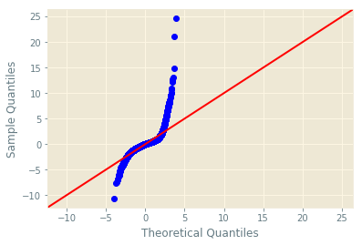

# **King County, Seattle Housing Selling Price**

# Methodology

To evaluate the King's country dataset, I have chosen to use the following steps:
- Business Understanding
- Data Understanding and Data Prep
 - Obtain Data
 - Scrub Data
 - Explore Data
- Modeling
- Interpret
- Evaluation
- Deployment of Model

This is a combination of the OSEMN method explained at:[insert link here] and the CRISP-DM method explained at:[insert line here]. I found that the OSEMN method explained the data science process, but did not provide a framework for contextualization of the model or original data; whereas, the CRISP-DM method provided the business understanding and deployment steps to handle defining the scope of a project. I found the descriptors in the CRISP-DM method for projects did not specify obtaining or cleaning the data, which is where the OSEMN method shines. Both methods have strengths and weakness; as a result, I decided to pull the details from both to enrich my project building experience and to always keep the client in mind by expanding on the steps of both methodologies.

# Business Understanding

To develop an understanding of the nature of the business of the housing market, I'm referencing my own experience apartment shopping, the things I learned about what's important to me as a consumer of housing, an article written by one of the top real estate leaders in the northeast about common seller's questions, and the information provided in the dataset. 

In my own experience, when looking for an apartment, as a home buyer, I am looking for livability and the condition of the home. Will I need to invest to ensure that the place meets my personal standard? Do the features available meet my needs? For instance, in the past, a one bedroom apartment was sufficent. However, now I'm looking to use a bedroom as an office, so I am looking for two bedroom apartments, but one bathroom is still okay. To conclude, as a consumer I look at the quality of my investment and then determine if the space meets my needs.

From a real estate perspective, some of the most frequently asked questions by a home seller include the following. What does the market look like right now? At what point in the year should I sell? How can I improve my home to sell? What price should I set? What is the actual value of my home? insert [reference] here. It seems as if a seller is trying to pinpoint where they are on the sliding scale of value for their surrounding area, and maximizing profit based on this scale.

The data provides both categorical and continuous data points that fall into a few different categories. The continuous data deals with square footage, time, and location; whereas the categorical data includes aspects of the home that cannot change, one of which is whether or not the property is waterfront, and opinions about the home. This is a nice mixture of data that buyers and sellers would be interested in. There are some data points that include information about the surrounding neighborhood to develop the type of sliding scale of home value as well as the condition of the home and included features.

# Data Understanding and Data Prep
## Scrub Data Highlights
This first decision about changing the sqft_basement variable into a binary value really elevated my adjusted r-squared value for the data set.


```python
df_clean.sqft_basement = df_clean.sqft_basement.astype(float)
df_clean.sqft_basement.value_counts()
```

    C:\Users\eannefawcett\Anaconda3\envs\learn-env\lib\site-packages\pandas\core\generic.py:4405: SettingWithCopyWarning: 
    A value is trying to be set on a copy of a slice from a DataFrame.
    Try using .loc[row_indexer,col_indexer] = value instead
    
    See the caveats in the documentation: http://pandas.pydata.org/pandas-docs/stable/indexing.html#indexing-view-versus-copy
      self[name] = value
    


    0.0       13250
    600.0       216
    500.0       209
    700.0       207
    800.0       201
    400.0       184
    1000.0      147
    900.0       142
    300.0       140
    200.0       105
    750.0       104
    530.0       103
    450.0       103
    480.0       102
    720.0        98
    620.0        90
    580.0        84
    840.0        83
    420.0        81
    1100.0       78
    860.0        78
    670.0        77
    550.0        76
    780.0        75
    650.0        75
    240.0        74
    680.0        73
    380.0        73
    910.0        71
    850.0        71
              ...  
    2600.0        1
    1008.0        1
    1281.0        1
    274.0         1
    417.0         1
    2850.0        1
    415.0         1
    2240.0        1
    243.0         1
    143.0         1
    1525.0        1
    862.0         1
    172.0         1
    225.0         1
    2490.0        1
    935.0         1
    3000.0        1
    2500.0        1
    1990.0        1
    1840.0        1
    1548.0        1
    518.0         1
    915.0         1
    266.0         1
    1930.0        1
    588.0         1
    1920.0        1
    602.0         1
    1245.0        1
    1135.0        1
    Name: sqft_basement, Length: 301, dtype: int64


Since the sqft_basement data type is pretty evenly divided between 0 and not zero, it might be useful to change this over to a binary type of data.


```python
# change sqft_basement over into a categorical type
df_clean.loc[df_clean['sqft_basement'] != 0, 'sqft_basement'] = 1
basement = df_clean['sqft_basement'].astype(str)
# print(len(basement)) # unhash to verify that all rows have been transformed
# print(len(df_clean)) # unhash to verify that all rows have been transformed
df_clean.sqft_basement.value_counts() # unhash to verify the above code worked
```

    C:\Users\eannefawcett\Anaconda3\envs\learn-env\lib\site-packages\pandas\core\indexing.py:543: SettingWithCopyWarning: 
    A value is trying to be set on a copy of a slice from a DataFrame.
    Try using .loc[row_indexer,col_indexer] = value instead
    
    See the caveats in the documentation: http://pandas.pydata.org/pandas-docs/stable/indexing.html#indexing-view-versus-copy
      self.obj[item] = s
    


    0.0    13250
    1.0     8284
    Name: sqft_basement, dtype: int64


# Modeling - 1.0
Below is the model after scrubbing and exploring have been managed, let's see what the model picks up.


```python
outcome = 'price'
predictors = kc_housing.drop('price', axis=1)
pred_sum = "+".join(predictors.columns)
formula = outcome + "~" + pred_sum
model_1 = ols(formula= formula, data=kc_housing).fit()
model_1.summary()
```


<table class="simpletable">
<caption>OLS Regression Results</caption>
<tr>
  <th>Dep. Variable:</th>          <td>price</td>      <th>  R-squared:         </th>  <td>   0.840</td>  
</tr>
<tr>
  <th>Model:</th>                   <td>OLS</td>       <th>  Adj. R-squared:    </th>  <td>   0.836</td>  
</tr>
<tr>
  <th>Method:</th>             <td>Least Squares</td>  <th>  F-statistic:       </th>  <td>   234.7</td>  
</tr>
<tr>
  <th>Date:</th>             <td>Sun, 20 Oct 2019</td> <th>  Prob (F-statistic):</th>   <td>  0.00</td>   
</tr>
<tr>
  <th>Time:</th>                 <td>02:22:39</td>     <th>  Log-Likelihood:    </th> <td>-2.8669e+05</td>
</tr>
<tr>
  <th>No. Observations:</th>      <td> 21534</td>      <th>  AIC:               </th>  <td>5.743e+05</td> 
</tr>
<tr>
  <th>Df Residuals:</th>          <td> 21062</td>      <th>  BIC:               </th>  <td>5.781e+05</td> 
</tr>
<tr>
  <th>Df Model:</th>              <td>   471</td>      <th>                     </th>      <td> </td>     
</tr>
<tr>
  <th>Covariance Type:</th>      <td>nonrobust</td>    <th>                     </th>      <td> </td>     
</tr>
</table>
<table class="simpletable">
<tr>
           <td></td>             <th>coef</th>     <th>std err</th>      <th>t</th>      <th>P>|t|</th>  <th>[0.025</th>    <th>0.975]</th>  
</tr>
<tr>
  <th>Intercept</th>          <td>-3.483e+07</td> <td> 5.73e+06</td> <td>   -6.078</td> <td> 0.000</td> <td>-4.61e+07</td> <td>-2.36e+07</td>
</tr>
<tr>
  <th>date[T.1/12/2015]</th>  <td> 3.096e+04</td> <td>  1.5e+05</td> <td>    0.206</td> <td> 0.837</td> <td>-2.63e+05</td> <td> 3.25e+05</td>
</tr>
<tr>
  <th>date[T.1/13/2015]</th>  <td> 5.102e+04</td> <td>  1.5e+05</td> <td>    0.340</td> <td> 0.734</td> <td>-2.43e+05</td> <td> 3.45e+05</td>
</tr>
<tr>
  <th>date[T.1/14/2015]</th>  <td> 1.853e+04</td> <td>  1.5e+05</td> <td>    0.124</td> <td> 0.902</td> <td>-2.75e+05</td> <td> 3.12e+05</td>
</tr>
<tr>
  <th>date[T.1/15/2015]</th>  <td> 3.572e+04</td> <td>  1.5e+05</td> <td>    0.238</td> <td> 0.812</td> <td>-2.58e+05</td> <td>  3.3e+05</td>
</tr>
<tr>
  <th>date[T.1/16/2015]</th>  <td>-1.322e+04</td> <td>  1.5e+05</td> <td>   -0.088</td> <td> 0.930</td> <td>-3.07e+05</td> <td>  2.8e+05</td>
</tr>
<tr>
  <th>date[T.1/17/2015]</th>  <td> 1.051e+05</td> <td>  2.1e+05</td> <td>    0.501</td> <td> 0.616</td> <td>-3.06e+05</td> <td> 5.16e+05</td>
</tr>
<tr>
  <th>date[T.1/19/2015]</th>  <td> -1.53e+04</td> <td> 1.57e+05</td> <td>   -0.097</td> <td> 0.923</td> <td>-3.24e+05</td> <td> 2.93e+05</td>
</tr>
<tr>
  <th>date[T.1/2/2015]</th>   <td> 5.344e+04</td> <td>  1.5e+05</td> <td>    0.356</td> <td> 0.722</td> <td> -2.4e+05</td> <td> 3.47e+05</td>
</tr>
<tr>
  <th>date[T.1/20/2015]</th>  <td> 5.687e+04</td> <td>  1.5e+05</td> <td>    0.379</td> <td> 0.704</td> <td>-2.37e+05</td> <td> 3.51e+05</td>
</tr>
<tr>
  <th>date[T.1/21/2015]</th>  <td> 4.765e+04</td> <td>  1.5e+05</td> <td>    0.319</td> <td> 0.750</td> <td>-2.46e+05</td> <td> 3.41e+05</td>
</tr>
<tr>
  <th>date[T.1/22/2015]</th>  <td> 2.961e+04</td> <td>  1.5e+05</td> <td>    0.198</td> <td> 0.843</td> <td>-2.64e+05</td> <td> 3.23e+05</td>
</tr>
<tr>
  <th>date[T.1/23/2015]</th>  <td> 4688.4355</td> <td>  1.5e+05</td> <td>    0.031</td> <td> 0.975</td> <td>-2.89e+05</td> <td> 2.98e+05</td>
</tr>
<tr>
  <th>date[T.1/24/2015]</th>  <td>-1.021e+05</td> <td> 1.66e+05</td> <td>   -0.616</td> <td> 0.538</td> <td>-4.27e+05</td> <td> 2.23e+05</td>
</tr>
<tr>
  <th>date[T.1/25/2015]</th>  <td> 5.641e+04</td> <td> 1.71e+05</td> <td>    0.329</td> <td> 0.742</td> <td>-2.79e+05</td> <td> 3.92e+05</td>
</tr>
<tr>
  <th>date[T.1/26/2015]</th>  <td> 1035.4509</td> <td>  1.5e+05</td> <td>    0.007</td> <td> 0.994</td> <td>-2.93e+05</td> <td> 2.95e+05</td>
</tr>
<tr>
  <th>date[T.1/27/2015]</th>  <td> 5.216e+04</td> <td>  1.5e+05</td> <td>    0.349</td> <td> 0.727</td> <td>-2.41e+05</td> <td> 3.45e+05</td>
</tr>
<tr>
  <th>date[T.1/28/2015]</th>  <td> 2.297e+04</td> <td> 1.49e+05</td> <td>    0.154</td> <td> 0.878</td> <td> -2.7e+05</td> <td> 3.16e+05</td>
</tr>
<tr>
  <th>date[T.1/29/2015]</th>  <td> 4.791e+04</td> <td>  1.5e+05</td> <td>    0.319</td> <td> 0.749</td> <td>-2.46e+05</td> <td> 3.42e+05</td>
</tr>
<tr>
  <th>date[T.1/30/2015]</th>  <td>  3.81e+04</td> <td>  1.5e+05</td> <td>    0.253</td> <td> 0.800</td> <td>-2.57e+05</td> <td> 3.33e+05</td>
</tr>
<tr>
  <th>date[T.1/31/2015]</th>  <td> 2297.0867</td> <td>  2.1e+05</td> <td>    0.011</td> <td> 0.991</td> <td>-4.09e+05</td> <td> 4.14e+05</td>
</tr>
<tr>
  <th>date[T.1/5/2015]</th>   <td> 4.338e+04</td> <td>  1.5e+05</td> <td>    0.290</td> <td> 0.772</td> <td> -2.5e+05</td> <td> 3.36e+05</td>
</tr>
<tr>
  <th>date[T.1/6/2015]</th>   <td> 4.436e+04</td> <td>  1.5e+05</td> <td>    0.296</td> <td> 0.768</td> <td> -2.5e+05</td> <td> 3.38e+05</td>
</tr>
<tr>
  <th>date[T.1/7/2015]</th>   <td> 6.496e+04</td> <td>  1.5e+05</td> <td>    0.434</td> <td> 0.664</td> <td>-2.28e+05</td> <td> 3.58e+05</td>
</tr>
<tr>
  <th>date[T.1/8/2015]</th>   <td> 1.616e+04</td> <td>  1.5e+05</td> <td>    0.108</td> <td> 0.914</td> <td>-2.77e+05</td> <td>  3.1e+05</td>
</tr>
<tr>
  <th>date[T.1/9/2015]</th>   <td>  9.15e+04</td> <td>  1.5e+05</td> <td>    0.609</td> <td> 0.543</td> <td>-2.03e+05</td> <td> 3.86e+05</td>
</tr>
<tr>
  <th>date[T.10/1/2014]</th>  <td> 4.421e+04</td> <td> 1.49e+05</td> <td>    0.296</td> <td> 0.767</td> <td>-2.48e+05</td> <td> 3.37e+05</td>
</tr>
<tr>
  <th>date[T.10/10/2014]</th> <td>  1.42e+04</td> <td> 1.49e+05</td> <td>    0.095</td> <td> 0.924</td> <td>-2.78e+05</td> <td> 3.07e+05</td>
</tr>
<tr>
  <th>date[T.10/11/2014]</th> <td> 4.496e+05</td> <td> 1.82e+05</td> <td>    2.469</td> <td> 0.014</td> <td> 9.26e+04</td> <td> 8.07e+05</td>
</tr>
<tr>
  <th>date[T.10/12/2014]</th> <td> 5.767e+04</td> <td> 1.71e+05</td> <td>    0.337</td> <td> 0.736</td> <td>-2.78e+05</td> <td> 3.93e+05</td>
</tr>
<tr>
  <th>date[T.10/13/2014]</th> <td> 5.718e+04</td> <td> 1.49e+05</td> <td>    0.383</td> <td> 0.702</td> <td>-2.36e+05</td> <td>  3.5e+05</td>
</tr>
<tr>
  <th>date[T.10/14/2014]</th> <td> 4.347e+04</td> <td> 1.49e+05</td> <td>    0.292</td> <td> 0.771</td> <td>-2.49e+05</td> <td> 3.36e+05</td>
</tr>
<tr>
  <th>date[T.10/15/2014]</th> <td>  1.95e+04</td> <td> 1.49e+05</td> <td>    0.131</td> <td> 0.896</td> <td>-2.73e+05</td> <td> 3.12e+05</td>
</tr>
<tr>
  <th>date[T.10/16/2014]</th> <td> 3.002e+04</td> <td> 1.49e+05</td> <td>    0.201</td> <td> 0.840</td> <td>-2.62e+05</td> <td> 3.22e+05</td>
</tr>
<tr>
  <th>date[T.10/17/2014]</th> <td> 2.244e+04</td> <td> 1.49e+05</td> <td>    0.150</td> <td> 0.880</td> <td> -2.7e+05</td> <td> 3.15e+05</td>
</tr>
<tr>
  <th>date[T.10/18/2014]</th> <td>  8.89e+04</td> <td>  1.6e+05</td> <td>    0.555</td> <td> 0.579</td> <td>-2.25e+05</td> <td> 4.03e+05</td>
</tr>
<tr>
  <th>date[T.10/19/2014]</th> <td> 5.131e+04</td> <td> 1.66e+05</td> <td>    0.309</td> <td> 0.757</td> <td>-2.74e+05</td> <td> 3.76e+05</td>
</tr>
<tr>
  <th>date[T.10/2/2014]</th>  <td> 2.257e+04</td> <td> 1.49e+05</td> <td>    0.151</td> <td> 0.880</td> <td> -2.7e+05</td> <td> 3.15e+05</td>
</tr>
<tr>
  <th>date[T.10/20/2014]</th> <td> 5.897e+04</td> <td> 1.49e+05</td> <td>    0.395</td> <td> 0.693</td> <td>-2.33e+05</td> <td> 3.51e+05</td>
</tr>
<tr>
  <th>date[T.10/21/2014]</th> <td> 6219.5073</td> <td> 1.49e+05</td> <td>    0.042</td> <td> 0.967</td> <td>-2.86e+05</td> <td> 2.98e+05</td>
</tr>
<tr>
  <th>date[T.10/22/2014]</th> <td> 2.885e+04</td> <td> 1.49e+05</td> <td>    0.193</td> <td> 0.847</td> <td>-2.64e+05</td> <td> 3.21e+05</td>
</tr>
<tr>
  <th>date[T.10/23/2014]</th> <td> 1.957e+04</td> <td> 1.49e+05</td> <td>    0.131</td> <td> 0.896</td> <td>-2.73e+05</td> <td> 3.12e+05</td>
</tr>
<tr>
  <th>date[T.10/24/2014]</th> <td> -241.2638</td> <td>  1.5e+05</td> <td>   -0.002</td> <td> 0.999</td> <td>-2.93e+05</td> <td> 2.93e+05</td>
</tr>
<tr>
  <th>date[T.10/25/2014]</th> <td> 7.107e+04</td> <td> 1.62e+05</td> <td>    0.438</td> <td> 0.662</td> <td>-2.47e+05</td> <td> 3.89e+05</td>
</tr>
<tr>
  <th>date[T.10/26/2014]</th> <td> 1.165e+04</td> <td> 1.66e+05</td> <td>    0.070</td> <td> 0.944</td> <td>-3.13e+05</td> <td> 3.37e+05</td>
</tr>
<tr>
  <th>date[T.10/27/2014]</th> <td> 1.638e+04</td> <td> 1.49e+05</td> <td>    0.110</td> <td> 0.912</td> <td>-2.76e+05</td> <td> 3.09e+05</td>
</tr>
<tr>
  <th>date[T.10/28/2014]</th> <td> 2.607e+04</td> <td> 1.49e+05</td> <td>    0.175</td> <td> 0.861</td> <td>-2.66e+05</td> <td> 3.18e+05</td>
</tr>
<tr>
  <th>date[T.10/29/2014]</th> <td>  4.97e+04</td> <td> 1.49e+05</td> <td>    0.333</td> <td> 0.739</td> <td>-2.43e+05</td> <td> 3.42e+05</td>
</tr>
<tr>
  <th>date[T.10/3/2014]</th>  <td> 2.784e+04</td> <td> 1.49e+05</td> <td>    0.186</td> <td> 0.852</td> <td>-2.65e+05</td> <td> 3.21e+05</td>
</tr>
<tr>
  <th>date[T.10/30/2014]</th> <td> 5.885e+04</td> <td> 1.49e+05</td> <td>    0.395</td> <td> 0.693</td> <td>-2.33e+05</td> <td> 3.51e+05</td>
</tr>
<tr>
  <th>date[T.10/31/2014]</th> <td> 1.643e+04</td> <td>  1.5e+05</td> <td>    0.109</td> <td> 0.913</td> <td>-2.78e+05</td> <td> 3.11e+05</td>
</tr>
<tr>
  <th>date[T.10/4/2014]</th>  <td> 1.618e+04</td> <td> 1.66e+05</td> <td>    0.098</td> <td> 0.922</td> <td>-3.09e+05</td> <td> 3.41e+05</td>
</tr>
<tr>
  <th>date[T.10/5/2014]</th>  <td>-3.232e+04</td> <td> 1.71e+05</td> <td>   -0.189</td> <td> 0.850</td> <td>-3.68e+05</td> <td> 3.03e+05</td>
</tr>
<tr>
  <th>date[T.10/6/2014]</th>  <td> 1.377e+04</td> <td> 1.49e+05</td> <td>    0.092</td> <td> 0.927</td> <td>-2.79e+05</td> <td> 3.07e+05</td>
</tr>
<tr>
  <th>date[T.10/7/2014]</th>  <td> 2.859e+04</td> <td> 1.49e+05</td> <td>    0.192</td> <td> 0.848</td> <td>-2.64e+05</td> <td> 3.21e+05</td>
</tr>
<tr>
  <th>date[T.10/8/2014]</th>  <td> 1.494e+04</td> <td> 1.49e+05</td> <td>    0.100</td> <td> 0.920</td> <td>-2.78e+05</td> <td> 3.07e+05</td>
</tr>
<tr>
  <th>date[T.10/9/2014]</th>  <td> 1.877e+04</td> <td> 1.49e+05</td> <td>    0.126</td> <td> 0.900</td> <td>-2.74e+05</td> <td> 3.11e+05</td>
</tr>
<tr>
  <th>date[T.11/1/2014]</th>  <td> 6.685e+04</td> <td> 1.62e+05</td> <td>    0.412</td> <td> 0.681</td> <td>-2.52e+05</td> <td> 3.85e+05</td>
</tr>
<tr>
  <th>date[T.11/10/2014]</th> <td> 5.409e+04</td> <td> 1.49e+05</td> <td>    0.363</td> <td> 0.717</td> <td>-2.38e+05</td> <td> 3.46e+05</td>
</tr>
<tr>
  <th>date[T.11/11/2014]</th> <td> 1.381e+04</td> <td>  1.5e+05</td> <td>    0.092</td> <td> 0.927</td> <td> -2.8e+05</td> <td> 3.07e+05</td>
</tr>
<tr>
  <th>date[T.11/12/2014]</th> <td> 1.243e+04</td> <td> 1.49e+05</td> <td>    0.083</td> <td> 0.934</td> <td> -2.8e+05</td> <td> 3.05e+05</td>
</tr>
<tr>
  <th>date[T.11/13/2014]</th> <td> 3.724e+04</td> <td> 1.49e+05</td> <td>    0.250</td> <td> 0.803</td> <td>-2.55e+05</td> <td> 3.29e+05</td>
</tr>
<tr>
  <th>date[T.11/14/2014]</th> <td> 5.088e+04</td> <td> 1.49e+05</td> <td>    0.341</td> <td> 0.733</td> <td>-2.42e+05</td> <td> 3.44e+05</td>
</tr>
<tr>
  <th>date[T.11/15/2014]</th> <td> 1.489e+05</td> <td> 1.82e+05</td> <td>    0.820</td> <td> 0.412</td> <td>-2.07e+05</td> <td> 5.05e+05</td>
</tr>
<tr>
  <th>date[T.11/16/2014]</th> <td>-1.892e+04</td> <td> 1.71e+05</td> <td>   -0.111</td> <td> 0.912</td> <td>-3.55e+05</td> <td> 3.17e+05</td>
</tr>
<tr>
  <th>date[T.11/17/2014]</th> <td> 7608.1641</td> <td> 1.49e+05</td> <td>    0.051</td> <td> 0.959</td> <td>-2.85e+05</td> <td>    3e+05</td>
</tr>
<tr>
  <th>date[T.11/18/2014]</th> <td> 3.831e+04</td> <td> 1.49e+05</td> <td>    0.257</td> <td> 0.797</td> <td>-2.54e+05</td> <td> 3.31e+05</td>
</tr>
<tr>
  <th>date[T.11/19/2014]</th> <td>  6.55e+04</td> <td> 1.49e+05</td> <td>    0.439</td> <td> 0.661</td> <td>-2.27e+05</td> <td> 3.58e+05</td>
</tr>
<tr>
  <th>date[T.11/2/2014]</th>  <td> 1.242e+05</td> <td>  2.1e+05</td> <td>    0.592</td> <td> 0.554</td> <td>-2.87e+05</td> <td> 5.35e+05</td>
</tr>
<tr>
  <th>date[T.11/20/2014]</th> <td> 2.104e+04</td> <td> 1.49e+05</td> <td>    0.141</td> <td> 0.888</td> <td>-2.71e+05</td> <td> 3.13e+05</td>
</tr>
<tr>
  <th>date[T.11/21/2014]</th> <td> 8627.7748</td> <td> 1.49e+05</td> <td>    0.058</td> <td> 0.954</td> <td>-2.84e+05</td> <td> 3.01e+05</td>
</tr>
<tr>
  <th>date[T.11/22/2014]</th> <td> 3.154e+04</td> <td> 1.59e+05</td> <td>    0.199</td> <td> 0.842</td> <td>-2.79e+05</td> <td> 3.42e+05</td>
</tr>
<tr>
  <th>date[T.11/23/2014]</th> <td> 5.783e+04</td> <td> 1.66e+05</td> <td>    0.349</td> <td> 0.727</td> <td>-2.67e+05</td> <td> 3.83e+05</td>
</tr>
<tr>
  <th>date[T.11/24/2014]</th> <td> 4.469e+04</td> <td> 1.49e+05</td> <td>    0.299</td> <td> 0.765</td> <td>-2.48e+05</td> <td> 3.37e+05</td>
</tr>
<tr>
  <th>date[T.11/25/2014]</th> <td> 3.274e+04</td> <td> 1.49e+05</td> <td>    0.219</td> <td> 0.826</td> <td> -2.6e+05</td> <td> 3.25e+05</td>
</tr>
<tr>
  <th>date[T.11/26/2014]</th> <td> 4.234e+04</td> <td>  1.5e+05</td> <td>    0.283</td> <td> 0.777</td> <td>-2.51e+05</td> <td> 3.36e+05</td>
</tr>
<tr>
  <th>date[T.11/28/2014]</th> <td> 3.483e+04</td> <td> 1.82e+05</td> <td>    0.192</td> <td> 0.848</td> <td>-3.21e+05</td> <td> 3.91e+05</td>
</tr>
<tr>
  <th>date[T.11/29/2014]</th> <td> 3.083e+04</td> <td> 1.71e+05</td> <td>    0.180</td> <td> 0.857</td> <td>-3.05e+05</td> <td> 3.66e+05</td>
</tr>
<tr>
  <th>date[T.11/3/2014]</th>  <td> 1.466e+04</td> <td> 1.49e+05</td> <td>    0.098</td> <td> 0.922</td> <td>-2.78e+05</td> <td> 3.07e+05</td>
</tr>
<tr>
  <th>date[T.11/30/2014]</th> <td> 3.097e+05</td> <td>  2.1e+05</td> <td>    1.476</td> <td> 0.140</td> <td>-1.02e+05</td> <td> 7.21e+05</td>
</tr>
<tr>
  <th>date[T.11/4/2014]</th>  <td> 3.299e+04</td> <td> 1.49e+05</td> <td>    0.221</td> <td> 0.825</td> <td> -2.6e+05</td> <td> 3.26e+05</td>
</tr>
<tr>
  <th>date[T.11/5/2014]</th>  <td> 2.168e+04</td> <td> 1.49e+05</td> <td>    0.145</td> <td> 0.884</td> <td>-2.71e+05</td> <td> 3.14e+05</td>
</tr>
<tr>
  <th>date[T.11/6/2014]</th>  <td>  4.14e+04</td> <td> 1.49e+05</td> <td>    0.277</td> <td> 0.781</td> <td>-2.51e+05</td> <td> 3.34e+05</td>
</tr>
<tr>
  <th>date[T.11/7/2014]</th>  <td> 9737.7912</td> <td> 1.49e+05</td> <td>    0.065</td> <td> 0.948</td> <td>-2.83e+05</td> <td> 3.02e+05</td>
</tr>
<tr>
  <th>date[T.11/8/2014]</th>  <td> 9.999e+04</td> <td> 1.62e+05</td> <td>    0.616</td> <td> 0.538</td> <td>-2.18e+05</td> <td> 4.18e+05</td>
</tr>
<tr>
  <th>date[T.11/9/2014]</th>  <td>-2.771e+04</td> <td> 1.71e+05</td> <td>   -0.162</td> <td> 0.871</td> <td>-3.63e+05</td> <td> 3.08e+05</td>
</tr>
<tr>
  <th>date[T.12/1/2014]</th>  <td>-3509.9418</td> <td> 1.49e+05</td> <td>   -0.024</td> <td> 0.981</td> <td>-2.96e+05</td> <td> 2.89e+05</td>
</tr>
<tr>
  <th>date[T.12/10/2014]</th> <td> 4.568e+04</td> <td> 1.49e+05</td> <td>    0.306</td> <td> 0.760</td> <td>-2.47e+05</td> <td> 3.38e+05</td>
</tr>
<tr>
  <th>date[T.12/11/2014]</th> <td> 3.329e+04</td> <td> 1.49e+05</td> <td>    0.223</td> <td> 0.823</td> <td>-2.59e+05</td> <td> 3.26e+05</td>
</tr>
<tr>
  <th>date[T.12/12/2014]</th> <td> 2.087e+04</td> <td> 1.49e+05</td> <td>    0.140</td> <td> 0.889</td> <td>-2.72e+05</td> <td> 3.14e+05</td>
</tr>
<tr>
  <th>date[T.12/13/2014]</th> <td>-2.672e+04</td> <td> 1.66e+05</td> <td>   -0.161</td> <td> 0.872</td> <td>-3.52e+05</td> <td> 2.98e+05</td>
</tr>
<tr>
  <th>date[T.12/14/2014]</th> <td> 7.151e+04</td> <td> 1.66e+05</td> <td>    0.431</td> <td> 0.666</td> <td>-2.53e+05</td> <td> 3.96e+05</td>
</tr>
<tr>
  <th>date[T.12/15/2014]</th> <td> 2.517e+04</td> <td> 1.49e+05</td> <td>    0.169</td> <td> 0.866</td> <td>-2.67e+05</td> <td> 3.18e+05</td>
</tr>
<tr>
  <th>date[T.12/16/2014]</th> <td> 3.372e+04</td> <td> 1.49e+05</td> <td>    0.226</td> <td> 0.821</td> <td>-2.59e+05</td> <td> 3.26e+05</td>
</tr>
<tr>
  <th>date[T.12/17/2014]</th> <td> 3.227e+04</td> <td> 1.49e+05</td> <td>    0.216</td> <td> 0.829</td> <td>-2.61e+05</td> <td> 3.25e+05</td>
</tr>
<tr>
  <th>date[T.12/18/2014]</th> <td> 3.105e+04</td> <td> 1.49e+05</td> <td>    0.208</td> <td> 0.835</td> <td>-2.62e+05</td> <td> 3.24e+05</td>
</tr>
<tr>
  <th>date[T.12/19/2014]</th> <td>  6.59e+04</td> <td>  1.5e+05</td> <td>    0.439</td> <td> 0.660</td> <td>-2.28e+05</td> <td>  3.6e+05</td>
</tr>
<tr>
  <th>date[T.12/2/2014]</th>  <td> 1.051e+04</td> <td> 1.49e+05</td> <td>    0.071</td> <td> 0.944</td> <td>-2.82e+05</td> <td> 3.03e+05</td>
</tr>
<tr>
  <th>date[T.12/20/2014]</th> <td>-1.346e+04</td> <td> 1.57e+05</td> <td>   -0.086</td> <td> 0.932</td> <td>-3.22e+05</td> <td> 2.95e+05</td>
</tr>
<tr>
  <th>date[T.12/21/2014]</th> <td> 8.729e+04</td> <td> 1.82e+05</td> <td>    0.481</td> <td> 0.631</td> <td>-2.69e+05</td> <td> 4.43e+05</td>
</tr>
<tr>
  <th>date[T.12/22/2014]</th> <td> 2.457e+04</td> <td> 1.49e+05</td> <td>    0.164</td> <td> 0.869</td> <td>-2.68e+05</td> <td> 3.17e+05</td>
</tr>
<tr>
  <th>date[T.12/23/2014]</th> <td> 4.382e+04</td> <td> 1.49e+05</td> <td>    0.293</td> <td> 0.769</td> <td>-2.49e+05</td> <td> 3.37e+05</td>
</tr>
<tr>
  <th>date[T.12/24/2014]</th> <td> 4.437e+04</td> <td> 1.51e+05</td> <td>    0.295</td> <td> 0.768</td> <td>-2.51e+05</td> <td>  3.4e+05</td>
</tr>
<tr>
  <th>date[T.12/26/2014]</th> <td> 2.031e+04</td> <td>  1.5e+05</td> <td>    0.135</td> <td> 0.892</td> <td>-2.74e+05</td> <td> 3.15e+05</td>
</tr>
<tr>
  <th>date[T.12/27/2014]</th> <td> 3.683e+04</td> <td> 1.82e+05</td> <td>    0.203</td> <td> 0.839</td> <td>-3.19e+05</td> <td> 3.93e+05</td>
</tr>
<tr>
  <th>date[T.12/29/2014]</th> <td> 3.509e+04</td> <td> 1.49e+05</td> <td>    0.235</td> <td> 0.814</td> <td>-2.58e+05</td> <td> 3.28e+05</td>
</tr>
<tr>
  <th>date[T.12/3/2014]</th>  <td>  4.87e+04</td> <td> 1.49e+05</td> <td>    0.326</td> <td> 0.744</td> <td>-2.44e+05</td> <td> 3.41e+05</td>
</tr>
<tr>
  <th>date[T.12/30/2014]</th> <td> 6.957e+04</td> <td>  1.5e+05</td> <td>    0.464</td> <td> 0.643</td> <td>-2.24e+05</td> <td> 3.64e+05</td>
</tr>
<tr>
  <th>date[T.12/31/2014]</th> <td> 5.538e+04</td> <td>  1.5e+05</td> <td>    0.369</td> <td> 0.712</td> <td>-2.38e+05</td> <td> 3.49e+05</td>
</tr>
<tr>
  <th>date[T.12/4/2014]</th>  <td> 2.132e+04</td> <td> 1.49e+05</td> <td>    0.143</td> <td> 0.887</td> <td>-2.71e+05</td> <td> 3.14e+05</td>
</tr>
<tr>
  <th>date[T.12/5/2014]</th>  <td> 5.724e+04</td> <td> 1.49e+05</td> <td>    0.383</td> <td> 0.702</td> <td>-2.36e+05</td> <td>  3.5e+05</td>
</tr>
<tr>
  <th>date[T.12/6/2014]</th>  <td>  3.96e+04</td> <td>  1.6e+05</td> <td>    0.247</td> <td> 0.805</td> <td>-2.74e+05</td> <td> 3.54e+05</td>
</tr>
<tr>
  <th>date[T.12/7/2014]</th>  <td>  -1.2e+05</td> <td> 1.82e+05</td> <td>   -0.661</td> <td> 0.509</td> <td>-4.76e+05</td> <td> 2.36e+05</td>
</tr>
<tr>
  <th>date[T.12/8/2014]</th>  <td> 5.182e+04</td> <td> 1.49e+05</td> <td>    0.347</td> <td> 0.728</td> <td>-2.41e+05</td> <td> 3.44e+05</td>
</tr>
<tr>
  <th>date[T.12/9/2014]</th>  <td> 4.168e+04</td> <td> 1.49e+05</td> <td>    0.279</td> <td> 0.780</td> <td>-2.51e+05</td> <td> 3.34e+05</td>
</tr>
<tr>
  <th>date[T.2/1/2015]</th>   <td> 8.415e+04</td> <td> 1.82e+05</td> <td>    0.463</td> <td> 0.643</td> <td>-2.72e+05</td> <td>  4.4e+05</td>
</tr>
<tr>
  <th>date[T.2/10/2015]</th>  <td> 2.897e+04</td> <td>  1.5e+05</td> <td>    0.194</td> <td> 0.846</td> <td>-2.64e+05</td> <td> 3.22e+05</td>
</tr>
<tr>
  <th>date[T.2/11/2015]</th>  <td> 4.975e+04</td> <td> 1.49e+05</td> <td>    0.333</td> <td> 0.739</td> <td>-2.43e+05</td> <td> 3.43e+05</td>
</tr>
<tr>
  <th>date[T.2/12/2015]</th>  <td> 4.411e+04</td> <td>  1.5e+05</td> <td>    0.294</td> <td> 0.768</td> <td>-2.49e+05</td> <td> 3.38e+05</td>
</tr>
<tr>
  <th>date[T.2/13/2015]</th>  <td> 6.439e+04</td> <td> 1.49e+05</td> <td>    0.431</td> <td> 0.666</td> <td>-2.28e+05</td> <td> 3.57e+05</td>
</tr>
<tr>
  <th>date[T.2/14/2015]</th>  <td> 6.003e+04</td> <td> 1.71e+05</td> <td>    0.351</td> <td> 0.726</td> <td>-2.76e+05</td> <td> 3.96e+05</td>
</tr>
<tr>
  <th>date[T.2/16/2015]</th>  <td> 1.051e+04</td> <td>  1.6e+05</td> <td>    0.066</td> <td> 0.948</td> <td>-3.03e+05</td> <td> 3.24e+05</td>
</tr>
<tr>
  <th>date[T.2/17/2015]</th>  <td> 3.898e+04</td> <td> 1.49e+05</td> <td>    0.261</td> <td> 0.794</td> <td>-2.54e+05</td> <td> 3.32e+05</td>
</tr>
<tr>
  <th>date[T.2/18/2015]</th>  <td> 2.877e+04</td> <td> 1.49e+05</td> <td>    0.193</td> <td> 0.847</td> <td>-2.64e+05</td> <td> 3.21e+05</td>
</tr>
<tr>
  <th>date[T.2/19/2015]</th>  <td> 3.407e+04</td> <td> 1.49e+05</td> <td>    0.228</td> <td> 0.819</td> <td>-2.58e+05</td> <td> 3.27e+05</td>
</tr>
<tr>
  <th>date[T.2/2/2015]</th>   <td> 5.705e+04</td> <td>  1.5e+05</td> <td>    0.381</td> <td> 0.703</td> <td>-2.37e+05</td> <td> 3.51e+05</td>
</tr>
<tr>
  <th>date[T.2/20/2015]</th>  <td>  5.78e+04</td> <td> 1.49e+05</td> <td>    0.387</td> <td> 0.699</td> <td>-2.35e+05</td> <td>  3.5e+05</td>
</tr>
<tr>
  <th>date[T.2/21/2015]</th>  <td> 8.296e+04</td> <td> 1.71e+05</td> <td>    0.484</td> <td> 0.628</td> <td>-2.53e+05</td> <td> 4.19e+05</td>
</tr>
<tr>
  <th>date[T.2/22/2015]</th>  <td>-1263.6098</td> <td> 1.54e+05</td> <td>   -0.008</td> <td> 0.993</td> <td>-3.03e+05</td> <td>    3e+05</td>
</tr>
<tr>
  <th>date[T.2/23/2015]</th>  <td> 4.056e+04</td> <td> 1.49e+05</td> <td>    0.272</td> <td> 0.786</td> <td>-2.52e+05</td> <td> 3.33e+05</td>
</tr>
<tr>
  <th>date[T.2/24/2015]</th>  <td> 2.205e+04</td> <td> 1.49e+05</td> <td>    0.148</td> <td> 0.882</td> <td> -2.7e+05</td> <td> 3.14e+05</td>
</tr>
<tr>
  <th>date[T.2/25/2015]</th>  <td> 6.372e+04</td> <td> 1.49e+05</td> <td>    0.428</td> <td> 0.669</td> <td>-2.28e+05</td> <td> 3.56e+05</td>
</tr>
<tr>
  <th>date[T.2/26/2015]</th>  <td>  4.05e+04</td> <td> 1.49e+05</td> <td>    0.271</td> <td> 0.786</td> <td>-2.53e+05</td> <td> 3.34e+05</td>
</tr>
<tr>
  <th>date[T.2/27/2015]</th>  <td> 5.233e+04</td> <td>  1.5e+05</td> <td>    0.349</td> <td> 0.727</td> <td>-2.41e+05</td> <td> 3.46e+05</td>
</tr>
<tr>
  <th>date[T.2/28/2015]</th>  <td> 6.118e+04</td> <td> 1.62e+05</td> <td>    0.377</td> <td> 0.706</td> <td>-2.57e+05</td> <td>  3.8e+05</td>
</tr>
<tr>
  <th>date[T.2/3/2015]</th>   <td> 1.102e+04</td> <td>  1.5e+05</td> <td>    0.074</td> <td> 0.941</td> <td>-2.83e+05</td> <td> 3.05e+05</td>
</tr>
<tr>
  <th>date[T.2/4/2015]</th>   <td> 4.978e+04</td> <td>  1.5e+05</td> <td>    0.333</td> <td> 0.739</td> <td>-2.44e+05</td> <td> 3.43e+05</td>
</tr>
<tr>
  <th>date[T.2/5/2015]</th>   <td> 2.852e+04</td> <td>  1.5e+05</td> <td>    0.190</td> <td> 0.849</td> <td>-2.65e+05</td> <td> 3.22e+05</td>
</tr>
<tr>
  <th>date[T.2/6/2015]</th>   <td>  4.33e+04</td> <td>  1.5e+05</td> <td>    0.289</td> <td> 0.772</td> <td> -2.5e+05</td> <td> 3.37e+05</td>
</tr>
<tr>
  <th>date[T.2/7/2015]</th>   <td> 3.508e+04</td> <td> 1.71e+05</td> <td>    0.205</td> <td> 0.838</td> <td>-3.01e+05</td> <td> 3.71e+05</td>
</tr>
<tr>
  <th>date[T.2/9/2015]</th>   <td> 5.065e+04</td> <td>  1.5e+05</td> <td>    0.339</td> <td> 0.735</td> <td>-2.43e+05</td> <td> 3.44e+05</td>
</tr>
<tr>
  <th>date[T.3/1/2015]</th>   <td>-2.645e+04</td> <td>  1.6e+05</td> <td>   -0.165</td> <td> 0.869</td> <td>-3.41e+05</td> <td> 2.88e+05</td>
</tr>
<tr>
  <th>date[T.3/10/2015]</th>  <td> 4.608e+04</td> <td> 1.49e+05</td> <td>    0.309</td> <td> 0.758</td> <td>-2.47e+05</td> <td> 3.39e+05</td>
</tr>
<tr>
  <th>date[T.3/11/2015]</th>  <td> 4.905e+04</td> <td> 1.49e+05</td> <td>    0.329</td> <td> 0.742</td> <td>-2.43e+05</td> <td> 3.41e+05</td>
</tr>
<tr>
  <th>date[T.3/12/2015]</th>  <td> 4.744e+04</td> <td> 1.49e+05</td> <td>    0.318</td> <td> 0.751</td> <td>-2.45e+05</td> <td>  3.4e+05</td>
</tr>
<tr>
  <th>date[T.3/13/2015]</th>  <td> 9.696e+04</td> <td> 1.49e+05</td> <td>    0.649</td> <td> 0.516</td> <td>-1.96e+05</td> <td>  3.9e+05</td>
</tr>
<tr>
  <th>date[T.3/14/2015]</th>  <td> 6.106e+04</td> <td>  1.6e+05</td> <td>    0.381</td> <td> 0.703</td> <td>-2.53e+05</td> <td> 3.75e+05</td>
</tr>
<tr>
  <th>date[T.3/15/2015]</th>  <td> 6.767e+04</td> <td> 1.71e+05</td> <td>    0.395</td> <td> 0.693</td> <td>-2.68e+05</td> <td> 4.03e+05</td>
</tr>
<tr>
  <th>date[T.3/16/2015]</th>  <td> 8.943e+04</td> <td> 1.49e+05</td> <td>    0.600</td> <td> 0.549</td> <td>-2.03e+05</td> <td> 3.82e+05</td>
</tr>
<tr>
  <th>date[T.3/17/2015]</th>  <td> 6.105e+04</td> <td> 1.49e+05</td> <td>    0.410</td> <td> 0.682</td> <td>-2.31e+05</td> <td> 3.53e+05</td>
</tr>
<tr>
  <th>date[T.3/18/2015]</th>  <td> 5.426e+04</td> <td> 1.49e+05</td> <td>    0.364</td> <td> 0.716</td> <td>-2.38e+05</td> <td> 3.46e+05</td>
</tr>
<tr>
  <th>date[T.3/19/2015]</th>  <td> 7.575e+04</td> <td> 1.49e+05</td> <td>    0.507</td> <td> 0.612</td> <td>-2.17e+05</td> <td> 3.68e+05</td>
</tr>
<tr>
  <th>date[T.3/2/2015]</th>   <td> 9.819e+04</td> <td>  1.5e+05</td> <td>    0.655</td> <td> 0.513</td> <td>-1.96e+05</td> <td> 3.92e+05</td>
</tr>
<tr>
  <th>date[T.3/20/2015]</th>  <td>   5.4e+04</td> <td> 1.49e+05</td> <td>    0.361</td> <td> 0.718</td> <td>-2.39e+05</td> <td> 3.47e+05</td>
</tr>
<tr>
  <th>date[T.3/21/2015]</th>  <td> 4.691e+04</td> <td> 1.53e+05</td> <td>    0.306</td> <td> 0.759</td> <td>-2.53e+05</td> <td> 3.47e+05</td>
</tr>
<tr>
  <th>date[T.3/22/2015]</th>  <td>  1.84e+05</td> <td> 1.66e+05</td> <td>    1.109</td> <td> 0.267</td> <td>-1.41e+05</td> <td> 5.09e+05</td>
</tr>
<tr>
  <th>date[T.3/23/2015]</th>  <td> 6.617e+04</td> <td> 1.49e+05</td> <td>    0.444</td> <td> 0.657</td> <td>-2.26e+05</td> <td> 3.58e+05</td>
</tr>
<tr>
  <th>date[T.3/24/2015]</th>  <td> 5.943e+04</td> <td> 1.49e+05</td> <td>    0.399</td> <td> 0.690</td> <td>-2.33e+05</td> <td> 3.51e+05</td>
</tr>
<tr>
  <th>date[T.3/25/2015]</th>  <td> 6.152e+04</td> <td> 1.49e+05</td> <td>    0.413</td> <td> 0.679</td> <td> -2.3e+05</td> <td> 3.53e+05</td>
</tr>
<tr>
  <th>date[T.3/26/2015]</th>  <td> 8.229e+04</td> <td> 1.49e+05</td> <td>    0.552</td> <td> 0.581</td> <td> -2.1e+05</td> <td> 3.74e+05</td>
</tr>
<tr>
  <th>date[T.3/27/2015]</th>  <td>  6.45e+04</td> <td> 1.49e+05</td> <td>    0.433</td> <td> 0.665</td> <td>-2.27e+05</td> <td> 3.56e+05</td>
</tr>
<tr>
  <th>date[T.3/28/2015]</th>  <td> 3.385e+04</td> <td> 1.57e+05</td> <td>    0.215</td> <td> 0.830</td> <td>-2.74e+05</td> <td> 3.42e+05</td>
</tr>
<tr>
  <th>date[T.3/29/2015]</th>  <td> -3.53e+04</td> <td> 1.57e+05</td> <td>   -0.224</td> <td> 0.822</td> <td>-3.44e+05</td> <td> 2.73e+05</td>
</tr>
<tr>
  <th>date[T.3/3/2015]</th>   <td> 1.013e+05</td> <td> 1.49e+05</td> <td>    0.678</td> <td> 0.498</td> <td>-1.92e+05</td> <td> 3.94e+05</td>
</tr>
<tr>
  <th>date[T.3/30/2015]</th>  <td> 5.619e+04</td> <td> 1.49e+05</td> <td>    0.377</td> <td> 0.706</td> <td>-2.36e+05</td> <td> 3.48e+05</td>
</tr>
<tr>
  <th>date[T.3/31/2015]</th>  <td> 7.334e+04</td> <td> 1.49e+05</td> <td>    0.491</td> <td> 0.623</td> <td>-2.19e+05</td> <td> 3.66e+05</td>
</tr>
<tr>
  <th>date[T.3/4/2015]</th>   <td> 5.856e+04</td> <td> 1.49e+05</td> <td>    0.393</td> <td> 0.694</td> <td>-2.34e+05</td> <td> 3.51e+05</td>
</tr>
<tr>
  <th>date[T.3/5/2015]</th>   <td> 5.562e+04</td> <td> 1.49e+05</td> <td>    0.373</td> <td> 0.709</td> <td>-2.37e+05</td> <td> 3.48e+05</td>
</tr>
<tr>
  <th>date[T.3/6/2015]</th>   <td> 5.462e+04</td> <td>  1.5e+05</td> <td>    0.365</td> <td> 0.715</td> <td>-2.38e+05</td> <td> 3.48e+05</td>
</tr>
<tr>
  <th>date[T.3/7/2015]</th>   <td>  6.15e+04</td> <td> 1.66e+05</td> <td>    0.371</td> <td> 0.711</td> <td>-2.63e+05</td> <td> 3.86e+05</td>
</tr>
<tr>
  <th>date[T.3/8/2015]</th>   <td> 1.509e+05</td> <td>  2.1e+05</td> <td>    0.719</td> <td> 0.472</td> <td> -2.6e+05</td> <td> 5.62e+05</td>
</tr>
<tr>
  <th>date[T.3/9/2015]</th>   <td> 5.901e+04</td> <td> 1.49e+05</td> <td>    0.395</td> <td> 0.693</td> <td>-2.34e+05</td> <td> 3.52e+05</td>
</tr>
<tr>
  <th>date[T.4/1/2015]</th>   <td> 6.903e+04</td> <td> 1.49e+05</td> <td>    0.463</td> <td> 0.643</td> <td>-2.23e+05</td> <td> 3.61e+05</td>
</tr>
<tr>
  <th>date[T.4/10/2015]</th>  <td> 8.007e+04</td> <td> 1.49e+05</td> <td>    0.537</td> <td> 0.592</td> <td>-2.12e+05</td> <td> 3.73e+05</td>
</tr>
<tr>
  <th>date[T.4/11/2015]</th>  <td>  5.57e+04</td> <td> 1.54e+05</td> <td>    0.362</td> <td> 0.717</td> <td>-2.46e+05</td> <td> 3.57e+05</td>
</tr>
<tr>
  <th>date[T.4/12/2015]</th>  <td> 1.693e+04</td> <td> 1.54e+05</td> <td>    0.110</td> <td> 0.912</td> <td>-2.85e+05</td> <td> 3.19e+05</td>
</tr>
<tr>
  <th>date[T.4/13/2015]</th>  <td> 7.911e+04</td> <td> 1.49e+05</td> <td>    0.531</td> <td> 0.596</td> <td>-2.13e+05</td> <td> 3.71e+05</td>
</tr>
<tr>
  <th>date[T.4/14/2015]</th>  <td> 6.137e+04</td> <td> 1.49e+05</td> <td>    0.412</td> <td> 0.680</td> <td> -2.3e+05</td> <td> 3.53e+05</td>
</tr>
<tr>
  <th>date[T.4/15/2015]</th>  <td> 9.179e+04</td> <td> 1.49e+05</td> <td>    0.615</td> <td> 0.539</td> <td>-2.01e+05</td> <td> 3.84e+05</td>
</tr>
<tr>
  <th>date[T.4/16/2015]</th>  <td> 6.269e+04</td> <td> 1.49e+05</td> <td>    0.420</td> <td> 0.674</td> <td> -2.3e+05</td> <td> 3.55e+05</td>
</tr>
<tr>
  <th>date[T.4/17/2015]</th>  <td> 6.484e+04</td> <td> 1.49e+05</td> <td>    0.435</td> <td> 0.664</td> <td>-2.28e+05</td> <td> 3.57e+05</td>
</tr>
<tr>
  <th>date[T.4/18/2015]</th>  <td> 6.084e+04</td> <td> 1.63e+05</td> <td>    0.374</td> <td> 0.708</td> <td>-2.58e+05</td> <td> 3.79e+05</td>
</tr>
<tr>
  <th>date[T.4/19/2015]</th>  <td> 1.042e+05</td> <td>  1.6e+05</td> <td>    0.651</td> <td> 0.515</td> <td> -2.1e+05</td> <td> 4.18e+05</td>
</tr>
<tr>
  <th>date[T.4/2/2015]</th>   <td> 7.632e+04</td> <td> 1.49e+05</td> <td>    0.512</td> <td> 0.608</td> <td>-2.16e+05</td> <td> 3.68e+05</td>
</tr>
<tr>
  <th>date[T.4/20/2015]</th>  <td> 2.384e+04</td> <td> 1.49e+05</td> <td>    0.160</td> <td> 0.873</td> <td>-2.69e+05</td> <td> 3.16e+05</td>
</tr>
<tr>
  <th>date[T.4/21/2015]</th>  <td> 8.132e+04</td> <td> 1.49e+05</td> <td>    0.546</td> <td> 0.585</td> <td>-2.11e+05</td> <td> 3.73e+05</td>
</tr>
<tr>
  <th>date[T.4/22/2015]</th>  <td> 5.059e+04</td> <td> 1.49e+05</td> <td>    0.340</td> <td> 0.734</td> <td>-2.41e+05</td> <td> 3.42e+05</td>
</tr>
<tr>
  <th>date[T.4/23/2015]</th>  <td> 7.253e+04</td> <td> 1.49e+05</td> <td>    0.487</td> <td> 0.626</td> <td>-2.19e+05</td> <td> 3.64e+05</td>
</tr>
<tr>
  <th>date[T.4/24/2015]</th>  <td> 7.747e+04</td> <td> 1.49e+05</td> <td>    0.520</td> <td> 0.603</td> <td>-2.15e+05</td> <td>  3.7e+05</td>
</tr>
<tr>
  <th>date[T.4/25/2015]</th>  <td> 1.006e+05</td> <td> 1.53e+05</td> <td>    0.658</td> <td> 0.510</td> <td>-1.99e+05</td> <td>    4e+05</td>
</tr>
<tr>
  <th>date[T.4/26/2015]</th>  <td> 7.067e+04</td> <td> 1.54e+05</td> <td>    0.459</td> <td> 0.646</td> <td>-2.31e+05</td> <td> 3.72e+05</td>
</tr>
<tr>
  <th>date[T.4/27/2015]</th>  <td> 5.552e+04</td> <td> 1.49e+05</td> <td>    0.373</td> <td> 0.709</td> <td>-2.36e+05</td> <td> 3.47e+05</td>
</tr>
<tr>
  <th>date[T.4/28/2015]</th>  <td> 7.041e+04</td> <td> 1.49e+05</td> <td>    0.473</td> <td> 0.636</td> <td>-2.21e+05</td> <td> 3.62e+05</td>
</tr>
<tr>
  <th>date[T.4/29/2015]</th>  <td> 9.245e+04</td> <td> 1.49e+05</td> <td>    0.621</td> <td> 0.535</td> <td>-1.99e+05</td> <td> 3.84e+05</td>
</tr>
<tr>
  <th>date[T.4/3/2015]</th>   <td> 8.733e+04</td> <td> 1.49e+05</td> <td>    0.585</td> <td> 0.558</td> <td>-2.05e+05</td> <td>  3.8e+05</td>
</tr>
<tr>
  <th>date[T.4/30/2015]</th>  <td> 7.214e+04</td> <td> 1.49e+05</td> <td>    0.484</td> <td> 0.629</td> <td> -2.2e+05</td> <td> 3.65e+05</td>
</tr>
<tr>
  <th>date[T.4/4/2015]</th>   <td> 1.106e+05</td> <td> 1.66e+05</td> <td>    0.667</td> <td> 0.505</td> <td>-2.14e+05</td> <td> 4.36e+05</td>
</tr>
<tr>
  <th>date[T.4/5/2015]</th>   <td>  5.29e+04</td> <td>  1.6e+05</td> <td>    0.330</td> <td> 0.741</td> <td>-2.61e+05</td> <td> 3.67e+05</td>
</tr>
<tr>
  <th>date[T.4/6/2015]</th>   <td> 6.008e+04</td> <td> 1.49e+05</td> <td>    0.403</td> <td> 0.687</td> <td>-2.32e+05</td> <td> 3.52e+05</td>
</tr>
<tr>
  <th>date[T.4/7/2015]</th>   <td> 1.003e+05</td> <td> 1.49e+05</td> <td>    0.673</td> <td> 0.501</td> <td>-1.92e+05</td> <td> 3.92e+05</td>
</tr>
<tr>
  <th>date[T.4/8/2015]</th>   <td> 6.854e+04</td> <td> 1.49e+05</td> <td>    0.460</td> <td> 0.645</td> <td>-2.23e+05</td> <td>  3.6e+05</td>
</tr>
<tr>
  <th>date[T.4/9/2015]</th>   <td> 5.801e+04</td> <td> 1.49e+05</td> <td>    0.389</td> <td> 0.697</td> <td>-2.34e+05</td> <td>  3.5e+05</td>
</tr>
<tr>
  <th>date[T.5/1/2015]</th>   <td> 9.774e+04</td> <td> 1.49e+05</td> <td>    0.655</td> <td> 0.513</td> <td>-1.95e+05</td> <td>  3.9e+05</td>
</tr>
<tr>
  <th>date[T.5/10/2014]</th>  <td> 6.602e+04</td> <td> 1.62e+05</td> <td>    0.406</td> <td> 0.684</td> <td>-2.52e+05</td> <td> 3.84e+05</td>
</tr>
<tr>
  <th>date[T.5/10/2015]</th>  <td>  4.39e+04</td> <td> 1.82e+05</td> <td>    0.242</td> <td> 0.809</td> <td>-3.12e+05</td> <td>    4e+05</td>
</tr>
<tr>
  <th>date[T.5/11/2014]</th>  <td> 6.439e+04</td> <td> 1.82e+05</td> <td>    0.354</td> <td> 0.723</td> <td>-2.92e+05</td> <td>  4.2e+05</td>
</tr>
<tr>
  <th>date[T.5/11/2015]</th>  <td> 1.044e+05</td> <td>  1.5e+05</td> <td>    0.695</td> <td> 0.487</td> <td> -1.9e+05</td> <td> 3.99e+05</td>
</tr>
<tr>
  <th>date[T.5/12/2014]</th>  <td>-1496.1853</td> <td> 1.49e+05</td> <td>   -0.010</td> <td> 0.992</td> <td>-2.94e+05</td> <td> 2.91e+05</td>
</tr>
<tr>
  <th>date[T.5/12/2015]</th>  <td> 6.731e+04</td> <td>  1.5e+05</td> <td>    0.449</td> <td> 0.653</td> <td>-2.26e+05</td> <td> 3.61e+05</td>
</tr>
<tr>
  <th>date[T.5/13/2014]</th>  <td> 4.349e+04</td> <td> 1.49e+05</td> <td>    0.292</td> <td> 0.771</td> <td>-2.49e+05</td> <td> 3.36e+05</td>
</tr>
<tr>
  <th>date[T.5/13/2015]</th>  <td> 9.249e+04</td> <td> 1.51e+05</td> <td>    0.614</td> <td> 0.539</td> <td>-2.03e+05</td> <td> 3.88e+05</td>
</tr>
<tr>
  <th>date[T.5/14/2014]</th>  <td> 2.316e+04</td> <td> 1.49e+05</td> <td>    0.155</td> <td> 0.877</td> <td>-2.69e+05</td> <td> 3.16e+05</td>
</tr>
<tr>
  <th>date[T.5/14/2015]</th>  <td> 1.599e+05</td> <td> 1.55e+05</td> <td>    1.032</td> <td> 0.302</td> <td>-1.44e+05</td> <td> 4.63e+05</td>
</tr>
<tr>
  <th>date[T.5/15/2014]</th>  <td> 1.998e+04</td> <td> 1.49e+05</td> <td>    0.134</td> <td> 0.893</td> <td>-2.72e+05</td> <td> 3.12e+05</td>
</tr>
<tr>
  <th>date[T.5/15/2015]</th>  <td> 4622.3603</td> <td>  2.1e+05</td> <td>    0.022</td> <td> 0.982</td> <td>-4.07e+05</td> <td> 4.16e+05</td>
</tr>
<tr>
  <th>date[T.5/16/2014]</th>  <td> 2.394e+04</td> <td> 1.49e+05</td> <td>    0.160</td> <td> 0.873</td> <td>-2.69e+05</td> <td> 3.17e+05</td>
</tr>
<tr>
  <th>date[T.5/17/2014]</th>  <td>-1.408e+05</td> <td>  2.1e+05</td> <td>   -0.671</td> <td> 0.502</td> <td>-5.52e+05</td> <td>  2.7e+05</td>
</tr>
<tr>
  <th>date[T.5/18/2014]</th>  <td> 6.041e+04</td> <td> 1.59e+05</td> <td>    0.381</td> <td> 0.703</td> <td> -2.5e+05</td> <td> 3.71e+05</td>
</tr>
<tr>
  <th>date[T.5/19/2014]</th>  <td> 3.412e+04</td> <td> 1.49e+05</td> <td>    0.229</td> <td> 0.819</td> <td>-2.58e+05</td> <td> 3.26e+05</td>
</tr>
<tr>
  <th>date[T.5/2/2014]</th>   <td> 3.601e+04</td> <td> 1.49e+05</td> <td>    0.241</td> <td> 0.810</td> <td>-2.57e+05</td> <td> 3.29e+05</td>
</tr>
<tr>
  <th>date[T.5/2/2015]</th>   <td> 9.158e+04</td> <td>  1.6e+05</td> <td>    0.572</td> <td> 0.567</td> <td>-2.22e+05</td> <td> 4.06e+05</td>
</tr>
<tr>
  <th>date[T.5/20/2014]</th>  <td> 2.188e+04</td> <td> 1.49e+05</td> <td>    0.147</td> <td> 0.883</td> <td> -2.7e+05</td> <td> 3.14e+05</td>
</tr>
<tr>
  <th>date[T.5/21/2014]</th>  <td> 2.102e+04</td> <td> 1.49e+05</td> <td>    0.141</td> <td> 0.888</td> <td>-2.71e+05</td> <td> 3.13e+05</td>
</tr>
<tr>
  <th>date[T.5/22/2014]</th>  <td> 6056.3046</td> <td> 1.49e+05</td> <td>    0.041</td> <td> 0.968</td> <td>-2.86e+05</td> <td> 2.98e+05</td>
</tr>
<tr>
  <th>date[T.5/23/2014]</th>  <td>-1637.4617</td> <td> 1.49e+05</td> <td>   -0.011</td> <td> 0.991</td> <td>-2.94e+05</td> <td> 2.91e+05</td>
</tr>
<tr>
  <th>date[T.5/24/2014]</th>  <td> 4.559e+04</td> <td> 1.55e+05</td> <td>    0.294</td> <td> 0.769</td> <td>-2.58e+05</td> <td> 3.49e+05</td>
</tr>
<tr>
  <th>date[T.5/24/2015]</th>  <td>-9173.1676</td> <td>  2.1e+05</td> <td>   -0.044</td> <td> 0.965</td> <td> -4.2e+05</td> <td> 4.02e+05</td>
</tr>
<tr>
  <th>date[T.5/25/2014]</th>  <td>-6.262e+04</td> <td> 1.62e+05</td> <td>   -0.385</td> <td> 0.700</td> <td>-3.81e+05</td> <td> 2.56e+05</td>
</tr>
<tr>
  <th>date[T.5/26/2014]</th>  <td> 8.881e+04</td> <td> 1.57e+05</td> <td>    0.565</td> <td> 0.572</td> <td>-2.19e+05</td> <td> 3.97e+05</td>
</tr>
<tr>
  <th>date[T.5/27/2014]</th>  <td> 3.175e+04</td> <td> 1.49e+05</td> <td>    0.213</td> <td> 0.831</td> <td> -2.6e+05</td> <td> 3.24e+05</td>
</tr>
<tr>
  <th>date[T.5/27/2015]</th>  <td> 4.154e+05</td> <td>  2.1e+05</td> <td>    1.981</td> <td> 0.048</td> <td> 4317.648</td> <td> 8.26e+05</td>
</tr>
<tr>
  <th>date[T.5/28/2014]</th>  <td> 2.755e+04</td> <td> 1.49e+05</td> <td>    0.185</td> <td> 0.853</td> <td>-2.64e+05</td> <td> 3.19e+05</td>
</tr>
<tr>
  <th>date[T.5/29/2014]</th>  <td> 4.415e+04</td> <td> 1.49e+05</td> <td>    0.296</td> <td> 0.767</td> <td>-2.48e+05</td> <td> 3.37e+05</td>
</tr>
<tr>
  <th>date[T.5/3/2014]</th>   <td> 1.227e+05</td> <td> 1.66e+05</td> <td>    0.740</td> <td> 0.459</td> <td>-2.02e+05</td> <td> 4.48e+05</td>
</tr>
<tr>
  <th>date[T.5/3/2015]</th>   <td> 9.723e+04</td> <td> 1.56e+05</td> <td>    0.625</td> <td> 0.532</td> <td>-2.08e+05</td> <td> 4.02e+05</td>
</tr>
<tr>
  <th>date[T.5/30/2014]</th>  <td> 4.603e+04</td> <td> 1.49e+05</td> <td>    0.308</td> <td> 0.758</td> <td>-2.47e+05</td> <td> 3.39e+05</td>
</tr>
<tr>
  <th>date[T.5/31/2014]</th>  <td> 4.312e+04</td> <td> 1.62e+05</td> <td>    0.265</td> <td> 0.791</td> <td>-2.75e+05</td> <td> 3.61e+05</td>
</tr>
<tr>
  <th>date[T.5/4/2014]</th>   <td>-1.642e+04</td> <td> 1.62e+05</td> <td>   -0.101</td> <td> 0.919</td> <td>-3.35e+05</td> <td> 3.02e+05</td>
</tr>
<tr>
  <th>date[T.5/4/2015]</th>   <td> 6.608e+04</td> <td> 1.49e+05</td> <td>    0.444</td> <td> 0.657</td> <td>-2.26e+05</td> <td> 3.58e+05</td>
</tr>
<tr>
  <th>date[T.5/5/2014]</th>   <td> 9167.3796</td> <td> 1.49e+05</td> <td>    0.061</td> <td> 0.951</td> <td>-2.83e+05</td> <td> 3.02e+05</td>
</tr>
<tr>
  <th>date[T.5/5/2015]</th>   <td> 8.581e+04</td> <td> 1.49e+05</td> <td>    0.576</td> <td> 0.565</td> <td>-2.06e+05</td> <td> 3.78e+05</td>
</tr>
<tr>
  <th>date[T.5/6/2014]</th>   <td> 2.183e+04</td> <td> 1.49e+05</td> <td>    0.146</td> <td> 0.884</td> <td>-2.71e+05</td> <td> 3.14e+05</td>
</tr>
<tr>
  <th>date[T.5/6/2015]</th>   <td> 9.001e+04</td> <td> 1.49e+05</td> <td>    0.604</td> <td> 0.546</td> <td>-2.02e+05</td> <td> 3.82e+05</td>
</tr>
<tr>
  <th>date[T.5/7/2014]</th>   <td> 2.608e+04</td> <td> 1.49e+05</td> <td>    0.175</td> <td> 0.861</td> <td>-2.66e+05</td> <td> 3.18e+05</td>
</tr>
<tr>
  <th>date[T.5/7/2015]</th>   <td> 7.728e+04</td> <td> 1.49e+05</td> <td>    0.518</td> <td> 0.605</td> <td>-2.15e+05</td> <td>  3.7e+05</td>
</tr>
<tr>
  <th>date[T.5/8/2014]</th>   <td> 3.719e+04</td> <td> 1.49e+05</td> <td>    0.249</td> <td> 0.803</td> <td>-2.55e+05</td> <td>  3.3e+05</td>
</tr>
<tr>
  <th>date[T.5/8/2015]</th>   <td> 9.017e+04</td> <td>  1.5e+05</td> <td>    0.603</td> <td> 0.547</td> <td>-2.03e+05</td> <td> 3.83e+05</td>
</tr>
<tr>
  <th>date[T.5/9/2014]</th>   <td> 1.302e+04</td> <td> 1.49e+05</td> <td>    0.087</td> <td> 0.930</td> <td>-2.79e+05</td> <td> 3.05e+05</td>
</tr>
<tr>
  <th>date[T.5/9/2015]</th>   <td> 5.659e+04</td> <td> 1.71e+05</td> <td>    0.330</td> <td> 0.741</td> <td>-2.79e+05</td> <td> 3.92e+05</td>
</tr>
<tr>
  <th>date[T.6/1/2014]</th>   <td> 1.116e+05</td> <td> 1.59e+05</td> <td>    0.704</td> <td> 0.482</td> <td>-1.99e+05</td> <td> 4.22e+05</td>
</tr>
<tr>
  <th>date[T.6/10/2014]</th>  <td> 4.123e+04</td> <td> 1.49e+05</td> <td>    0.277</td> <td> 0.782</td> <td>-2.51e+05</td> <td> 3.33e+05</td>
</tr>
<tr>
  <th>date[T.6/11/2014]</th>  <td>   3.7e+04</td> <td> 1.49e+05</td> <td>    0.248</td> <td> 0.804</td> <td>-2.55e+05</td> <td> 3.29e+05</td>
</tr>
<tr>
  <th>date[T.6/12/2014]</th>  <td> 2.919e+04</td> <td> 1.49e+05</td> <td>    0.196</td> <td> 0.845</td> <td>-2.63e+05</td> <td> 3.21e+05</td>
</tr>
<tr>
  <th>date[T.6/13/2014]</th>  <td>  5.38e+04</td> <td> 1.49e+05</td> <td>    0.361</td> <td> 0.718</td> <td>-2.39e+05</td> <td> 3.46e+05</td>
</tr>
<tr>
  <th>date[T.6/14/2014]</th>  <td> 8.052e+04</td> <td> 1.57e+05</td> <td>    0.512</td> <td> 0.609</td> <td>-2.28e+05</td> <td> 3.89e+05</td>
</tr>
<tr>
  <th>date[T.6/15/2014]</th>  <td>-3.948e+04</td> <td> 1.59e+05</td> <td>   -0.249</td> <td> 0.803</td> <td> -3.5e+05</td> <td> 2.71e+05</td>
</tr>
<tr>
  <th>date[T.6/16/2014]</th>  <td> 3.358e+04</td> <td> 1.49e+05</td> <td>    0.225</td> <td> 0.822</td> <td>-2.59e+05</td> <td> 3.26e+05</td>
</tr>
<tr>
  <th>date[T.6/17/2014]</th>  <td> 5.747e+04</td> <td> 1.49e+05</td> <td>    0.386</td> <td> 0.700</td> <td>-2.34e+05</td> <td> 3.49e+05</td>
</tr>
<tr>
  <th>date[T.6/18/2014]</th>  <td> 6.147e+04</td> <td> 1.49e+05</td> <td>    0.413</td> <td> 0.680</td> <td>-2.31e+05</td> <td> 3.54e+05</td>
</tr>
<tr>
  <th>date[T.6/19/2014]</th>  <td> 2.878e+04</td> <td> 1.49e+05</td> <td>    0.193</td> <td> 0.847</td> <td>-2.63e+05</td> <td> 3.21e+05</td>
</tr>
<tr>
  <th>date[T.6/2/2014]</th>   <td> 3.085e+04</td> <td> 1.49e+05</td> <td>    0.207</td> <td> 0.836</td> <td>-2.62e+05</td> <td> 3.23e+05</td>
</tr>
<tr>
  <th>date[T.6/20/2014]</th>  <td> 4.958e+04</td> <td> 1.49e+05</td> <td>    0.333</td> <td> 0.739</td> <td>-2.42e+05</td> <td> 3.42e+05</td>
</tr>
<tr>
  <th>date[T.6/21/2014]</th>  <td> 2.054e+04</td> <td> 1.57e+05</td> <td>    0.131</td> <td> 0.896</td> <td>-2.88e+05</td> <td> 3.29e+05</td>
</tr>
<tr>
  <th>date[T.6/22/2014]</th>  <td> 2.788e+04</td> <td> 1.54e+05</td> <td>    0.181</td> <td> 0.857</td> <td>-2.75e+05</td> <td>  3.3e+05</td>
</tr>
<tr>
  <th>date[T.6/23/2014]</th>  <td>  2.64e+04</td> <td> 1.49e+05</td> <td>    0.177</td> <td> 0.859</td> <td>-2.65e+05</td> <td> 3.18e+05</td>
</tr>
<tr>
  <th>date[T.6/24/2014]</th>  <td>  4.75e+04</td> <td> 1.49e+05</td> <td>    0.319</td> <td> 0.750</td> <td>-2.44e+05</td> <td> 3.39e+05</td>
</tr>
<tr>
  <th>date[T.6/25/2014]</th>  <td> 4.399e+04</td> <td> 1.49e+05</td> <td>    0.296</td> <td> 0.768</td> <td>-2.48e+05</td> <td> 3.36e+05</td>
</tr>
<tr>
  <th>date[T.6/26/2014]</th>  <td> 2.452e+04</td> <td> 1.49e+05</td> <td>    0.165</td> <td> 0.869</td> <td>-2.67e+05</td> <td> 3.16e+05</td>
</tr>
<tr>
  <th>date[T.6/27/2014]</th>  <td> 5229.4093</td> <td> 1.49e+05</td> <td>    0.035</td> <td> 0.972</td> <td>-2.87e+05</td> <td> 2.97e+05</td>
</tr>
<tr>
  <th>date[T.6/28/2014]</th>  <td>  7.11e+04</td> <td> 1.54e+05</td> <td>    0.462</td> <td> 0.644</td> <td>-2.31e+05</td> <td> 3.73e+05</td>
</tr>
<tr>
  <th>date[T.6/29/2014]</th>  <td>-3.119e+04</td> <td> 1.58e+05</td> <td>   -0.197</td> <td> 0.844</td> <td>-3.42e+05</td> <td> 2.79e+05</td>
</tr>
<tr>
  <th>date[T.6/3/2014]</th>   <td> 3.219e+04</td> <td> 1.49e+05</td> <td>    0.216</td> <td> 0.829</td> <td> -2.6e+05</td> <td> 3.24e+05</td>
</tr>
<tr>
  <th>date[T.6/30/2014]</th>  <td> 3.108e+04</td> <td> 1.49e+05</td> <td>    0.208</td> <td> 0.835</td> <td>-2.61e+05</td> <td> 3.24e+05</td>
</tr>
<tr>
  <th>date[T.6/4/2014]</th>   <td> 6.063e+04</td> <td> 1.49e+05</td> <td>    0.407</td> <td> 0.684</td> <td>-2.31e+05</td> <td> 3.53e+05</td>
</tr>
<tr>
  <th>date[T.6/5/2014]</th>   <td> 1.104e+04</td> <td> 1.49e+05</td> <td>    0.074</td> <td> 0.941</td> <td>-2.81e+05</td> <td> 3.03e+05</td>
</tr>
<tr>
  <th>date[T.6/6/2014]</th>   <td> 3.349e+04</td> <td> 1.49e+05</td> <td>    0.224</td> <td> 0.823</td> <td>-2.59e+05</td> <td> 3.26e+05</td>
</tr>
<tr>
  <th>date[T.6/7/2014]</th>   <td>-4.056e+04</td> <td> 1.66e+05</td> <td>   -0.245</td> <td> 0.807</td> <td>-3.66e+05</td> <td> 2.84e+05</td>
</tr>
<tr>
  <th>date[T.6/8/2014]</th>   <td> 7.791e+04</td> <td> 1.56e+05</td> <td>    0.501</td> <td> 0.616</td> <td>-2.27e+05</td> <td> 3.83e+05</td>
</tr>
<tr>
  <th>date[T.6/9/2014]</th>   <td> 3.321e+04</td> <td> 1.49e+05</td> <td>    0.223</td> <td> 0.824</td> <td>-2.59e+05</td> <td> 3.25e+05</td>
</tr>
<tr>
  <th>date[T.7/1/2014]</th>   <td> 4.313e+04</td> <td> 1.49e+05</td> <td>    0.290</td> <td> 0.772</td> <td>-2.49e+05</td> <td> 3.35e+05</td>
</tr>
<tr>
  <th>date[T.7/10/2014]</th>  <td> 2.848e+04</td> <td> 1.49e+05</td> <td>    0.191</td> <td> 0.848</td> <td>-2.64e+05</td> <td> 3.21e+05</td>
</tr>
<tr>
  <th>date[T.7/11/2014]</th>  <td> 4.226e+04</td> <td> 1.49e+05</td> <td>    0.283</td> <td> 0.777</td> <td> -2.5e+05</td> <td> 3.35e+05</td>
</tr>
<tr>
  <th>date[T.7/12/2014]</th>  <td> 3.905e+04</td> <td> 1.56e+05</td> <td>    0.250</td> <td> 0.803</td> <td>-2.67e+05</td> <td> 3.45e+05</td>
</tr>
<tr>
  <th>date[T.7/13/2014]</th>  <td> 4.601e+04</td> <td> 1.71e+05</td> <td>    0.269</td> <td> 0.788</td> <td>-2.89e+05</td> <td> 3.81e+05</td>
</tr>
<tr>
  <th>date[T.7/14/2014]</th>  <td> 5.372e+04</td> <td> 1.49e+05</td> <td>    0.361</td> <td> 0.718</td> <td>-2.38e+05</td> <td> 3.46e+05</td>
</tr>
<tr>
  <th>date[T.7/15/2014]</th>  <td> 2.469e+04</td> <td> 1.49e+05</td> <td>    0.166</td> <td> 0.868</td> <td>-2.67e+05</td> <td> 3.17e+05</td>
</tr>
<tr>
  <th>date[T.7/16/2014]</th>  <td> 4.202e+04</td> <td> 1.49e+05</td> <td>    0.282</td> <td> 0.778</td> <td> -2.5e+05</td> <td> 3.34e+05</td>
</tr>
<tr>
  <th>date[T.7/17/2014]</th>  <td> 3.104e+04</td> <td> 1.49e+05</td> <td>    0.208</td> <td> 0.835</td> <td>-2.61e+05</td> <td> 3.23e+05</td>
</tr>
<tr>
  <th>date[T.7/18/2014]</th>  <td> 4.151e+04</td> <td> 1.49e+05</td> <td>    0.279</td> <td> 0.781</td> <td>-2.51e+05</td> <td> 3.34e+05</td>
</tr>
<tr>
  <th>date[T.7/19/2014]</th>  <td>  6.56e+04</td> <td> 1.62e+05</td> <td>    0.404</td> <td> 0.686</td> <td>-2.53e+05</td> <td> 3.84e+05</td>
</tr>
<tr>
  <th>date[T.7/2/2014]</th>   <td> 5.335e+04</td> <td> 1.49e+05</td> <td>    0.358</td> <td> 0.720</td> <td>-2.39e+05</td> <td> 3.46e+05</td>
</tr>
<tr>
  <th>date[T.7/20/2014]</th>  <td>-3.878e+04</td> <td> 1.57e+05</td> <td>   -0.247</td> <td> 0.805</td> <td>-3.47e+05</td> <td>  2.7e+05</td>
</tr>
<tr>
  <th>date[T.7/21/2014]</th>  <td> 2.874e+04</td> <td> 1.49e+05</td> <td>    0.193</td> <td> 0.847</td> <td>-2.63e+05</td> <td> 3.21e+05</td>
</tr>
<tr>
  <th>date[T.7/22/2014]</th>  <td> 2.007e+04</td> <td> 1.49e+05</td> <td>    0.135</td> <td> 0.893</td> <td>-2.72e+05</td> <td> 3.12e+05</td>
</tr>
<tr>
  <th>date[T.7/23/2014]</th>  <td> 2.609e+04</td> <td> 1.49e+05</td> <td>    0.175</td> <td> 0.861</td> <td>-2.66e+05</td> <td> 3.18e+05</td>
</tr>
<tr>
  <th>date[T.7/24/2014]</th>  <td> 2.193e+04</td> <td> 1.49e+05</td> <td>    0.147</td> <td> 0.883</td> <td> -2.7e+05</td> <td> 3.14e+05</td>
</tr>
<tr>
  <th>date[T.7/25/2014]</th>  <td> 4.796e+04</td> <td> 1.49e+05</td> <td>    0.322</td> <td> 0.748</td> <td>-2.44e+05</td> <td>  3.4e+05</td>
</tr>
<tr>
  <th>date[T.7/26/2014]</th>  <td> 8.445e+04</td> <td> 1.57e+05</td> <td>    0.537</td> <td> 0.591</td> <td>-2.24e+05</td> <td> 3.93e+05</td>
</tr>
<tr>
  <th>date[T.7/27/2014]</th>  <td> 7.338e+04</td> <td>  2.1e+05</td> <td>    0.350</td> <td> 0.726</td> <td>-3.38e+05</td> <td> 4.84e+05</td>
</tr>
<tr>
  <th>date[T.7/28/2014]</th>  <td> 7654.7729</td> <td> 1.49e+05</td> <td>    0.051</td> <td> 0.959</td> <td>-2.85e+05</td> <td>    3e+05</td>
</tr>
<tr>
  <th>date[T.7/29/2014]</th>  <td>  2.11e+04</td> <td> 1.49e+05</td> <td>    0.142</td> <td> 0.887</td> <td>-2.71e+05</td> <td> 3.13e+05</td>
</tr>
<tr>
  <th>date[T.7/3/2014]</th>   <td> 1.501e+04</td> <td> 1.49e+05</td> <td>    0.101</td> <td> 0.920</td> <td>-2.78e+05</td> <td> 3.08e+05</td>
</tr>
<tr>
  <th>date[T.7/30/2014]</th>  <td> 1.924e+04</td> <td> 1.49e+05</td> <td>    0.129</td> <td> 0.897</td> <td>-2.73e+05</td> <td> 3.12e+05</td>
</tr>
<tr>
  <th>date[T.7/31/2014]</th>  <td> 3.185e+04</td> <td> 1.49e+05</td> <td>    0.214</td> <td> 0.831</td> <td>-2.61e+05</td> <td> 3.24e+05</td>
</tr>
<tr>
  <th>date[T.7/4/2014]</th>   <td>  7.78e+04</td> <td> 1.82e+05</td> <td>    0.428</td> <td> 0.668</td> <td>-2.78e+05</td> <td> 4.34e+05</td>
</tr>
<tr>
  <th>date[T.7/5/2014]</th>   <td> 1.777e+05</td> <td>  1.6e+05</td> <td>    1.109</td> <td> 0.267</td> <td>-1.36e+05</td> <td> 4.92e+05</td>
</tr>
<tr>
  <th>date[T.7/6/2014]</th>   <td> 5.828e+04</td> <td> 1.71e+05</td> <td>    0.340</td> <td> 0.734</td> <td>-2.77e+05</td> <td> 3.94e+05</td>
</tr>
<tr>
  <th>date[T.7/7/2014]</th>   <td> 4.329e+04</td> <td> 1.49e+05</td> <td>    0.290</td> <td> 0.772</td> <td>-2.49e+05</td> <td> 3.36e+05</td>
</tr>
<tr>
  <th>date[T.7/8/2014]</th>   <td> 2.847e+04</td> <td> 1.49e+05</td> <td>    0.191</td> <td> 0.848</td> <td>-2.63e+05</td> <td>  3.2e+05</td>
</tr>
<tr>
  <th>date[T.7/9/2014]</th>   <td> 3.363e+04</td> <td> 1.49e+05</td> <td>    0.226</td> <td> 0.821</td> <td>-2.58e+05</td> <td> 3.25e+05</td>
</tr>
<tr>
  <th>date[T.8/1/2014]</th>   <td> 4.287e+04</td> <td> 1.49e+05</td> <td>    0.287</td> <td> 0.774</td> <td> -2.5e+05</td> <td> 3.35e+05</td>
</tr>
<tr>
  <th>date[T.8/10/2014]</th>  <td> 4.214e+04</td> <td> 1.71e+05</td> <td>    0.246</td> <td> 0.806</td> <td>-2.93e+05</td> <td> 3.78e+05</td>
</tr>
<tr>
  <th>date[T.8/11/2014]</th>  <td> 4.232e+04</td> <td> 1.49e+05</td> <td>    0.284</td> <td> 0.776</td> <td> -2.5e+05</td> <td> 3.34e+05</td>
</tr>
<tr>
  <th>date[T.8/12/2014]</th>  <td> 4.301e+04</td> <td> 1.49e+05</td> <td>    0.289</td> <td> 0.773</td> <td>-2.49e+05</td> <td> 3.35e+05</td>
</tr>
<tr>
  <th>date[T.8/13/2014]</th>  <td> 3.503e+04</td> <td> 1.49e+05</td> <td>    0.235</td> <td> 0.814</td> <td>-2.57e+05</td> <td> 3.27e+05</td>
</tr>
<tr>
  <th>date[T.8/14/2014]</th>  <td> 1.575e+04</td> <td> 1.49e+05</td> <td>    0.106</td> <td> 0.916</td> <td>-2.76e+05</td> <td> 3.08e+05</td>
</tr>
<tr>
  <th>date[T.8/15/2014]</th>  <td>  4.61e+04</td> <td> 1.49e+05</td> <td>    0.308</td> <td> 0.758</td> <td>-2.47e+05</td> <td> 3.39e+05</td>
</tr>
<tr>
  <th>date[T.8/16/2014]</th>  <td> 2693.5206</td> <td> 1.66e+05</td> <td>    0.016</td> <td> 0.987</td> <td>-3.22e+05</td> <td> 3.28e+05</td>
</tr>
<tr>
  <th>date[T.8/17/2014]</th>  <td>-2.608e+04</td> <td> 1.66e+05</td> <td>   -0.157</td> <td> 0.875</td> <td>-3.51e+05</td> <td> 2.99e+05</td>
</tr>
<tr>
  <th>date[T.8/18/2014]</th>  <td> 3.843e+04</td> <td> 1.49e+05</td> <td>    0.258</td> <td> 0.797</td> <td>-2.54e+05</td> <td> 3.31e+05</td>
</tr>
<tr>
  <th>date[T.8/19/2014]</th>  <td> 5.106e+04</td> <td> 1.49e+05</td> <td>    0.343</td> <td> 0.732</td> <td>-2.41e+05</td> <td> 3.43e+05</td>
</tr>
<tr>
  <th>date[T.8/2/2014]</th>   <td> 4.944e+04</td> <td> 1.62e+05</td> <td>    0.304</td> <td> 0.761</td> <td>-2.69e+05</td> <td> 3.68e+05</td>
</tr>
<tr>
  <th>date[T.8/20/2014]</th>  <td> 3.298e+04</td> <td> 1.49e+05</td> <td>    0.221</td> <td> 0.825</td> <td>-2.59e+05</td> <td> 3.25e+05</td>
</tr>
<tr>
  <th>date[T.8/21/2014]</th>  <td> 2.513e+04</td> <td> 1.49e+05</td> <td>    0.169</td> <td> 0.866</td> <td>-2.67e+05</td> <td> 3.17e+05</td>
</tr>
<tr>
  <th>date[T.8/22/2014]</th>  <td> 6869.8618</td> <td> 1.49e+05</td> <td>    0.046</td> <td> 0.963</td> <td>-2.85e+05</td> <td> 2.99e+05</td>
</tr>
<tr>
  <th>date[T.8/23/2014]</th>  <td> 6.355e+04</td> <td> 1.59e+05</td> <td>    0.401</td> <td> 0.689</td> <td>-2.47e+05</td> <td> 3.74e+05</td>
</tr>
<tr>
  <th>date[T.8/24/2014]</th>  <td> 1.546e+04</td> <td> 1.82e+05</td> <td>    0.085</td> <td> 0.932</td> <td>-3.41e+05</td> <td> 3.71e+05</td>
</tr>
<tr>
  <th>date[T.8/25/2014]</th>  <td> 4.245e+04</td> <td> 1.49e+05</td> <td>    0.285</td> <td> 0.776</td> <td> -2.5e+05</td> <td> 3.34e+05</td>
</tr>
<tr>
  <th>date[T.8/26/2014]</th>  <td>  3.64e+04</td> <td> 1.49e+05</td> <td>    0.244</td> <td> 0.807</td> <td>-2.55e+05</td> <td> 3.28e+05</td>
</tr>
<tr>
  <th>date[T.8/27/2014]</th>  <td> 1.391e+04</td> <td> 1.49e+05</td> <td>    0.093</td> <td> 0.926</td> <td>-2.78e+05</td> <td> 3.06e+05</td>
</tr>
<tr>
  <th>date[T.8/28/2014]</th>  <td> 2.973e+04</td> <td> 1.49e+05</td> <td>    0.199</td> <td> 0.842</td> <td>-2.63e+05</td> <td> 3.22e+05</td>
</tr>
<tr>
  <th>date[T.8/29/2014]</th>  <td> 2.993e+04</td> <td>  1.5e+05</td> <td>    0.200</td> <td> 0.841</td> <td>-2.63e+05</td> <td> 3.23e+05</td>
</tr>
<tr>
  <th>date[T.8/3/2014]</th>   <td> 3.266e+04</td> <td>  2.1e+05</td> <td>    0.156</td> <td> 0.876</td> <td>-3.78e+05</td> <td> 4.44e+05</td>
</tr>
<tr>
  <th>date[T.8/30/2014]</th>  <td> 5.644e+04</td> <td>  2.1e+05</td> <td>    0.269</td> <td> 0.788</td> <td>-3.55e+05</td> <td> 4.68e+05</td>
</tr>
<tr>
  <th>date[T.8/31/2014]</th>  <td> 5.362e+04</td> <td> 1.71e+05</td> <td>    0.313</td> <td> 0.754</td> <td>-2.82e+05</td> <td> 3.89e+05</td>
</tr>
<tr>
  <th>date[T.8/4/2014]</th>   <td> 3.581e+04</td> <td> 1.49e+05</td> <td>    0.240</td> <td> 0.810</td> <td>-2.56e+05</td> <td> 3.28e+05</td>
</tr>
<tr>
  <th>date[T.8/5/2014]</th>   <td> 4.185e+04</td> <td> 1.49e+05</td> <td>    0.281</td> <td> 0.779</td> <td> -2.5e+05</td> <td> 3.34e+05</td>
</tr>
<tr>
  <th>date[T.8/6/2014]</th>   <td> 1.962e+04</td> <td> 1.49e+05</td> <td>    0.132</td> <td> 0.895</td> <td>-2.73e+05</td> <td> 3.12e+05</td>
</tr>
<tr>
  <th>date[T.8/7/2014]</th>   <td> 3.702e+04</td> <td> 1.49e+05</td> <td>    0.248</td> <td> 0.804</td> <td>-2.56e+05</td> <td>  3.3e+05</td>
</tr>
<tr>
  <th>date[T.8/8/2014]</th>   <td> 3.279e+04</td> <td> 1.49e+05</td> <td>    0.220</td> <td> 0.826</td> <td> -2.6e+05</td> <td> 3.25e+05</td>
</tr>
<tr>
  <th>date[T.8/9/2014]</th>   <td> 8.568e+04</td> <td> 1.82e+05</td> <td>    0.472</td> <td> 0.637</td> <td> -2.7e+05</td> <td> 4.42e+05</td>
</tr>
<tr>
  <th>date[T.9/1/2014]</th>   <td> 8.868e+04</td> <td>  1.6e+05</td> <td>    0.554</td> <td> 0.580</td> <td>-2.25e+05</td> <td> 4.03e+05</td>
</tr>
<tr>
  <th>date[T.9/10/2014]</th>  <td> 2.001e+04</td> <td> 1.49e+05</td> <td>    0.134</td> <td> 0.893</td> <td>-2.72e+05</td> <td> 3.12e+05</td>
</tr>
<tr>
  <th>date[T.9/11/2014]</th>  <td> 3.274e+04</td> <td> 1.49e+05</td> <td>    0.220</td> <td> 0.826</td> <td> -2.6e+05</td> <td> 3.25e+05</td>
</tr>
<tr>
  <th>date[T.9/12/2014]</th>  <td>-1871.4570</td> <td>  1.5e+05</td> <td>   -0.013</td> <td> 0.990</td> <td>-2.95e+05</td> <td> 2.91e+05</td>
</tr>
<tr>
  <th>date[T.9/13/2014]</th>  <td> 6.748e+04</td> <td> 1.62e+05</td> <td>    0.415</td> <td> 0.678</td> <td>-2.51e+05</td> <td> 3.86e+05</td>
</tr>
<tr>
  <th>date[T.9/14/2014]</th>  <td> 5.316e+04</td> <td> 1.66e+05</td> <td>    0.321</td> <td> 0.748</td> <td>-2.72e+05</td> <td> 3.78e+05</td>
</tr>
<tr>
  <th>date[T.9/15/2014]</th>  <td> 7486.4923</td> <td> 1.49e+05</td> <td>    0.050</td> <td> 0.960</td> <td>-2.85e+05</td> <td>    3e+05</td>
</tr>
<tr>
  <th>date[T.9/16/2014]</th>  <td> 2.128e+04</td> <td> 1.49e+05</td> <td>    0.143</td> <td> 0.886</td> <td>-2.71e+05</td> <td> 3.13e+05</td>
</tr>
<tr>
  <th>date[T.9/17/2014]</th>  <td> 1.349e+04</td> <td> 1.49e+05</td> <td>    0.090</td> <td> 0.928</td> <td>-2.79e+05</td> <td> 3.06e+05</td>
</tr>
<tr>
  <th>date[T.9/18/2014]</th>  <td> 2.838e+04</td> <td> 1.49e+05</td> <td>    0.190</td> <td> 0.849</td> <td>-2.64e+05</td> <td> 3.21e+05</td>
</tr>
<tr>
  <th>date[T.9/19/2014]</th>  <td> 3.804e+04</td> <td> 1.49e+05</td> <td>    0.255</td> <td> 0.799</td> <td>-2.54e+05</td> <td> 3.31e+05</td>
</tr>
<tr>
  <th>date[T.9/2/2014]</th>   <td> 4.433e+04</td> <td> 1.49e+05</td> <td>    0.297</td> <td> 0.766</td> <td>-2.48e+05</td> <td> 3.37e+05</td>
</tr>
<tr>
  <th>date[T.9/20/2014]</th>  <td> 4.511e+04</td> <td> 1.62e+05</td> <td>    0.278</td> <td> 0.781</td> <td>-2.73e+05</td> <td> 3.63e+05</td>
</tr>
<tr>
  <th>date[T.9/21/2014]</th>  <td>-1.783e+04</td> <td> 1.62e+05</td> <td>   -0.110</td> <td> 0.913</td> <td>-3.36e+05</td> <td> 3.01e+05</td>
</tr>
<tr>
  <th>date[T.9/22/2014]</th>  <td> 3.242e+04</td> <td> 1.49e+05</td> <td>    0.217</td> <td> 0.828</td> <td> -2.6e+05</td> <td> 3.25e+05</td>
</tr>
<tr>
  <th>date[T.9/23/2014]</th>  <td> 3.511e+04</td> <td> 1.49e+05</td> <td>    0.236</td> <td> 0.814</td> <td>-2.57e+05</td> <td> 3.27e+05</td>
</tr>
<tr>
  <th>date[T.9/24/2014]</th>  <td> 1.312e+04</td> <td> 1.49e+05</td> <td>    0.088</td> <td> 0.930</td> <td>-2.79e+05</td> <td> 3.05e+05</td>
</tr>
<tr>
  <th>date[T.9/25/2014]</th>  <td> 2.227e+04</td> <td> 1.49e+05</td> <td>    0.149</td> <td> 0.881</td> <td> -2.7e+05</td> <td> 3.15e+05</td>
</tr>
<tr>
  <th>date[T.9/26/2014]</th>  <td> 3.538e+04</td> <td> 1.49e+05</td> <td>    0.237</td> <td> 0.812</td> <td>-2.57e+05</td> <td> 3.28e+05</td>
</tr>
<tr>
  <th>date[T.9/27/2014]</th>  <td>-1.058e+05</td> <td> 1.62e+05</td> <td>   -0.652</td> <td> 0.515</td> <td>-4.24e+05</td> <td> 2.13e+05</td>
</tr>
<tr>
  <th>date[T.9/28/2014]</th>  <td> 7.025e+04</td> <td> 1.71e+05</td> <td>    0.410</td> <td> 0.682</td> <td>-2.65e+05</td> <td> 4.06e+05</td>
</tr>
<tr>
  <th>date[T.9/29/2014]</th>  <td> 3.388e+04</td> <td> 1.49e+05</td> <td>    0.227</td> <td> 0.820</td> <td>-2.58e+05</td> <td> 3.26e+05</td>
</tr>
<tr>
  <th>date[T.9/3/2014]</th>   <td> 3.714e+04</td> <td> 1.49e+05</td> <td>    0.249</td> <td> 0.803</td> <td>-2.55e+05</td> <td> 3.29e+05</td>
</tr>
<tr>
  <th>date[T.9/30/2014]</th>  <td> 1.131e+04</td> <td>  1.5e+05</td> <td>    0.076</td> <td> 0.940</td> <td>-2.82e+05</td> <td> 3.05e+05</td>
</tr>
<tr>
  <th>date[T.9/4/2014]</th>   <td> 2.642e+04</td> <td> 1.49e+05</td> <td>    0.177</td> <td> 0.859</td> <td>-2.66e+05</td> <td> 3.19e+05</td>
</tr>
<tr>
  <th>date[T.9/5/2014]</th>   <td> 3.434e+04</td> <td> 1.49e+05</td> <td>    0.230</td> <td> 0.818</td> <td>-2.58e+05</td> <td> 3.27e+05</td>
</tr>
<tr>
  <th>date[T.9/6/2014]</th>   <td> 1.533e+04</td> <td> 1.62e+05</td> <td>    0.094</td> <td> 0.925</td> <td>-3.03e+05</td> <td> 3.34e+05</td>
</tr>
<tr>
  <th>date[T.9/7/2014]</th>   <td> 1.295e+04</td> <td> 1.82e+05</td> <td>    0.071</td> <td> 0.943</td> <td>-3.43e+05</td> <td> 3.69e+05</td>
</tr>
<tr>
  <th>date[T.9/8/2014]</th>   <td> 4.409e+04</td> <td> 1.49e+05</td> <td>    0.295</td> <td> 0.768</td> <td>-2.48e+05</td> <td> 3.37e+05</td>
</tr>
<tr>
  <th>date[T.9/9/2014]</th>   <td> 2.499e+04</td> <td> 1.49e+05</td> <td>    0.168</td> <td> 0.867</td> <td>-2.67e+05</td> <td> 3.17e+05</td>
</tr>
<tr>
  <th>zipcode[T.98002]</th>   <td> 1.503e+04</td> <td> 1.35e+04</td> <td>    1.116</td> <td> 0.264</td> <td>-1.14e+04</td> <td> 4.14e+04</td>
</tr>
<tr>
  <th>zipcode[T.98003]</th>   <td>-1.585e+04</td> <td>  1.2e+04</td> <td>   -1.316</td> <td> 0.188</td> <td>-3.94e+04</td> <td> 7749.288</td>
</tr>
<tr>
  <th>zipcode[T.98004]</th>   <td> 7.149e+05</td> <td> 2.19e+04</td> <td>   32.664</td> <td> 0.000</td> <td> 6.72e+05</td> <td> 7.58e+05</td>
</tr>
<tr>
  <th>zipcode[T.98005]</th>   <td> 2.665e+05</td> <td> 2.34e+04</td> <td>   11.388</td> <td> 0.000</td> <td> 2.21e+05</td> <td> 3.12e+05</td>
</tr>
<tr>
  <th>zipcode[T.98006]</th>   <td> 2.222e+05</td> <td> 1.91e+04</td> <td>   11.616</td> <td> 0.000</td> <td> 1.85e+05</td> <td>  2.6e+05</td>
</tr>
<tr>
  <th>zipcode[T.98007]</th>   <td> 2.166e+05</td> <td> 2.42e+04</td> <td>    8.967</td> <td> 0.000</td> <td> 1.69e+05</td> <td> 2.64e+05</td>
</tr>
<tr>
  <th>zipcode[T.98008]</th>   <td> 2.319e+05</td> <td> 2.29e+04</td> <td>   10.111</td> <td> 0.000</td> <td> 1.87e+05</td> <td> 2.77e+05</td>
</tr>
<tr>
  <th>zipcode[T.98010]</th>   <td> 1.102e+05</td> <td> 2.05e+04</td> <td>    5.376</td> <td> 0.000</td> <td>    7e+04</td> <td>  1.5e+05</td>
</tr>
<tr>
  <th>zipcode[T.98011]</th>   <td> 5.981e+04</td> <td> 2.98e+04</td> <td>    2.005</td> <td> 0.045</td> <td> 1331.289</td> <td> 1.18e+05</td>
</tr>
<tr>
  <th>zipcode[T.98014]</th>   <td> 1.137e+05</td> <td> 3.28e+04</td> <td>    3.465</td> <td> 0.001</td> <td> 4.94e+04</td> <td> 1.78e+05</td>
</tr>
<tr>
  <th>zipcode[T.98019]</th>   <td>  7.35e+04</td> <td> 3.23e+04</td> <td>    2.273</td> <td> 0.023</td> <td> 1.01e+04</td> <td> 1.37e+05</td>
</tr>
<tr>
  <th>zipcode[T.98022]</th>   <td> 6.488e+04</td> <td> 1.79e+04</td> <td>    3.625</td> <td> 0.000</td> <td> 2.98e+04</td> <td>    1e+05</td>
</tr>
<tr>
  <th>zipcode[T.98023]</th>   <td>-4.839e+04</td> <td> 1.11e+04</td> <td>   -4.360</td> <td> 0.000</td> <td>-7.01e+04</td> <td>-2.66e+04</td>
</tr>
<tr>
  <th>zipcode[T.98024]</th>   <td> 1.805e+05</td> <td> 2.89e+04</td> <td>    6.256</td> <td> 0.000</td> <td> 1.24e+05</td> <td> 2.37e+05</td>
</tr>
<tr>
  <th>zipcode[T.98027]</th>   <td> 1.743e+05</td> <td> 1.96e+04</td> <td>    8.871</td> <td> 0.000</td> <td> 1.36e+05</td> <td> 2.13e+05</td>
</tr>
<tr>
  <th>zipcode[T.98028]</th>   <td> 4.758e+04</td> <td>  2.9e+04</td> <td>    1.643</td> <td> 0.100</td> <td>-9187.739</td> <td> 1.04e+05</td>
</tr>
<tr>
  <th>zipcode[T.98029]</th>   <td>  2.29e+05</td> <td> 2.24e+04</td> <td>   10.208</td> <td> 0.000</td> <td> 1.85e+05</td> <td> 2.73e+05</td>
</tr>
<tr>
  <th>zipcode[T.98030]</th>   <td> 9101.3409</td> <td> 1.32e+04</td> <td>    0.688</td> <td> 0.491</td> <td>-1.68e+04</td> <td>  3.5e+04</td>
</tr>
<tr>
  <th>zipcode[T.98031]</th>   <td> 1.226e+04</td> <td> 1.38e+04</td> <td>    0.890</td> <td> 0.374</td> <td>-1.48e+04</td> <td> 3.93e+04</td>
</tr>
<tr>
  <th>zipcode[T.98032]</th>   <td>-8183.0758</td> <td>  1.6e+04</td> <td>   -0.510</td> <td> 0.610</td> <td>-3.96e+04</td> <td> 2.32e+04</td>
</tr>
<tr>
  <th>zipcode[T.98033]</th>   <td> 3.026e+05</td> <td> 2.48e+04</td> <td>   12.178</td> <td> 0.000</td> <td> 2.54e+05</td> <td> 3.51e+05</td>
</tr>
<tr>
  <th>zipcode[T.98034]</th>   <td> 1.331e+05</td> <td> 2.66e+04</td> <td>    4.995</td> <td> 0.000</td> <td> 8.09e+04</td> <td> 1.85e+05</td>
</tr>
<tr>
  <th>zipcode[T.98038]</th>   <td> 7.093e+04</td> <td> 1.49e+04</td> <td>    4.762</td> <td> 0.000</td> <td> 4.17e+04</td> <td>    1e+05</td>
</tr>
<tr>
  <th>zipcode[T.98039]</th>   <td> 1.157e+06</td> <td> 2.96e+04</td> <td>   39.041</td> <td> 0.000</td> <td>  1.1e+06</td> <td> 1.22e+06</td>
</tr>
<tr>
  <th>zipcode[T.98040]</th>   <td> 4.567e+05</td> <td> 1.94e+04</td> <td>   23.570</td> <td> 0.000</td> <td> 4.19e+05</td> <td> 4.95e+05</td>
</tr>
<tr>
  <th>zipcode[T.98042]</th>   <td> 2.388e+04</td> <td> 1.27e+04</td> <td>    1.883</td> <td> 0.060</td> <td> -981.645</td> <td> 4.87e+04</td>
</tr>
<tr>
  <th>zipcode[T.98045]</th>   <td> 1.742e+05</td> <td> 2.75e+04</td> <td>    6.339</td> <td> 0.000</td> <td>  1.2e+05</td> <td> 2.28e+05</td>
</tr>
<tr>
  <th>zipcode[T.98052]</th>   <td> 1.987e+05</td> <td> 2.54e+04</td> <td>    7.828</td> <td> 0.000</td> <td> 1.49e+05</td> <td> 2.48e+05</td>
</tr>
<tr>
  <th>zipcode[T.98053]</th>   <td> 1.844e+05</td> <td> 2.72e+04</td> <td>    6.781</td> <td> 0.000</td> <td> 1.31e+05</td> <td> 2.38e+05</td>
</tr>
<tr>
  <th>zipcode[T.98055]</th>   <td> 2.402e+04</td> <td> 1.53e+04</td> <td>    1.565</td> <td> 0.118</td> <td>-6061.245</td> <td> 5.41e+04</td>
</tr>
<tr>
  <th>zipcode[T.98056]</th>   <td> 6.451e+04</td> <td> 1.67e+04</td> <td>    3.865</td> <td> 0.000</td> <td> 3.18e+04</td> <td> 9.72e+04</td>
</tr>
<tr>
  <th>zipcode[T.98058]</th>   <td> 2.977e+04</td> <td> 1.45e+04</td> <td>    2.052</td> <td> 0.040</td> <td> 1328.081</td> <td> 5.82e+04</td>
</tr>
<tr>
  <th>zipcode[T.98059]</th>   <td> 6.986e+04</td> <td> 1.64e+04</td> <td>    4.269</td> <td> 0.000</td> <td> 3.78e+04</td> <td> 1.02e+05</td>
</tr>
<tr>
  <th>zipcode[T.98065]</th>   <td> 1.296e+05</td> <td> 2.53e+04</td> <td>    5.118</td> <td> 0.000</td> <td>    8e+04</td> <td> 1.79e+05</td>
</tr>
<tr>
  <th>zipcode[T.98070]</th>   <td>-5.242e+04</td> <td> 1.93e+04</td> <td>   -2.715</td> <td> 0.007</td> <td>-9.03e+04</td> <td>-1.46e+04</td>
</tr>
<tr>
  <th>zipcode[T.98072]</th>   <td> 1.006e+05</td> <td> 2.97e+04</td> <td>    3.390</td> <td> 0.001</td> <td> 4.24e+04</td> <td> 1.59e+05</td>
</tr>
<tr>
  <th>zipcode[T.98074]</th>   <td> 1.601e+05</td> <td>  2.4e+04</td> <td>    6.663</td> <td> 0.000</td> <td> 1.13e+05</td> <td> 2.07e+05</td>
</tr>
<tr>
  <th>zipcode[T.98075]</th>   <td> 1.626e+05</td> <td> 2.31e+04</td> <td>    7.034</td> <td> 0.000</td> <td> 1.17e+05</td> <td> 2.08e+05</td>
</tr>
<tr>
  <th>zipcode[T.98077]</th>   <td> 7.342e+04</td> <td> 3.09e+04</td> <td>    2.379</td> <td> 0.017</td> <td> 1.29e+04</td> <td> 1.34e+05</td>
</tr>
<tr>
  <th>zipcode[T.98092]</th>   <td>-4258.1595</td> <td> 1.21e+04</td> <td>   -0.353</td> <td> 0.724</td> <td>-2.79e+04</td> <td> 1.94e+04</td>
</tr>
<tr>
  <th>zipcode[T.98102]</th>   <td>   4.2e+05</td> <td> 2.56e+04</td> <td>   16.386</td> <td> 0.000</td> <td>  3.7e+05</td> <td>  4.7e+05</td>
</tr>
<tr>
  <th>zipcode[T.98103]</th>   <td> 2.583e+05</td> <td>  2.4e+04</td> <td>   10.747</td> <td> 0.000</td> <td> 2.11e+05</td> <td> 3.05e+05</td>
</tr>
<tr>
  <th>zipcode[T.98105]</th>   <td> 4.087e+05</td> <td> 2.47e+04</td> <td>   16.546</td> <td> 0.000</td> <td>  3.6e+05</td> <td> 4.57e+05</td>
</tr>
<tr>
  <th>zipcode[T.98106]</th>   <td> 6.476e+04</td> <td> 1.78e+04</td> <td>    3.633</td> <td> 0.000</td> <td> 2.98e+04</td> <td> 9.97e+04</td>
</tr>
<tr>
  <th>zipcode[T.98107]</th>   <td> 2.589e+05</td> <td> 2.48e+04</td> <td>   10.453</td> <td> 0.000</td> <td>  2.1e+05</td> <td> 3.07e+05</td>
</tr>
<tr>
  <th>zipcode[T.98108]</th>   <td> 6.578e+04</td> <td> 1.97e+04</td> <td>    3.343</td> <td> 0.001</td> <td> 2.72e+04</td> <td> 1.04e+05</td>
</tr>
<tr>
  <th>zipcode[T.98109]</th>   <td> 4.325e+05</td> <td> 2.55e+04</td> <td>   16.935</td> <td> 0.000</td> <td> 3.82e+05</td> <td> 4.83e+05</td>
</tr>
<tr>
  <th>zipcode[T.98112]</th>   <td> 5.685e+05</td> <td> 2.27e+04</td> <td>   25.094</td> <td> 0.000</td> <td> 5.24e+05</td> <td> 6.13e+05</td>
</tr>
<tr>
  <th>zipcode[T.98115]</th>   <td> 2.573e+05</td> <td> 2.45e+04</td> <td>   10.523</td> <td> 0.000</td> <td> 2.09e+05</td> <td> 3.05e+05</td>
</tr>
<tr>
  <th>zipcode[T.98116]</th>   <td>  2.14e+05</td> <td> 1.99e+04</td> <td>   10.758</td> <td> 0.000</td> <td> 1.75e+05</td> <td> 2.53e+05</td>
</tr>
<tr>
  <th>zipcode[T.98117]</th>   <td> 2.255e+05</td> <td> 2.47e+04</td> <td>    9.115</td> <td> 0.000</td> <td> 1.77e+05</td> <td> 2.74e+05</td>
</tr>
<tr>
  <th>zipcode[T.98118]</th>   <td> 1.142e+05</td> <td> 1.74e+04</td> <td>    6.568</td> <td> 0.000</td> <td> 8.01e+04</td> <td> 1.48e+05</td>
</tr>
<tr>
  <th>zipcode[T.98119]</th>   <td> 4.084e+05</td> <td> 2.41e+04</td> <td>   16.919</td> <td> 0.000</td> <td> 3.61e+05</td> <td> 4.56e+05</td>
</tr>
<tr>
  <th>zipcode[T.98122]</th>   <td> 2.881e+05</td> <td> 2.15e+04</td> <td>   13.393</td> <td> 0.000</td> <td> 2.46e+05</td> <td>  3.3e+05</td>
</tr>
<tr>
  <th>zipcode[T.98125]</th>   <td> 1.182e+05</td> <td> 2.64e+04</td> <td>    4.479</td> <td> 0.000</td> <td> 6.65e+04</td> <td>  1.7e+05</td>
</tr>
<tr>
  <th>zipcode[T.98126]</th>   <td> 1.263e+05</td> <td> 1.83e+04</td> <td>    6.909</td> <td> 0.000</td> <td> 9.05e+04</td> <td> 1.62e+05</td>
</tr>
<tr>
  <th>zipcode[T.98133]</th>   <td> 6.426e+04</td> <td> 2.73e+04</td> <td>    2.358</td> <td> 0.018</td> <td> 1.08e+04</td> <td> 1.18e+05</td>
</tr>
<tr>
  <th>zipcode[T.98136]</th>   <td> 1.799e+05</td> <td> 1.88e+04</td> <td>    9.596</td> <td> 0.000</td> <td> 1.43e+05</td> <td> 2.17e+05</td>
</tr>
<tr>
  <th>zipcode[T.98144]</th>   <td> 2.195e+05</td> <td>    2e+04</td> <td>   10.960</td> <td> 0.000</td> <td>  1.8e+05</td> <td> 2.59e+05</td>
</tr>
<tr>
  <th>zipcode[T.98146]</th>   <td> 3.864e+04</td> <td> 1.67e+04</td> <td>    2.312</td> <td> 0.021</td> <td> 5883.410</td> <td> 7.14e+04</td>
</tr>
<tr>
  <th>zipcode[T.98148]</th>   <td> 3.188e+04</td> <td> 2.27e+04</td> <td>    1.405</td> <td> 0.160</td> <td>-1.26e+04</td> <td> 7.63e+04</td>
</tr>
<tr>
  <th>zipcode[T.98155]</th>   <td> 5.082e+04</td> <td> 2.83e+04</td> <td>    1.795</td> <td> 0.073</td> <td>-4687.713</td> <td> 1.06e+05</td>
</tr>
<tr>
  <th>zipcode[T.98166]</th>   <td> 1.202e+04</td> <td> 1.53e+04</td> <td>    0.786</td> <td> 0.432</td> <td> -1.8e+04</td> <td>  4.2e+04</td>
</tr>
<tr>
  <th>zipcode[T.98168]</th>   <td> 1.092e+04</td> <td> 1.62e+04</td> <td>    0.675</td> <td> 0.500</td> <td>-2.08e+04</td> <td> 4.26e+04</td>
</tr>
<tr>
  <th>zipcode[T.98177]</th>   <td>  1.06e+05</td> <td> 2.84e+04</td> <td>    3.726</td> <td> 0.000</td> <td> 5.02e+04</td> <td> 1.62e+05</td>
</tr>
<tr>
  <th>zipcode[T.98178]</th>   <td> -680.4216</td> <td> 1.67e+04</td> <td>   -0.041</td> <td> 0.967</td> <td>-3.34e+04</td> <td> 3.21e+04</td>
</tr>
<tr>
  <th>zipcode[T.98188]</th>   <td>  575.3278</td> <td> 1.71e+04</td> <td>    0.034</td> <td> 0.973</td> <td> -3.3e+04</td> <td> 3.41e+04</td>
</tr>
<tr>
  <th>zipcode[T.98198]</th>   <td>-3.098e+04</td> <td>  1.3e+04</td> <td>   -2.381</td> <td> 0.017</td> <td>-5.65e+04</td> <td>-5476.810</td>
</tr>
<tr>
  <th>zipcode[T.98199]</th>   <td> 2.991e+05</td> <td> 2.35e+04</td> <td>   12.717</td> <td> 0.000</td> <td> 2.53e+05</td> <td> 3.45e+05</td>
</tr>
<tr>
  <th>waterfront[T.1.0]</th>  <td> 5.737e+05</td> <td> 1.55e+04</td> <td>   37.033</td> <td> 0.000</td> <td> 5.43e+05</td> <td> 6.04e+05</td>
</tr>
<tr>
  <th>view[T.1.0]</th>        <td> 8.659e+04</td> <td> 8502.788</td> <td>   10.183</td> <td> 0.000</td> <td> 6.99e+04</td> <td> 1.03e+05</td>
</tr>
<tr>
  <th>view[T.2.0]</th>        <td> 7.047e+04</td> <td> 5196.742</td> <td>   13.560</td> <td> 0.000</td> <td> 6.03e+04</td> <td> 8.07e+04</td>
</tr>
<tr>
  <th>view[T.3.0]</th>        <td> 1.552e+05</td> <td> 7119.901</td> <td>   21.801</td> <td> 0.000</td> <td> 1.41e+05</td> <td> 1.69e+05</td>
</tr>
<tr>
  <th>view[T.4.0]</th>        <td> 3.101e+05</td> <td> 1.08e+04</td> <td>   28.819</td> <td> 0.000</td> <td> 2.89e+05</td> <td> 3.31e+05</td>
</tr>
<tr>
  <th>condition[T.2]</th>     <td> 9.211e+04</td> <td> 3.02e+04</td> <td>    3.055</td> <td> 0.002</td> <td>  3.3e+04</td> <td> 1.51e+05</td>
</tr>
<tr>
  <th>condition[T.3]</th>     <td> 1.017e+05</td> <td> 2.81e+04</td> <td>    3.626</td> <td> 0.000</td> <td> 4.67e+04</td> <td> 1.57e+05</td>
</tr>
<tr>
  <th>condition[T.4]</th>     <td> 1.272e+05</td> <td> 2.81e+04</td> <td>    4.530</td> <td> 0.000</td> <td> 7.21e+04</td> <td> 1.82e+05</td>
</tr>
<tr>
  <th>condition[T.5]</th>     <td> 1.749e+05</td> <td> 2.82e+04</td> <td>    6.196</td> <td> 0.000</td> <td>  1.2e+05</td> <td>  2.3e+05</td>
</tr>
<tr>
  <th>grade[T.4]</th>         <td>-8.701e+04</td> <td> 1.52e+05</td> <td>   -0.572</td> <td> 0.567</td> <td>-3.85e+05</td> <td> 2.11e+05</td>
</tr>
<tr>
  <th>grade[T.5]</th>         <td>-1.247e+05</td> <td>  1.5e+05</td> <td>   -0.834</td> <td> 0.404</td> <td>-4.18e+05</td> <td> 1.68e+05</td>
</tr>
<tr>
  <th>grade[T.6]</th>         <td>-1.286e+05</td> <td> 1.49e+05</td> <td>   -0.862</td> <td> 0.389</td> <td>-4.21e+05</td> <td> 1.64e+05</td>
</tr>
<tr>
  <th>grade[T.7]</th>         <td>-1.238e+05</td> <td> 1.49e+05</td> <td>   -0.829</td> <td> 0.407</td> <td>-4.16e+05</td> <td> 1.69e+05</td>
</tr>
<tr>
  <th>grade[T.8]</th>         <td>-1.008e+05</td> <td> 1.49e+05</td> <td>   -0.675</td> <td> 0.500</td> <td>-3.93e+05</td> <td> 1.92e+05</td>
</tr>
<tr>
  <th>grade[T.9]</th>         <td>-2.628e+04</td> <td> 1.49e+05</td> <td>   -0.176</td> <td> 0.860</td> <td>-3.19e+05</td> <td> 2.67e+05</td>
</tr>
<tr>
  <th>grade[T.10]</th>        <td> 9.448e+04</td> <td>  1.5e+05</td> <td>    0.632</td> <td> 0.527</td> <td>-1.99e+05</td> <td> 3.88e+05</td>
</tr>
<tr>
  <th>grade[T.11]</th>        <td> 2.907e+05</td> <td>  1.5e+05</td> <td>    1.941</td> <td> 0.052</td> <td>-2804.247</td> <td> 5.84e+05</td>
</tr>
<tr>
  <th>grade[T.12]</th>        <td> 6.679e+05</td> <td> 1.51e+05</td> <td>    4.437</td> <td> 0.000</td> <td> 3.73e+05</td> <td> 9.63e+05</td>
</tr>
<tr>
  <th>grade[T.13]</th>        <td> 1.802e+06</td> <td> 1.56e+05</td> <td>   11.575</td> <td> 0.000</td> <td>  1.5e+06</td> <td> 2.11e+06</td>
</tr>
<tr>
  <th>lat</th>                <td>  1.99e+05</td> <td> 5.91e+04</td> <td>    3.369</td> <td> 0.001</td> <td> 8.32e+04</td> <td> 3.15e+05</td>
</tr>
<tr>
  <th>long</th>               <td>-2.122e+05</td> <td> 4.24e+04</td> <td>   -5.001</td> <td> 0.000</td> <td>-2.95e+05</td> <td>-1.29e+05</td>
</tr>
<tr>
  <th>sqft_lot</th>           <td>    0.2480</td> <td>    0.036</td> <td>    6.911</td> <td> 0.000</td> <td>    0.178</td> <td>    0.318</td>
</tr>
<tr>
  <th>sqft_living</th>        <td>  121.0712</td> <td>    4.523</td> <td>   26.769</td> <td> 0.000</td> <td>  112.206</td> <td>  129.936</td>
</tr>
<tr>
  <th>sqft_above</th>         <td>   44.1149</td> <td>    4.969</td> <td>    8.878</td> <td> 0.000</td> <td>   34.375</td> <td>   53.855</td>
</tr>
<tr>
  <th>sqft_basement</th>      <td>-1.003e+04</td> <td> 3830.944</td> <td>   -2.618</td> <td> 0.009</td> <td>-1.75e+04</td> <td>-2518.615</td>
</tr>
<tr>
  <th>sqft_living15</th>      <td>   15.7319</td> <td>    2.715</td> <td>    5.794</td> <td> 0.000</td> <td>   10.410</td> <td>   21.054</td>
</tr>
<tr>
  <th>sqft_lot15</th>         <td>   -0.1479</td> <td>    0.056</td> <td>   -2.623</td> <td> 0.009</td> <td>   -0.258</td> <td>   -0.037</td>
</tr>
<tr>
  <th>yr_built</th>           <td> -303.7699</td> <td>   61.183</td> <td>   -4.965</td> <td> 0.000</td> <td> -423.693</td> <td> -183.847</td>
</tr>
<tr>
  <th>bedrooms</th>           <td>-1.298e+04</td> <td> 1462.918</td> <td>   -8.876</td> <td> 0.000</td> <td>-1.59e+04</td> <td>-1.01e+04</td>
</tr>
<tr>
  <th>bathrooms</th>          <td> 2.572e+04</td> <td> 2481.571</td> <td>   10.364</td> <td> 0.000</td> <td> 2.09e+04</td> <td> 3.06e+04</td>
</tr>
<tr>
  <th>floors</th>             <td>-2.989e+04</td> <td> 2988.772</td> <td>  -10.002</td> <td> 0.000</td> <td>-3.58e+04</td> <td> -2.4e+04</td>
</tr>
<tr>
  <th>yr_renovated</th>       <td>   30.3452</td> <td>    2.997</td> <td>   10.124</td> <td> 0.000</td> <td>   24.470</td> <td>   36.220</td>
</tr>
</table>
<table class="simpletable">
<tr>
  <th>Omnibus:</th>       <td>16610.361</td> <th>  Durbin-Watson:     </th>  <td>   1.999</td>  
</tr>
<tr>
  <th>Prob(Omnibus):</th>  <td> 0.000</td>   <th>  Jarque-Bera (JB):  </th> <td>2107777.815</td>
</tr>
<tr>
  <th>Skew:</th>           <td> 2.950</td>   <th>  Prob(JB):          </th>  <td>    0.00</td>  
</tr>
<tr>
  <th>Kurtosis:</th>       <td>51.108</td>   <th>  Cond. No.          </th>  <td>2.87e+08</td>  
</tr>
</table><br/><br/>Warnings:<br/>[1] Standard Errors assume that the covariance matrix of the errors is correctly specified.<br/>[2] The condition number is large, 2.87e+08. This might indicate that there are<br/>strong multicollinearity or other numerical problems.


```python
# q-q plot
residuals = model_1.resid
fig = sm.graphics.qqplot(residuals, dist=stats.norm, line='45', fit=True)
```





The adjusted r-squared vales is 0.843, which is pretty good for a raw data set. Our goal is to reach 0.800. The following variables are statistically significant (meaning their p-value is less than 0.05):
- zipcode = 98004, 98005, 98006, 98007, 98008, 98010, 98011, 98014, 98019, 98022, 98023, 98024, 98027, 98029, 98033, 98034, 98038, 98039, 98040, 98045, 98052, 98053, 98056, 98058, 98059, 98065, 98070, 98072, 98074, 98075, 98077, 98102, 98103, 98105, 98106, 98107, 98108, 98109, 98112, 98115, 98116, 98117, 98118, 98119, 98122, 98125, 98126, 98133, 98136, 98144, 98177, 98198, 98199
- yr_built = 1901, 1908, 1952, 1953, 1954, 1955, 1960, 1961, 1962, 1964, 1965, 1966, 1974, 1977, 1978, 1979, 1986, 1987, 1988, 1990, 1991, 1992, 1997, 1998, 2000, 2001, 2002, 2004, 2005, 2006, 2007
- bathrooms = 4.25, 4.75, 5.0, 5.25, 5.5, 5.75, 6, 6.25, 6.75, 7.75, 8
- waterfront = 1
- view = 1, 2, 3, 4
- condition = 2, 3, 4, 5
- grade = 12, 13
- lat
- long
- sqft_lot
- sqft_living
- sqft_above
- sqft_basement
- sqft_living15
- sqft_lot15
- bedrooms
- floors
- yr_renovated

The only column of data without statistically significant data is the **date** column, so let's **drop** it.

It looks like we need a management plan for zipcode and yr_built. I'd like to **see where these signifcant zipcodes** are located. In yr_built, there are several spans of time where some years contibuted to price. It might be useful to **categorize these yr_built** separately from every other, because advice to these consumers will be different. It also looks as if larger homes need to be separated out as well, because homes with 4.25 bathrooms or more contribute to price, and could be masking interactions for smaller homes, which is where I want to focus my information and recommendations to the client.

However, before we move forward with this three step cleaning plan, let's remove outliers.

## EDA Highlights

The primary discoveries in this section of the project included:
- Zipcode helping to determine price, by the end of the model, 7 of the total 70 zipcode respresented were not significant
- Year built having some significance after the 1950s, almost split up by decade (evidenced in the model above)
- Sqft_lot15 was not signicant and the transformed sqft_basement information wasn't significant to the model either
- In a colinearity check, sqft_above was dropped, and more suprisingly, sqft_living was colinear with price and was dropped as well
- Bedroom Exploration that resulted in a very useful feature
- Transformations for sqft_lot and sqft_living15 and price

## Zipcode Exploration and Visualization
Where are the significant zipcodes located?


```python
# add insignificant zipcodes to map using a red marker. 
total_zip = np.array(sorted(kc_housing['zipcode'].unique()))
sig_zip = np.array(sorted(sig_zip))
def Diff(li1, li2): 
    return (list(set(li1) - set(li2)))
in_sig_zip = Diff(total_zip,sig_zip)
in_sig_zip = sorted(in_sig_zip)
# in_sig_zip = [98001, 98002, 98003, 98011, 98019, 98028, 98030, 
            #   98031, 98032, 98042, 98055, 98058, 98092, 98133,
            #   98146, 98148, 98155, 98166, 98168, 98178, 98188]
# in_sig_zipll = [(47.30749,-122.26591), (47.31005,-122.20918), (47.30776,-122.31121), (47.75028,-122.20465),
                # (47.73320,-121.79933), (47.75488,-122.24710), (47.36236,-122.19828), (47.41390,-122.19809), 
                # (47.39233,-122.26459), (47.36451,-122.10208), (47.45108,-122.19632), (47.43509,-122.11652), 
                # (47.28985,-122.10962), (47.73957,-122.34495), (47.50035,-122.36334), (47.44655,-122.32183), 
                # (47.75530,-122.29591), (47.44796,-122.35840), (47.49011,-122.29153), (47.49637,-122.25194),
                # (47.44821,-122.27785)]

popup_98001 = "98001"
marker_98001 = folium.Marker([47.30749,-122.26591], popup=popup_98001, icon=folium.Icon(color='red'))
popup_98002 = "98002"
marker_98002 = folium.Marker([47.31005,-122.20918], popup=popup_98002, icon=folium.Icon(color='red'))
popup_98003 = "98003"
marker_98003 = folium.Marker([47.30776,-122.31121], popup=popup_98003, icon=folium.Icon(color='red'))


popup_98028 = "98028"
marker_98028 = folium.Marker([47.75488,-122.24710], popup=popup_98028, icon=folium.Icon(color='red'))
popup_98030 = "98030"
marker_98030 = folium.Marker([47.36236,-122.19828], popup=popup_98030, icon=folium.Icon(color='red'))

popup_98031 = "98031"
marker_98031 = folium.Marker([47.41390,-122.19809], popup=popup_98031, icon=folium.Icon(color='red'))
popup_98032 = "98032"
marker_98032 = folium.Marker([47.39233,-122.26459], popup=popup_98032, icon=folium.Icon(color='red'))
popup_98042 = "98042"
marker_98042 = folium.Marker([47.36451,-122.10208], popup=popup_98042, icon=folium.Icon(color='red'))
popup_98055 = "98055"
marker_98055 = folium.Marker([47.45108,-122.19632], popup=popup_98055, icon=folium.Icon(color='red'))

popup_98092 = "98092"
marker_98092 = folium.Marker([47.28985,-122.10962], popup=popup_98092, icon=folium.Icon(color='red'))


popup_98146 = "98146"
marker_98146 = folium.Marker([47.50035,-122.36334], popup=popup_98146, icon=folium.Icon(color='red'))
popup_98148 = "98148"
marker_98148 = folium.Marker([47.44655,-122.32183], popup=popup_98148, icon=folium.Icon(color='red'))
popup_98155 = "98155"
marker_98155 = folium.Marker([47.75530,-122.29591], popup=popup_98155, icon=folium.Icon(color='red'))
popup_98166 = "98166"
marker_98166 = folium.Marker([47.44796,-122.35840], popup=popup_98166, icon=folium.Icon(color='red'))
popup_98168 = "998168"
marker_98168 = folium.Marker([47.49011,-122.29153], popup=popup_98168, icon=folium.Icon(color='red'))
popup_98178 = "98178"
marker_98178 = folium.Marker([47.49637,-122.25194], popup=popup_98178, icon=folium.Icon(color='red'))
popup_98188 = "98188"
marker_98188 = folium.Marker([47.44821,-122.27785], popup=popup_98188, icon=folium.Icon(color='red'))

sig_zip_map.add_child(marker_98001)
sig_zip_map.add_child(marker_98002)
sig_zip_map.add_child(marker_98003)


sig_zip_map.add_child(marker_98028)
sig_zip_map.add_child(marker_98030)
sig_zip_map.add_child(marker_98031)
sig_zip_map.add_child(marker_98032)
sig_zip_map.add_child(marker_98042)
sig_zip_map.add_child(marker_98055)

sig_zip_map.add_child(marker_98092)

sig_zip_map.add_child(marker_98146)
sig_zip_map.add_child(marker_98148)
sig_zip_map.add_child(marker_98155)
sig_zip_map.add_child(marker_98166)
sig_zip_map.add_child(marker_98168)
sig_zip_map.add_child(marker_98178)
sig_zip_map.add_child(marker_98188)

sig_zip_map.save('price where zipcodes matter.html')
sig_zip_map
```


<div style="width:100%;"><div style="position:relative;width:100%;height:0;padding-bottom:60%;"><iframe src="data:text/html;charset=utf-8;base64,PCFET0NUWVBFIGh0bWw+CjxoZWFkPiAgICAKICAgIDxtZXRhIGh0dHAtZXF1aXY9ImNvbnRlbnQtdHlwZSIgY29udGVudD0idGV4dC9odG1sOyBjaGFyc2V0PVVURi04IiAvPgogICAgCiAgICAgICAgPHNjcmlwdD4KICAgICAgICAgICAgTF9OT19UT1VDSCA9IGZhbHNlOwogICAgICAgICAgICBMX0RJU0FCTEVfM0QgPSBmYWxzZTsKICAgICAgICA8L3NjcmlwdD4KICAgIAogICAgPHNjcmlwdCBzcmM9Imh0dHBzOi8vY2RuLmpzZGVsaXZyLm5ldC9ucG0vbGVhZmxldEAxLjUuMS9kaXN0L2xlYWZsZXQuanMiPjwvc2NyaXB0PgogICAgPHNjcmlwdCBzcmM9Imh0dHBzOi8vY29kZS5qcXVlcnkuY29tL2pxdWVyeS0xLjEyLjQubWluLmpzIj48L3NjcmlwdD4KICAgIDxzY3JpcHQgc3JjPSJodHRwczovL21heGNkbi5ib290c3RyYXBjZG4uY29tL2Jvb3RzdHJhcC8zLjIuMC9qcy9ib290c3RyYXAubWluLmpzIj48L3NjcmlwdD4KICAgIDxzY3JpcHQgc3JjPSJodHRwczovL2NkbmpzLmNsb3VkZmxhcmUuY29tL2FqYXgvbGlicy9MZWFmbGV0LmF3ZXNvbWUtbWFya2Vycy8yLjAuMi9sZWFmbGV0LmF3ZXNvbWUtbWFya2Vycy5qcyI+PC9zY3JpcHQ+CiAgICA8bGluayByZWw9InN0eWxlc2hlZXQiIGhyZWY9Imh0dHBzOi8vY2RuLmpzZGVsaXZyLm5ldC9ucG0vbGVhZmxldEAxLjUuMS9kaXN0L2xlYWZsZXQuY3NzIi8+CiAgICA8bGluayByZWw9InN0eWxlc2hlZXQiIGhyZWY9Imh0dHBzOi8vbWF4Y2RuLmJvb3RzdHJhcGNkbi5jb20vYm9vdHN0cmFwLzMuMi4wL2Nzcy9ib290c3RyYXAubWluLmNzcyIvPgogICAgPGxpbmsgcmVsPSJzdHlsZXNoZWV0IiBocmVmPSJodHRwczovL21heGNkbi5ib290c3RyYXBjZG4uY29tL2Jvb3RzdHJhcC8zLjIuMC9jc3MvYm9vdHN0cmFwLXRoZW1lLm1pbi5jc3MiLz4KICAgIDxsaW5rIHJlbD0ic3R5bGVzaGVldCIgaHJlZj0iaHR0cHM6Ly9tYXhjZG4uYm9vdHN0cmFwY2RuLmNvbS9mb250LWF3ZXNvbWUvNC42LjMvY3NzL2ZvbnQtYXdlc29tZS5taW4uY3NzIi8+CiAgICA8bGluayByZWw9InN0eWxlc2hlZXQiIGhyZWY9Imh0dHBzOi8vY2RuanMuY2xvdWRmbGFyZS5jb20vYWpheC9saWJzL0xlYWZsZXQuYXdlc29tZS1tYXJrZXJzLzIuMC4yL2xlYWZsZXQuYXdlc29tZS1tYXJrZXJzLmNzcyIvPgogICAgPGxpbmsgcmVsPSJzdHlsZXNoZWV0IiBocmVmPSJodHRwczovL3Jhd2Nkbi5naXRoYWNrLmNvbS9weXRob24tdmlzdWFsaXphdGlvbi9mb2xpdW0vbWFzdGVyL2ZvbGl1bS90ZW1wbGF0ZXMvbGVhZmxldC5hd2Vzb21lLnJvdGF0ZS5jc3MiLz4KICAgIDxzdHlsZT5odG1sLCBib2R5IHt3aWR0aDogMTAwJTtoZWlnaHQ6IDEwMCU7bWFyZ2luOiAwO3BhZGRpbmc6IDA7fTwvc3R5bGU+CiAgICA8c3R5bGU+I21hcCB7cG9zaXRpb246YWJzb2x1dGU7dG9wOjA7Ym90dG9tOjA7cmlnaHQ6MDtsZWZ0OjA7fTwvc3R5bGU+CiAgICAKICAgICAgICAgICAgPG1ldGEgbmFtZT0idmlld3BvcnQiIGNvbnRlbnQ9IndpZHRoPWRldmljZS13aWR0aCwKICAgICAgICAgICAgICAgIGluaXRpYWwtc2NhbGU9MS4wLCBtYXhpbXVtLXNjYWxlPTEuMCwgdXNlci1zY2FsYWJsZT1ubyIgLz4KICAgICAgICAgICAgPHN0eWxlPgogICAgICAgICAgICAgICAgI21hcF80YzU1MDk1Y2U4M2U0N2MyYTVjYmYyMDBmNGU1NDVkZCB7CiAgICAgICAgICAgICAgICAgICAgcG9zaXRpb246IHJlbGF0aXZlOwogICAgICAgICAgICAgICAgICAgIHdpZHRoOiAxMDAuMCU7CiAgICAgICAgICAgICAgICAgICAgaGVpZ2h0OiAxMDAuMCU7CiAgICAgICAgICAgICAgICAgICAgbGVmdDogMC4wJTsKICAgICAgICAgICAgICAgICAgICB0b3A6IDAuMCU7CiAgICAgICAgICAgICAgICB9CiAgICAgICAgICAgIDwvc3R5bGU+CiAgICAgICAgCjwvaGVhZD4KPGJvZHk+ICAgIAogICAgCiAgICAgICAgICAgIDxkaXYgY2xhc3M9ImZvbGl1bS1tYXAiIGlkPSJtYXBfNGM1NTA5NWNlODNlNDdjMmE1Y2JmMjAwZjRlNTQ1ZGQiID48L2Rpdj4KICAgICAgICAKPC9ib2R5Pgo8c2NyaXB0PiAgICAKICAgIAogICAgICAgICAgICB2YXIgbWFwXzRjNTUwOTVjZTgzZTQ3YzJhNWNiZjIwMGY0ZTU0NWRkID0gTC5tYXAoCiAgICAgICAgICAgICAgICAibWFwXzRjNTUwOTVjZTgzZTQ3YzJhNWNiZjIwMGY0ZTU0NWRkIiwKICAgICAgICAgICAgICAgIHsKICAgICAgICAgICAgICAgICAgICBjZW50ZXI6IFs0Ny42MTc3NSwgLTEyMi4yMTA4XSwKICAgICAgICAgICAgICAgICAgICBjcnM6IEwuQ1JTLkVQU0czODU3LAogICAgICAgICAgICAgICAgICAgIHpvb206IDEwLAogICAgICAgICAgICAgICAgICAgIHpvb21Db250cm9sOiB0cnVlLAogICAgICAgICAgICAgICAgICAgIHByZWZlckNhbnZhczogZmFsc2UsCiAgICAgICAgICAgICAgICB9CiAgICAgICAgICAgICk7CgogICAgICAgICAgICAKCiAgICAgICAgCiAgICAKICAgICAgICAgICAgdmFyIHRpbGVfbGF5ZXJfMzM0YWVlYWU2YWY3NDAwNzkxNjg0MjA2MGJiMzllMjAgPSBMLnRpbGVMYXllcigKICAgICAgICAgICAgICAgICJodHRwczovL3tzfS50aWxlLm9wZW5zdHJlZXRtYXAub3JnL3t6fS97eH0ve3l9LnBuZyIsCiAgICAgICAgICAgICAgICB7ImF0dHJpYnV0aW9uIjogIkRhdGEgYnkgXHUwMDI2Y29weTsgXHUwMDNjYSBocmVmPVwiaHR0cDovL29wZW5zdHJlZXRtYXAub3JnXCJcdTAwM2VPcGVuU3RyZWV0TWFwXHUwMDNjL2FcdTAwM2UsIHVuZGVyIFx1MDAzY2EgaHJlZj1cImh0dHA6Ly93d3cub3BlbnN0cmVldG1hcC5vcmcvY29weXJpZ2h0XCJcdTAwM2VPRGJMXHUwMDNjL2FcdTAwM2UuIiwgImRldGVjdFJldGluYSI6IGZhbHNlLCAibWF4TmF0aXZlWm9vbSI6IDE4LCAibWF4Wm9vbSI6IDE4LCAibWluWm9vbSI6IDAsICJub1dyYXAiOiBmYWxzZSwgIm9wYWNpdHkiOiAxLCAic3ViZG9tYWlucyI6ICJhYmMiLCAidG1zIjogZmFsc2V9CiAgICAgICAgICAgICkuYWRkVG8obWFwXzRjNTUwOTVjZTgzZTQ3YzJhNWNiZjIwMGY0ZTU0NWRkKTsKICAgICAgICAKICAgIAogICAgICAgICAgICB2YXIgbWFya2VyXzY0MWYyODE1NDA5NjRlNjFhNWNmMjQwOGI4ZTY1OWRjID0gTC5tYXJrZXIoCiAgICAgICAgICAgICAgICBbNDcuNjE3NzUsIC0xMjIuMjEwOF0sCiAgICAgICAgICAgICAgICB7fQogICAgICAgICAgICApLmFkZFRvKG1hcF80YzU1MDk1Y2U4M2U0N2MyYTVjYmYyMDBmNGU1NDVkZCk7CiAgICAgICAgCiAgICAKICAgICAgICAgICAgdmFyIGljb25fNjgzMTBmMTE3ZGYyNGUxYzllYWNiYjIzMjc2M2Q0MTQgPSBMLkF3ZXNvbWVNYXJrZXJzLmljb24oCiAgICAgICAgICAgICAgICB7ImV4dHJhQ2xhc3NlcyI6ICJmYS1yb3RhdGUtMCIsICJpY29uIjogImluZm8tc2lnbiIsICJpY29uQ29sb3IiOiAid2hpdGUiLCAibWFya2VyQ29sb3IiOiAiZ3JlZW4iLCAicHJlZml4IjogImdseXBoaWNvbiJ9CiAgICAgICAgICAgICk7CiAgICAgICAgICAgIG1hcmtlcl82NDFmMjgxNTQwOTY0ZTYxYTVjZjI0MDhiOGU2NTlkYy5zZXRJY29uKGljb25fNjgzMTBmMTE3ZGYyNGUxYzllYWNiYjIzMjc2M2Q0MTQpOwogICAgICAgIAogICAgCiAgICAgICAgdmFyIHBvcHVwX2RhMDExZDA3MTdkZjQ0YjA4MzAzOWYwNWY2NTE2YTFlID0gTC5wb3B1cCh7Im1heFdpZHRoIjogIjEwMCUifSk7CgogICAgICAgIAogICAgICAgICAgICB2YXIgaHRtbF83ZDJhNWVmMTFlYmM0NWQ5OGU4YzM2YjlkZmZhMGM0ZiA9ICQoYDxkaXYgaWQ9Imh0bWxfN2QyYTVlZjExZWJjNDVkOThlOGMzNmI5ZGZmYTBjNGYiIHN0eWxlPSJ3aWR0aDogMTAwLjAlOyBoZWlnaHQ6IDEwMC4wJTsiPjk4MDA0PC9kaXY+YClbMF07CiAgICAgICAgICAgIHBvcHVwX2RhMDExZDA3MTdkZjQ0YjA4MzAzOWYwNWY2NTE2YTFlLnNldENvbnRlbnQoaHRtbF83ZDJhNWVmMTFlYmM0NWQ5OGU4YzM2YjlkZmZhMGM0Zik7CiAgICAgICAgCgogICAgICAgIG1hcmtlcl82NDFmMjgxNTQwOTY0ZTYxYTVjZjI0MDhiOGU2NTlkYy5iaW5kUG9wdXAocG9wdXBfZGEwMTFkMDcxN2RmNDRiMDgzMDM5ZjA1ZjY1MTZhMWUpCiAgICAgICAgOwoKICAgICAgICAKICAgIAogICAgCiAgICAgICAgICAgIHZhciBtYXJrZXJfZTI3NjNmOGQwNTc2NDBlOThjMDI0NDUwYzM1NjlhYWQgPSBMLm1hcmtlcigKICAgICAgICAgICAgICAgIFs0Ny42MjAwNywgLTEyMi4xNzMwOV0sCiAgICAgICAgICAgICAgICB7fQogICAgICAgICAgICApLmFkZFRvKG1hcF80YzU1MDk1Y2U4M2U0N2MyYTVjYmYyMDBmNGU1NDVkZCk7CiAgICAgICAgCiAgICAKICAgICAgICAgICAgdmFyIGljb25fN2Y1MDM3ZWI0NDFhNDg3NGFmMTg3MDRkYTIyYTMzNmUgPSBMLkF3ZXNvbWVNYXJrZXJzLmljb24oCiAgICAgICAgICAgICAgICB7ImV4dHJhQ2xhc3NlcyI6ICJmYS1yb3RhdGUtMCIsICJpY29uIjogImluZm8tc2lnbiIsICJpY29uQ29sb3IiOiAid2hpdGUiLCAibWFya2VyQ29sb3IiOiAiZ3JlZW4iLCAicHJlZml4IjogImdseXBoaWNvbiJ9CiAgICAgICAgICAgICk7CiAgICAgICAgICAgIG1hcmtlcl9lMjc2M2Y4ZDA1NzY0MGU5OGMwMjQ0NTBjMzU2OWFhZC5zZXRJY29uKGljb25fN2Y1MDM3ZWI0NDFhNDg3NGFmMTg3MDRkYTIyYTMzNmUpOwogICAgICAgIAogICAgCiAgICAgICAgdmFyIHBvcHVwXzk5YTJhYzViMjU0MzQzYThiZTJlZDA3MTlmODRiZGViID0gTC5wb3B1cCh7Im1heFdpZHRoIjogIjEwMCUifSk7CgogICAgICAgIAogICAgICAgICAgICB2YXIgaHRtbF8wNTI0NGY0NTExMDQ0Yjg0YTFiOWJmNzU0MzViMzhlNiA9ICQoYDxkaXYgaWQ9Imh0bWxfMDUyNDRmNDUxMTA0NGI4NGExYjliZjc1NDM1YjM4ZTYiIHN0eWxlPSJ3aWR0aDogMTAwLjAlOyBoZWlnaHQ6IDEwMC4wJTsiPjk4MDA1PC9kaXY+YClbMF07CiAgICAgICAgICAgIHBvcHVwXzk5YTJhYzViMjU0MzQzYThiZTJlZDA3MTlmODRiZGViLnNldENvbnRlbnQoaHRtbF8wNTI0NGY0NTExMDQ0Yjg0YTFiOWJmNzU0MzViMzhlNik7CiAgICAgICAgCgogICAgICAgIG1hcmtlcl9lMjc2M2Y4ZDA1NzY0MGU5OGMwMjQ0NTBjMzU2OWFhZC5iaW5kUG9wdXAocG9wdXBfOTlhMmFjNWIyNTQzNDNhOGJlMmVkMDcxOWY4NGJkZWIpCiAgICAgICAgOwoKICAgICAgICAKICAgIAogICAgCiAgICAgICAgICAgIHZhciBtYXJrZXJfM2UyMjY1NzQxOWVhNGM4MmEwNmNhMzJhNGEwNzcxMTUgPSBMLm1hcmtlcigKICAgICAgICAgICAgICAgIFs0Ny41NTI3NiwgLTEyMi4xNTA1OV0sCiAgICAgICAgICAgICAgICB7fQogICAgICAgICAgICApLmFkZFRvKG1hcF80YzU1MDk1Y2U4M2U0N2MyYTVjYmYyMDBmNGU1NDVkZCk7CiAgICAgICAgCiAgICAKICAgICAgICAgICAgdmFyIGljb25fNTE3NjI4N2FkZDVhNDY2YmE1YzBjNTI2YjZiOTAxMTQgPSBMLkF3ZXNvbWVNYXJrZXJzLmljb24oCiAgICAgICAgICAgICAgICB7ImV4dHJhQ2xhc3NlcyI6ICJmYS1yb3RhdGUtMCIsICJpY29uIjogImluZm8tc2lnbiIsICJpY29uQ29sb3IiOiAid2hpdGUiLCAibWFya2VyQ29sb3IiOiAiZ3JlZW4iLCAicHJlZml4IjogImdseXBoaWNvbiJ9CiAgICAgICAgICAgICk7CiAgICAgICAgICAgIG1hcmtlcl8zZTIyNjU3NDE5ZWE0YzgyYTA2Y2EzMmE0YTA3NzExNS5zZXRJY29uKGljb25fNTE3NjI4N2FkZDVhNDY2YmE1YzBjNTI2YjZiOTAxMTQpOwogICAgICAgIAogICAgCiAgICAgICAgdmFyIHBvcHVwXzhhMzU1ZDlkYzcwMzRjOGM5N2RmYWFjZDU5NjIzYzUzID0gTC5wb3B1cCh7Im1heFdpZHRoIjogIjEwMCUifSk7CgogICAgICAgIAogICAgICAgICAgICB2YXIgaHRtbF8xM2NkZjM5NWQxY2I0NTljOTc4MjNjMDFlNzcwM2E0MiA9ICQoYDxkaXYgaWQ9Imh0bWxfMTNjZGYzOTVkMWNiNDU5Yzk3ODIzYzAxZTc3MDNhNDIiIHN0eWxlPSJ3aWR0aDogMTAwLjAlOyBoZWlnaHQ6IDEwMC4wJTsiPjk4MDA2PC9kaXY+YClbMF07CiAgICAgICAgICAgIHBvcHVwXzhhMzU1ZDlkYzcwMzRjOGM5N2RmYWFjZDU5NjIzYzUzLnNldENvbnRlbnQoaHRtbF8xM2NkZjM5NWQxY2I0NTljOTc4MjNjMDFlNzcwM2E0Mik7CiAgICAgICAgCgogICAgICAgIG1hcmtlcl8zZTIyNjU3NDE5ZWE0YzgyYTA2Y2EzMmE0YTA3NzExNS5iaW5kUG9wdXAocG9wdXBfOGEzNTVkOWRjNzAzNGM4Yzk3ZGZhYWNkNTk2MjNjNTMpCiAgICAgICAgOwoKICAgICAgICAKICAgIAogICAgCiAgICAgICAgICAgIHZhciBtYXJrZXJfMjM1ZGQwMDg0NjlhNGE1ZDkxMjIyMjliZDYyNTA3ODcgPSBMLm1hcmtlcigKICAgICAgICAgICAgICAgIFs0Ny42MTk3NCwgLTEyMi4xNDI5OV0sCiAgICAgICAgICAgICAgICB7fQogICAgICAgICAgICApLmFkZFRvKG1hcF80YzU1MDk1Y2U4M2U0N2MyYTVjYmYyMDBmNGU1NDVkZCk7CiAgICAgICAgCiAgICAKICAgICAgICAgICAgdmFyIGljb25fNzRjY2M3MjNmZGY1NGQ1ZGJkZDQ3NTQ5MTdiNDdjYjYgPSBMLkF3ZXNvbWVNYXJrZXJzLmljb24oCiAgICAgICAgICAgICAgICB7ImV4dHJhQ2xhc3NlcyI6ICJmYS1yb3RhdGUtMCIsICJpY29uIjogImluZm8tc2lnbiIsICJpY29uQ29sb3IiOiAid2hpdGUiLCAibWFya2VyQ29sb3IiOiAiZ3JlZW4iLCAicHJlZml4IjogImdseXBoaWNvbiJ9CiAgICAgICAgICAgICk7CiAgICAgICAgICAgIG1hcmtlcl8yMzVkZDAwODQ2OWE0YTVkOTEyMjIyOWJkNjI1MDc4Ny5zZXRJY29uKGljb25fNzRjY2M3MjNmZGY1NGQ1ZGJkZDQ3NTQ5MTdiNDdjYjYpOwogICAgICAgIAogICAgCiAgICAgICAgdmFyIHBvcHVwXzk1OGNhMWRmNDg5MTQ3YmE4MGMzOGY5ZGNmNjFiMzBjID0gTC5wb3B1cCh7Im1heFdpZHRoIjogIjEwMCUifSk7CgogICAgICAgIAogICAgICAgICAgICB2YXIgaHRtbF82NzZmNWUxZTQ1YjU0YmJlOWQyNTNjYTk1ZjM4ZWNjOSA9ICQoYDxkaXYgaWQ9Imh0bWxfNjc2ZjVlMWU0NWI1NGJiZTlkMjUzY2E5NWYzOGVjYzkiIHN0eWxlPSJ3aWR0aDogMTAwLjAlOyBoZWlnaHQ6IDEwMC4wJTsiPjk4MDA3PC9kaXY+YClbMF07CiAgICAgICAgICAgIHBvcHVwXzk1OGNhMWRmNDg5MTQ3YmE4MGMzOGY5ZGNmNjFiMzBjLnNldENvbnRlbnQoaHRtbF82NzZmNWUxZTQ1YjU0YmJlOWQyNTNjYTk1ZjM4ZWNjOSk7CiAgICAgICAgCgogICAgICAgIG1hcmtlcl8yMzVkZDAwODQ2OWE0YTVkOTEyMjIyOWJkNjI1MDc4Ny5iaW5kUG9wdXAocG9wdXBfOTU4Y2ExZGY0ODkxNDdiYTgwYzM4ZjlkY2Y2MWIzMGMpCiAgICAgICAgOwoKICAgICAgICAKICAgIAogICAgCiAgICAgICAgICAgIHZhciBtYXJrZXJfMzgyOWFjOTQxM2VhNGE5NThhNjgwZmI3Y2IxOWU2Y2YgPSBMLm1hcmtlcigKICAgICAgICAgICAgICAgIFs0Ny42MDU2MywgLTEyMi4xMDgyOV0sCiAgICAgICAgICAgICAgICB7fQogICAgICAgICAgICApLmFkZFRvKG1hcF80YzU1MDk1Y2U4M2U0N2MyYTVjYmYyMDBmNGU1NDVkZCk7CiAgICAgICAgCiAgICAKICAgICAgICAgICAgdmFyIGljb25fODQzZWZmMzBlMDdmNDhjZTk0NWMzMzdiNDhhYjJkMzEgPSBMLkF3ZXNvbWVNYXJrZXJzLmljb24oCiAgICAgICAgICAgICAgICB7ImV4dHJhQ2xhc3NlcyI6ICJmYS1yb3RhdGUtMCIsICJpY29uIjogImluZm8tc2lnbiIsICJpY29uQ29sb3IiOiAid2hpdGUiLCAibWFya2VyQ29sb3IiOiAiZ3JlZW4iLCAicHJlZml4IjogImdseXBoaWNvbiJ9CiAgICAgICAgICAgICk7CiAgICAgICAgICAgIG1hcmtlcl8zODI5YWM5NDEzZWE0YTk1OGE2ODBmYjdjYjE5ZTZjZi5zZXRJY29uKGljb25fODQzZWZmMzBlMDdmNDhjZTk0NWMzMzdiNDhhYjJkMzEpOwogICAgICAgIAogICAgCiAgICAgICAgdmFyIHBvcHVwXzg1MDcyZTdlMmQ2ODQwODFhZWE1NWI1ZjllMDc2NWIwID0gTC5wb3B1cCh7Im1heFdpZHRoIjogIjEwMCUifSk7CgogICAgICAgIAogICAgICAgICAgICB2YXIgaHRtbF9kMDZjYWExNjg3Yzk0NDJlOTkxY2QzODVkNjk3ZjgwOSA9ICQoYDxkaXYgaWQ9Imh0bWxfZDA2Y2FhMTY4N2M5NDQyZTk5MWNkMzg1ZDY5N2Y4MDkiIHN0eWxlPSJ3aWR0aDogMTAwLjAlOyBoZWlnaHQ6IDEwMC4wJTsiPjk4MDA4PC9kaXY+YClbMF07CiAgICAgICAgICAgIHBvcHVwXzg1MDcyZTdlMmQ2ODQwODFhZWE1NWI1ZjllMDc2NWIwLnNldENvbnRlbnQoaHRtbF9kMDZjYWExNjg3Yzk0NDJlOTkxY2QzODVkNjk3ZjgwOSk7CiAgICAgICAgCgogICAgICAgIG1hcmtlcl8zODI5YWM5NDEzZWE0YTk1OGE2ODBmYjdjYjE5ZTZjZi5iaW5kUG9wdXAocG9wdXBfODUwNzJlN2UyZDY4NDA4MWFlYTU1YjVmOWUwNzY1YjApCiAgICAgICAgOwoKICAgICAgICAKICAgIAogICAgCiAgICAgICAgICAgIHZhciBtYXJrZXJfMTQwODZkZjUxYWNlNDI5OGFmZjZjYTFhMzBhNTI1NjkgPSBMLm1hcmtlcigKICAgICAgICAgICAgICAgIFs0Ny4zMTQyNCwgLTEyMS45OTQ5Nl0sCiAgICAgICAgICAgICAgICB7fQogICAgICAgICAgICApLmFkZFRvKG1hcF80YzU1MDk1Y2U4M2U0N2MyYTVjYmYyMDBmNGU1NDVkZCk7CiAgICAgICAgCiAgICAKICAgICAgICAgICAgdmFyIGljb25fYzg2NmM5ZTFlMzAwNGUzN2I1YjBiMDU2ZmYxN2FkODYgPSBMLkF3ZXNvbWVNYXJrZXJzLmljb24oCiAgICAgICAgICAgICAgICB7ImV4dHJhQ2xhc3NlcyI6ICJmYS1yb3RhdGUtMCIsICJpY29uIjogImluZm8tc2lnbiIsICJpY29uQ29sb3IiOiAid2hpdGUiLCAibWFya2VyQ29sb3IiOiAiZ3JlZW4iLCAicHJlZml4IjogImdseXBoaWNvbiJ9CiAgICAgICAgICAgICk7CiAgICAgICAgICAgIG1hcmtlcl8xNDA4NmRmNTFhY2U0Mjk4YWZmNmNhMWEzMGE1MjU2OS5zZXRJY29uKGljb25fYzg2NmM5ZTFlMzAwNGUzN2I1YjBiMDU2ZmYxN2FkODYpOwogICAgICAgIAogICAgCiAgICAgICAgdmFyIHBvcHVwX2E0OGUwNzEyOGVkODRjMmFhOTA3MTZmMGNkOGQyYTFkID0gTC5wb3B1cCh7Im1heFdpZHRoIjogIjEwMCUifSk7CgogICAgICAgIAogICAgICAgICAgICB2YXIgaHRtbF9kY2U5ODQwZWIyNjg0NWQyYTU2MDhiN2QzY2M1MjA4OCA9ICQoYDxkaXYgaWQ9Imh0bWxfZGNlOTg0MGViMjY4NDVkMmE1NjA4YjdkM2NjNTIwODgiIHN0eWxlPSJ3aWR0aDogMTAwLjAlOyBoZWlnaHQ6IDEwMC4wJTsiPjk4MDEwPC9kaXY+YClbMF07CiAgICAgICAgICAgIHBvcHVwX2E0OGUwNzEyOGVkODRjMmFhOTA3MTZmMGNkOGQyYTFkLnNldENvbnRlbnQoaHRtbF9kY2U5ODQwZWIyNjg0NWQyYTU2MDhiN2QzY2M1MjA4OCk7CiAgICAgICAgCgogICAgICAgIG1hcmtlcl8xNDA4NmRmNTFhY2U0Mjk4YWZmNmNhMWEzMGE1MjU2OS5iaW5kUG9wdXAocG9wdXBfYTQ4ZTA3MTI4ZWQ4NGMyYWE5MDcxNmYwY2Q4ZDJhMWQpCiAgICAgICAgOwoKICAgICAgICAKICAgIAogICAgCiAgICAgICAgICAgIHZhciBtYXJrZXJfOWU1MWVhZGRkMTA3NDFkY2FmZTUzZjEyODZlNmE1ZDUgPSBMLm1hcmtlcigKICAgICAgICAgICAgICAgIFs0Ny43NTAyOCwgLTEyMi4yMDQ2NV0sCiAgICAgICAgICAgICAgICB7fQogICAgICAgICAgICApLmFkZFRvKG1hcF80YzU1MDk1Y2U4M2U0N2MyYTVjYmYyMDBmNGU1NDVkZCk7CiAgICAgICAgCiAgICAKICAgICAgICAgICAgdmFyIGljb25fOTgxYzM4ZTBlZGRiNGUxYWFkYzU2NjAxYTNiZmM5ZGUgPSBMLkF3ZXNvbWVNYXJrZXJzLmljb24oCiAgICAgICAgICAgICAgICB7ImV4dHJhQ2xhc3NlcyI6ICJmYS1yb3RhdGUtMCIsICJpY29uIjogImluZm8tc2lnbiIsICJpY29uQ29sb3IiOiAid2hpdGUiLCAibWFya2VyQ29sb3IiOiAiZ3JlZW4iLCAicHJlZml4IjogImdseXBoaWNvbiJ9CiAgICAgICAgICAgICk7CiAgICAgICAgICAgIG1hcmtlcl85ZTUxZWFkZGQxMDc0MWRjYWZlNTNmMTI4NmU2YTVkNS5zZXRJY29uKGljb25fOTgxYzM4ZTBlZGRiNGUxYWFkYzU2NjAxYTNiZmM5ZGUpOwogICAgICAgIAogICAgCiAgICAgICAgdmFyIHBvcHVwXzdkODAxYmJhN2RhNTQwZjBiZjBhNTMwZWZlYTc2ZWQ0ID0gTC5wb3B1cCh7Im1heFdpZHRoIjogIjEwMCUifSk7CgogICAgICAgIAogICAgICAgICAgICB2YXIgaHRtbF8yYjU5MzM2N2I2ODc0MzliYjY5M2RiZDM2YTkwYmE1MSA9ICQoYDxkaXYgaWQ9Imh0bWxfMmI1OTMzNjdiNjg3NDM5YmI2OTNkYmQzNmE5MGJhNTEiIHN0eWxlPSJ3aWR0aDogMTAwLjAlOyBoZWlnaHQ6IDEwMC4wJTsiPjk4MDExPC9kaXY+YClbMF07CiAgICAgICAgICAgIHBvcHVwXzdkODAxYmJhN2RhNTQwZjBiZjBhNTMwZWZlYTc2ZWQ0LnNldENvbnRlbnQoaHRtbF8yYjU5MzM2N2I2ODc0MzliYjY5M2RiZDM2YTkwYmE1MSk7CiAgICAgICAgCgogICAgICAgIG1hcmtlcl85ZTUxZWFkZGQxMDc0MWRjYWZlNTNmMTI4NmU2YTVkNS5iaW5kUG9wdXAocG9wdXBfN2Q4MDFiYmE3ZGE1NDBmMGJmMGE1MzBlZmVhNzZlZDQpCiAgICAgICAgOwoKICAgICAgICAKICAgIAogICAgCiAgICAgICAgICAgIHZhciBtYXJrZXJfMjk4NTk1OGE1ZTQyNDkzMDkwYjFmZjMxODY1NmFjYjkgPSBMLm1hcmtlcigKICAgICAgICAgICAgICAgIFs0Ny42NTI3MiwgLTEyMS44OTc3OV0sCiAgICAgICAgICAgICAgICB7fQogICAgICAgICAgICApLmFkZFRvKG1hcF80YzU1MDk1Y2U4M2U0N2MyYTVjYmYyMDBmNGU1NDVkZCk7CiAgICAgICAgCiAgICAKICAgICAgICAgICAgdmFyIGljb25fM2JkYmIxM2ZkYjdiNDY1ZjlhNDczZjY4NTZjNDU2MTYgPSBMLkF3ZXNvbWVNYXJrZXJzLmljb24oCiAgICAgICAgICAgICAgICB7ImV4dHJhQ2xhc3NlcyI6ICJmYS1yb3RhdGUtMCIsICJpY29uIjogImluZm8tc2lnbiIsICJpY29uQ29sb3IiOiAid2hpdGUiLCAibWFya2VyQ29sb3IiOiAiZ3JlZW4iLCAicHJlZml4IjogImdseXBoaWNvbiJ9CiAgICAgICAgICAgICk7CiAgICAgICAgICAgIG1hcmtlcl8yOTg1OTU4YTVlNDI0OTMwOTBiMWZmMzE4NjU2YWNiOS5zZXRJY29uKGljb25fM2JkYmIxM2ZkYjdiNDY1ZjlhNDczZjY4NTZjNDU2MTYpOwogICAgICAgIAogICAgCiAgICAgICAgdmFyIHBvcHVwXzgzZGNlYTI2MjJjNDRkMmQ5MGQ0NGY1ODM3NjI4MTVhID0gTC5wb3B1cCh7Im1heFdpZHRoIjogIjEwMCUifSk7CgogICAgICAgIAogICAgICAgICAgICB2YXIgaHRtbF9jYzViNGQ2Y2NlYTk0NjdkYWIyZmQ3YTYyMmE5MDRmMSA9ICQoYDxkaXYgaWQ9Imh0bWxfY2M1YjRkNmNjZWE5NDY3ZGFiMmZkN2E2MjJhOTA0ZjEiIHN0eWxlPSJ3aWR0aDogMTAwLjAlOyBoZWlnaHQ6IDEwMC4wJTsiPjk4MDE0PC9kaXY+YClbMF07CiAgICAgICAgICAgIHBvcHVwXzgzZGNlYTI2MjJjNDRkMmQ5MGQ0NGY1ODM3NjI4MTVhLnNldENvbnRlbnQoaHRtbF9jYzViNGQ2Y2NlYTk0NjdkYWIyZmQ3YTYyMmE5MDRmMSk7CiAgICAgICAgCgogICAgICAgIG1hcmtlcl8yOTg1OTU4YTVlNDI0OTMwOTBiMWZmMzE4NjU2YWNiOS5iaW5kUG9wdXAocG9wdXBfODNkY2VhMjYyMmM0NGQyZDkwZDQ0ZjU4Mzc2MjgxNWEpCiAgICAgICAgOwoKICAgICAgICAKICAgIAogICAgCiAgICAgICAgICAgIHZhciBtYXJrZXJfMGJkMDBiOGJlNTViNDA2NGE3MjE1MjZlZjlkZDIxNTUgPSBMLm1hcmtlcigKICAgICAgICAgICAgICAgIFs0Ny43MzMyLCAtMTIxLjc5OTMzXSwKICAgICAgICAgICAgICAgIHt9CiAgICAgICAgICAgICkuYWRkVG8obWFwXzRjNTUwOTVjZTgzZTQ3YzJhNWNiZjIwMGY0ZTU0NWRkKTsKICAgICAgICAKICAgIAogICAgICAgICAgICB2YXIgaWNvbl9lYzU3ZjJjYzFhNDA0MTMyOGRhYWNkNjVlMmFlMjBlNiA9IEwuQXdlc29tZU1hcmtlcnMuaWNvbigKICAgICAgICAgICAgICAgIHsiZXh0cmFDbGFzc2VzIjogImZhLXJvdGF0ZS0wIiwgImljb24iOiAiaW5mby1zaWduIiwgImljb25Db2xvciI6ICJ3aGl0ZSIsICJtYXJrZXJDb2xvciI6ICJncmVlbiIsICJwcmVmaXgiOiAiZ2x5cGhpY29uIn0KICAgICAgICAgICAgKTsKICAgICAgICAgICAgbWFya2VyXzBiZDAwYjhiZTU1YjQwNjRhNzIxNTI2ZWY5ZGQyMTU1LnNldEljb24oaWNvbl9lYzU3ZjJjYzFhNDA0MTMyOGRhYWNkNjVlMmFlMjBlNik7CiAgICAgICAgCiAgICAKICAgICAgICB2YXIgcG9wdXBfYzZhOGNlMWViM2M2NGNjMDliZTc1YjE0OGQyZjNhNGEgPSBMLnBvcHVwKHsibWF4V2lkdGgiOiAiMTAwJSJ9KTsKCiAgICAgICAgCiAgICAgICAgICAgIHZhciBodG1sXzIzODAxYjEzZmE3ZjQ2Y2M4MzE2MGYwODRjNGZiZDRiID0gJChgPGRpdiBpZD0iaHRtbF8yMzgwMWIxM2ZhN2Y0NmNjODMxNjBmMDg0YzRmYmQ0YiIgc3R5bGU9IndpZHRoOiAxMDAuMCU7IGhlaWdodDogMTAwLjAlOyI+OTgwMTk8L2Rpdj5gKVswXTsKICAgICAgICAgICAgcG9wdXBfYzZhOGNlMWViM2M2NGNjMDliZTc1YjE0OGQyZjNhNGEuc2V0Q29udGVudChodG1sXzIzODAxYjEzZmE3ZjQ2Y2M4MzE2MGYwODRjNGZiZDRiKTsKICAgICAgICAKCiAgICAgICAgbWFya2VyXzBiZDAwYjhiZTU1YjQwNjRhNzIxNTI2ZWY5ZGQyMTU1LmJpbmRQb3B1cChwb3B1cF9jNmE4Y2UxZWIzYzY0Y2MwOWJlNzViMTQ4ZDJmM2E0YSkKICAgICAgICA7CgogICAgICAgIAogICAgCiAgICAKICAgICAgICAgICAgdmFyIG1hcmtlcl85NGZlMjY1MGE2MTg0ZWNhYjc4ZTFiMTRiMmIwZGU5OSA9IEwubWFya2VyKAogICAgICAgICAgICAgICAgWzQ3LjA4ODA2LCAtMTIxLjcxMTQ4XSwKICAgICAgICAgICAgICAgIHt9CiAgICAgICAgICAgICkuYWRkVG8obWFwXzRjNTUwOTVjZTgzZTQ3YzJhNWNiZjIwMGY0ZTU0NWRkKTsKICAgICAgICAKICAgIAogICAgICAgICAgICB2YXIgaWNvbl8wNzUyNzlmZmFhMTM0ZDQ3OTExMTM3MjdkMThiY2MzNSA9IEwuQXdlc29tZU1hcmtlcnMuaWNvbigKICAgICAgICAgICAgICAgIHsiZXh0cmFDbGFzc2VzIjogImZhLXJvdGF0ZS0wIiwgImljb24iOiAiaW5mby1zaWduIiwgImljb25Db2xvciI6ICJ3aGl0ZSIsICJtYXJrZXJDb2xvciI6ICJncmVlbiIsICJwcmVmaXgiOiAiZ2x5cGhpY29uIn0KICAgICAgICAgICAgKTsKICAgICAgICAgICAgbWFya2VyXzk0ZmUyNjUwYTYxODRlY2FiNzhlMWIxNGIyYjBkZTk5LnNldEljb24oaWNvbl8wNzUyNzlmZmFhMTM0ZDQ3OTExMTM3MjdkMThiY2MzNSk7CiAgICAgICAgCiAgICAKICAgICAgICB2YXIgcG9wdXBfMmVkZTViZmQ1ZWQzNDY3ZmIwYTMzZTNkOTBkNTVlNDggPSBMLnBvcHVwKHsibWF4V2lkdGgiOiAiMTAwJSJ9KTsKCiAgICAgICAgCiAgICAgICAgICAgIHZhciBodG1sXzk4YmJkMWEyODk2OTQzZWRhOGI1MmVmNmEwMGRlNzhlID0gJChgPGRpdiBpZD0iaHRtbF85OGJiZDFhMjg5Njk0M2VkYThiNTJlZjZhMDBkZTc4ZSIgc3R5bGU9IndpZHRoOiAxMDAuMCU7IGhlaWdodDogMTAwLjAlOyI+OTgwMjI8L2Rpdj5gKVswXTsKICAgICAgICAgICAgcG9wdXBfMmVkZTViZmQ1ZWQzNDY3ZmIwYTMzZTNkOTBkNTVlNDguc2V0Q29udGVudChodG1sXzk4YmJkMWEyODk2OTQzZWRhOGI1MmVmNmEwMGRlNzhlKTsKICAgICAgICAKCiAgICAgICAgbWFya2VyXzk0ZmUyNjUwYTYxODRlY2FiNzhlMWIxNGIyYjBkZTk5LmJpbmRQb3B1cChwb3B1cF8yZWRlNWJmZDVlZDM0NjdmYjBhMzNlM2Q5MGQ1NWU0OCkKICAgICAgICA7CgogICAgICAgIAogICAgCiAgICAKICAgICAgICAgICAgdmFyIG1hcmtlcl83ZTk0MDc5OTIyMDI0NzJhOTVjMTJiZmUxYzFjMTk0NiA9IEwubWFya2VyKAogICAgICAgICAgICAgICAgWzQ3LjMwMzksIC0xMjIuMzc1NzRdLAogICAgICAgICAgICAgICAge30KICAgICAgICAgICAgKS5hZGRUbyhtYXBfNGM1NTA5NWNlODNlNDdjMmE1Y2JmMjAwZjRlNTQ1ZGQpOwogICAgICAgIAogICAgCiAgICAgICAgICAgIHZhciBpY29uXzYwNTNlOGE4NmU2NDQ4ZmViOTVkM2IxMjQ1MDhkZmU3ID0gTC5Bd2Vzb21lTWFya2Vycy5pY29uKAogICAgICAgICAgICAgICAgeyJleHRyYUNsYXNzZXMiOiAiZmEtcm90YXRlLTAiLCAiaWNvbiI6ICJpbmZvLXNpZ24iLCAiaWNvbkNvbG9yIjogIndoaXRlIiwgIm1hcmtlckNvbG9yIjogImdyZWVuIiwgInByZWZpeCI6ICJnbHlwaGljb24ifQogICAgICAgICAgICApOwogICAgICAgICAgICBtYXJrZXJfN2U5NDA3OTkyMjAyNDcyYTk1YzEyYmZlMWMxYzE5NDYuc2V0SWNvbihpY29uXzYwNTNlOGE4NmU2NDQ4ZmViOTVkM2IxMjQ1MDhkZmU3KTsKICAgICAgICAKICAgIAogICAgICAgIHZhciBwb3B1cF82OGE1NzY5NTIxZDQ0NTQ3OTA0NTBlYmM2NTVkODRlNCA9IEwucG9wdXAoeyJtYXhXaWR0aCI6ICIxMDAlIn0pOwoKICAgICAgICAKICAgICAgICAgICAgdmFyIGh0bWxfN2EzYmNjZjdiZDQ0NGQyN2EyN2VkNjBmMDk5ZTU2MDggPSAkKGA8ZGl2IGlkPSJodG1sXzdhM2JjY2Y3YmQ0NDRkMjdhMjdlZDYwZjA5OWU1NjA4IiBzdHlsZT0id2lkdGg6IDEwMC4wJTsgaGVpZ2h0OiAxMDAuMCU7Ij45ODAyMzwvZGl2PmApWzBdOwogICAgICAgICAgICBwb3B1cF82OGE1NzY5NTIxZDQ0NTQ3OTA0NTBlYmM2NTVkODRlNC5zZXRDb250ZW50KGh0bWxfN2EzYmNjZjdiZDQ0NGQyN2EyN2VkNjBmMDk5ZTU2MDgpOwogICAgICAgIAoKICAgICAgICBtYXJrZXJfN2U5NDA3OTkyMjAyNDcyYTk1YzEyYmZlMWMxYzE5NDYuYmluZFBvcHVwKHBvcHVwXzY4YTU3Njk1MjFkNDQ1NDc5MDQ1MGViYzY1NWQ4NGU0KQogICAgICAgIDsKCiAgICAgICAgCiAgICAKICAgIAogICAgICAgICAgICB2YXIgbWFya2VyXzczNjVkYWVmOGRmMzRlMjRiNjU0ODc4ODgyZTlkOWZlID0gTC5tYXJrZXIoCiAgICAgICAgICAgICAgICBbNDcuNjE1MzksIC0xMjEuNzgyNDRdLAogICAgICAgICAgICAgICAge30KICAgICAgICAgICAgKS5hZGRUbyhtYXBfNGM1NTA5NWNlODNlNDdjMmE1Y2JmMjAwZjRlNTQ1ZGQpOwogICAgICAgIAogICAgCiAgICAgICAgICAgIHZhciBpY29uXzgyYzcwZTEwMDcyMTQzZjE5Y2U4MTQzNzMwNWU2ODhkID0gTC5Bd2Vzb21lTWFya2Vycy5pY29uKAogICAgICAgICAgICAgICAgeyJleHRyYUNsYXNzZXMiOiAiZmEtcm90YXRlLTAiLCAiaWNvbiI6ICJpbmZvLXNpZ24iLCAiaWNvbkNvbG9yIjogIndoaXRlIiwgIm1hcmtlckNvbG9yIjogImdyZWVuIiwgInByZWZpeCI6ICJnbHlwaGljb24ifQogICAgICAgICAgICApOwogICAgICAgICAgICBtYXJrZXJfNzM2NWRhZWY4ZGYzNGUyNGI2NTQ4Nzg4ODJlOWQ5ZmUuc2V0SWNvbihpY29uXzgyYzcwZTEwMDcyMTQzZjE5Y2U4MTQzNzMwNWU2ODhkKTsKICAgICAgICAKICAgIAogICAgICAgIHZhciBwb3B1cF85NGYxM2FlMmVmY2Q0ZGJjODU3YTM2OWMwNWRlNDMwNyA9IEwucG9wdXAoeyJtYXhXaWR0aCI6ICIxMDAlIn0pOwoKICAgICAgICAKICAgICAgICAgICAgdmFyIGh0bWxfZDg3M2U0ZTg0MTMxNDg3OWJiYzE1YmQwOTgyZWY0NjQgPSAkKGA8ZGl2IGlkPSJodG1sX2Q4NzNlNGU4NDEzMTQ4NzliYmMxNWJkMDk4MmVmNDY0IiBzdHlsZT0id2lkdGg6IDEwMC4wJTsgaGVpZ2h0OiAxMDAuMCU7Ij45ODAyNDwvZGl2PmApWzBdOwogICAgICAgICAgICBwb3B1cF85NGYxM2FlMmVmY2Q0ZGJjODU3YTM2OWMwNWRlNDMwNy5zZXRDb250ZW50KGh0bWxfZDg3M2U0ZTg0MTMxNDg3OWJiYzE1YmQwOTgyZWY0NjQpOwogICAgICAgIAoKICAgICAgICBtYXJrZXJfNzM2NWRhZWY4ZGYzNGUyNGI2NTQ4Nzg4ODJlOWQ5ZmUuYmluZFBvcHVwKHBvcHVwXzk0ZjEzYWUyZWZjZDRkYmM4NTdhMzY5YzA1ZGU0MzA3KQogICAgICAgIDsKCiAgICAgICAgCiAgICAKICAgIAogICAgICAgICAgICB2YXIgbWFya2VyX2M3ZDYxMTg5YzI0MzQ5OWVhZjc4N2RkMTcyMTdlMjM4ID0gTC5tYXJrZXIoCiAgICAgICAgICAgICAgICBbNDcuNDk2MzgsIC0xMjEuOTkwOV0sCiAgICAgICAgICAgICAgICB7fQogICAgICAgICAgICApLmFkZFRvKG1hcF80YzU1MDk1Y2U4M2U0N2MyYTVjYmYyMDBmNGU1NDVkZCk7CiAgICAgICAgCiAgICAKICAgICAgICAgICAgdmFyIGljb25fNzgyM2U2MzkxMmQ1NGZmOTgwMmJmZDIwMTc3ODMwMTEgPSBMLkF3ZXNvbWVNYXJrZXJzLmljb24oCiAgICAgICAgICAgICAgICB7ImV4dHJhQ2xhc3NlcyI6ICJmYS1yb3RhdGUtMCIsICJpY29uIjogImluZm8tc2lnbiIsICJpY29uQ29sb3IiOiAid2hpdGUiLCAibWFya2VyQ29sb3IiOiAiZ3JlZW4iLCAicHJlZml4IjogImdseXBoaWNvbiJ9CiAgICAgICAgICAgICk7CiAgICAgICAgICAgIG1hcmtlcl9jN2Q2MTE4OWMyNDM0OTllYWY3ODdkZDE3MjE3ZTIzOC5zZXRJY29uKGljb25fNzgyM2U2MzkxMmQ1NGZmOTgwMmJmZDIwMTc3ODMwMTEpOwogICAgICAgIAogICAgCiAgICAgICAgdmFyIHBvcHVwXzQxMDFkMTMzNTY0OTQyNWY4ODM5OGIwNGYxMDg0YmMxID0gTC5wb3B1cCh7Im1heFdpZHRoIjogIjEwMCUifSk7CgogICAgICAgIAogICAgICAgICAgICB2YXIgaHRtbF8zYzZjY2Y5MDg3NzA0ZDJlOTZlYTlhNzg0ZjExYjMzZCA9ICQoYDxkaXYgaWQ9Imh0bWxfM2M2Y2NmOTA4NzcwNGQyZTk2ZWE5YTc4NGYxMWIzM2QiIHN0eWxlPSJ3aWR0aDogMTAwLjAlOyBoZWlnaHQ6IDEwMC4wJTsiPjk4MDI3PC9kaXY+YClbMF07CiAgICAgICAgICAgIHBvcHVwXzQxMDFkMTMzNTY0OTQyNWY4ODM5OGIwNGYxMDg0YmMxLnNldENvbnRlbnQoaHRtbF8zYzZjY2Y5MDg3NzA0ZDJlOTZlYTlhNzg0ZjExYjMzZCk7CiAgICAgICAgCgogICAgICAgIG1hcmtlcl9jN2Q2MTE4OWMyNDM0OTllYWY3ODdkZDE3MjE3ZTIzOC5iaW5kUG9wdXAocG9wdXBfNDEwMWQxMzM1NjQ5NDI1Zjg4Mzk4YjA0ZjEwODRiYzEpCiAgICAgICAgOwoKICAgICAgICAKICAgIAogICAgCiAgICAgICAgICAgIHZhciBtYXJrZXJfOGJkNWQ2OTE4YTRjNDU0MzlmNTViM2E5YjIwYzFiNDcgPSBMLm1hcmtlcigKICAgICAgICAgICAgICAgIFs0Ny41NTk2LCAtMTIyLjAyMzk1XSwKICAgICAgICAgICAgICAgIHt9CiAgICAgICAgICAgICkuYWRkVG8obWFwXzRjNTUwOTVjZTgzZTQ3YzJhNWNiZjIwMGY0ZTU0NWRkKTsKICAgICAgICAKICAgIAogICAgICAgICAgICB2YXIgaWNvbl9kMjRkZjQyNmYwMWQ0NDU2OWExNTI0MTYzOTE2NGJiYSA9IEwuQXdlc29tZU1hcmtlcnMuaWNvbigKICAgICAgICAgICAgICAgIHsiZXh0cmFDbGFzc2VzIjogImZhLXJvdGF0ZS0wIiwgImljb24iOiAiaW5mby1zaWduIiwgImljb25Db2xvciI6ICJ3aGl0ZSIsICJtYXJrZXJDb2xvciI6ICJncmVlbiIsICJwcmVmaXgiOiAiZ2x5cGhpY29uIn0KICAgICAgICAgICAgKTsKICAgICAgICAgICAgbWFya2VyXzhiZDVkNjkxOGE0YzQ1NDM5ZjU1YjNhOWIyMGMxYjQ3LnNldEljb24oaWNvbl9kMjRkZjQyNmYwMWQ0NDU2OWExNTI0MTYzOTE2NGJiYSk7CiAgICAgICAgCiAgICAKICAgICAgICB2YXIgcG9wdXBfZGIwMzczNDg5YjQ2NGZlZThhMDY0MDdjYTE0NTQ0OGEgPSBMLnBvcHVwKHsibWF4V2lkdGgiOiAiMTAwJSJ9KTsKCiAgICAgICAgCiAgICAgICAgICAgIHZhciBodG1sXzgxMjJhNjgzMjgwODQzMjM5ODJjZWJiNzUwNWQ5M2RjID0gJChgPGRpdiBpZD0iaHRtbF84MTIyYTY4MzI4MDg0MzIzOTgyY2ViYjc1MDVkOTNkYyIgc3R5bGU9IndpZHRoOiAxMDAuMCU7IGhlaWdodDogMTAwLjAlOyI+OTgwMjk8L2Rpdj5gKVswXTsKICAgICAgICAgICAgcG9wdXBfZGIwMzczNDg5YjQ2NGZlZThhMDY0MDdjYTE0NTQ0OGEuc2V0Q29udGVudChodG1sXzgxMjJhNjgzMjgwODQzMjM5ODJjZWJiNzUwNWQ5M2RjKTsKICAgICAgICAKCiAgICAgICAgbWFya2VyXzhiZDVkNjkxOGE0YzQ1NDM5ZjU1YjNhOWIyMGMxYjQ3LmJpbmRQb3B1cChwb3B1cF9kYjAzNzM0ODliNDY0ZmVlOGEwNjQwN2NhMTQ1NDQ4YSkKICAgICAgICA7CgogICAgICAgIAogICAgCiAgICAKICAgICAgICAgICAgdmFyIG1hcmtlcl8yODczOTEzNDE3NjI0Y2FlODdlNzc2ZGI4MGVkOWY5MyA9IEwubWFya2VyKAogICAgICAgICAgICAgICAgWzQ3LjY3MzE2LCAtMTIyLjE5NzYzXSwKICAgICAgICAgICAgICAgIHt9CiAgICAgICAgICAgICkuYWRkVG8obWFwXzRjNTUwOTVjZTgzZTQ3YzJhNWNiZjIwMGY0ZTU0NWRkKTsKICAgICAgICAKICAgIAogICAgICAgICAgICB2YXIgaWNvbl85YjgxNmYzMTJhNjA0ZjNmYTczZGU2MmYzMzRjNDc0YiA9IEwuQXdlc29tZU1hcmtlcnMuaWNvbigKICAgICAgICAgICAgICAgIHsiZXh0cmFDbGFzc2VzIjogImZhLXJvdGF0ZS0wIiwgImljb24iOiAiaW5mby1zaWduIiwgImljb25Db2xvciI6ICJ3aGl0ZSIsICJtYXJrZXJDb2xvciI6ICJncmVlbiIsICJwcmVmaXgiOiAiZ2x5cGhpY29uIn0KICAgICAgICAgICAgKTsKICAgICAgICAgICAgbWFya2VyXzI4NzM5MTM0MTc2MjRjYWU4N2U3NzZkYjgwZWQ5ZjkzLnNldEljb24oaWNvbl85YjgxNmYzMTJhNjA0ZjNmYTczZGU2MmYzMzRjNDc0Yik7CiAgICAgICAgCiAgICAKICAgICAgICB2YXIgcG9wdXBfMTRjNmY2NjBjOTllNDMxOWFiMjlkMWRmNDY1Y2UwMmQgPSBMLnBvcHVwKHsibWF4V2lkdGgiOiAiMTAwJSJ9KTsKCiAgICAgICAgCiAgICAgICAgICAgIHZhciBodG1sXzk5Nzk4ZWQ1ZTZmYjRmM2Y4NGNmMzk3MTQxNzY4N2JhID0gJChgPGRpdiBpZD0iaHRtbF85OTc5OGVkNWU2ZmI0ZjNmODRjZjM5NzE0MTc2ODdiYSIgc3R5bGU9IndpZHRoOiAxMDAuMCU7IGhlaWdodDogMTAwLjAlOyI+OTgwMzM8L2Rpdj5gKVswXTsKICAgICAgICAgICAgcG9wdXBfMTRjNmY2NjBjOTllNDMxOWFiMjlkMWRmNDY1Y2UwMmQuc2V0Q29udGVudChodG1sXzk5Nzk4ZWQ1ZTZmYjRmM2Y4NGNmMzk3MTQxNzY4N2JhKTsKICAgICAgICAKCiAgICAgICAgbWFya2VyXzI4NzM5MTM0MTc2MjRjYWU4N2U3NzZkYjgwZWQ5ZjkzLmJpbmRQb3B1cChwb3B1cF8xNGM2ZjY2MGM5OWU0MzE5YWIyOWQxZGY0NjVjZTAyZCkKICAgICAgICA7CgogICAgICAgIAogICAgCiAgICAKICAgICAgICAgICAgdmFyIG1hcmtlcl8wYjk3MWNiNzFhZjA0YmZkOGU1NDc3NGMyYzQ2MTE4MCA9IEwubWFya2VyKAogICAgICAgICAgICAgICAgWzQ3LjcxNTE5LCAtMTIyLjIxMDY0XSwKICAgICAgICAgICAgICAgIHt9CiAgICAgICAgICAgICkuYWRkVG8obWFwXzRjNTUwOTVjZTgzZTQ3YzJhNWNiZjIwMGY0ZTU0NWRkKTsKICAgICAgICAKICAgIAogICAgICAgICAgICB2YXIgaWNvbl85NTA0NmVmMWUyYTk0YjM1YThkZTcwODk5YTgzMzJjYSA9IEwuQXdlc29tZU1hcmtlcnMuaWNvbigKICAgICAgICAgICAgICAgIHsiZXh0cmFDbGFzc2VzIjogImZhLXJvdGF0ZS0wIiwgImljb24iOiAiaW5mby1zaWduIiwgImljb25Db2xvciI6ICJ3aGl0ZSIsICJtYXJrZXJDb2xvciI6ICJncmVlbiIsICJwcmVmaXgiOiAiZ2x5cGhpY29uIn0KICAgICAgICAgICAgKTsKICAgICAgICAgICAgbWFya2VyXzBiOTcxY2I3MWFmMDRiZmQ4ZTU0Nzc0YzJjNDYxMTgwLnNldEljb24oaWNvbl85NTA0NmVmMWUyYTk0YjM1YThkZTcwODk5YTgzMzJjYSk7CiAgICAgICAgCiAgICAKICAgICAgICB2YXIgcG9wdXBfYWY4NTExZGI0NDM5NDBiNWIwMmFjMTI3NTYzMDA1MjUgPSBMLnBvcHVwKHsibWF4V2lkdGgiOiAiMTAwJSJ9KTsKCiAgICAgICAgCiAgICAgICAgICAgIHZhciBodG1sXzBmNDQ0MzQxMzRhMjQ5MWZhMDY3OWU1NjBhZDFmYTdjID0gJChgPGRpdiBpZD0iaHRtbF8wZjQ0NDM0MTM0YTI0OTFmYTA2NzllNTYwYWQxZmE3YyIgc3R5bGU9IndpZHRoOiAxMDAuMCU7IGhlaWdodDogMTAwLjAlOyI+OTgwMzQ8L2Rpdj5gKVswXTsKICAgICAgICAgICAgcG9wdXBfYWY4NTExZGI0NDM5NDBiNWIwMmFjMTI3NTYzMDA1MjUuc2V0Q29udGVudChodG1sXzBmNDQ0MzQxMzRhMjQ5MWZhMDY3OWU1NjBhZDFmYTdjKTsKICAgICAgICAKCiAgICAgICAgbWFya2VyXzBiOTcxY2I3MWFmMDRiZmQ4ZTU0Nzc0YzJjNDYxMTgwLmJpbmRQb3B1cChwb3B1cF9hZjg1MTFkYjQ0Mzk0MGI1YjAyYWMxMjc1NjMwMDUyNSkKICAgICAgICA7CgogICAgICAgIAogICAgCiAgICAKICAgICAgICAgICAgdmFyIG1hcmtlcl9iYzMyNjcyMWFhZmM0ZDA1ODRlMTk1NDA0ZWM4YjU3MiA9IEwubWFya2VyKAogICAgICAgICAgICAgICAgWzQ3LjQwMzc3LCAtMTIyLjAwNTg2XSwKICAgICAgICAgICAgICAgIHt9CiAgICAgICAgICAgICkuYWRkVG8obWFwXzRjNTUwOTVjZTgzZTQ3YzJhNWNiZjIwMGY0ZTU0NWRkKTsKICAgICAgICAKICAgIAogICAgICAgICAgICB2YXIgaWNvbl9mZmIyYzc4NTY2ODQ0MjBhODk3ZDZlNzRlOGM4N2ZmMCA9IEwuQXdlc29tZU1hcmtlcnMuaWNvbigKICAgICAgICAgICAgICAgIHsiZXh0cmFDbGFzc2VzIjogImZhLXJvdGF0ZS0wIiwgImljb24iOiAiaW5mby1zaWduIiwgImljb25Db2xvciI6ICJ3aGl0ZSIsICJtYXJrZXJDb2xvciI6ICJncmVlbiIsICJwcmVmaXgiOiAiZ2x5cGhpY29uIn0KICAgICAgICAgICAgKTsKICAgICAgICAgICAgbWFya2VyX2JjMzI2NzIxYWFmYzRkMDU4NGUxOTU0MDRlYzhiNTcyLnNldEljb24oaWNvbl9mZmIyYzc4NTY2ODQ0MjBhODk3ZDZlNzRlOGM4N2ZmMCk7CiAgICAgICAgCiAgICAKICAgICAgICB2YXIgcG9wdXBfNWE2ZmUwNGI3MjRhNDcxMmEyNmYzNzJiMzQ1MjVjZDggPSBMLnBvcHVwKHsibWF4V2lkdGgiOiAiMTAwJSJ9KTsKCiAgICAgICAgCiAgICAgICAgICAgIHZhciBodG1sXzdjMDA2NDVhM2MyNDRlOWNhZjk5N2U5MTBiNmM5NzdmID0gJChgPGRpdiBpZD0iaHRtbF83YzAwNjQ1YTNjMjQ0ZTljYWY5OTdlOTEwYjZjOTc3ZiIgc3R5bGU9IndpZHRoOiAxMDAuMCU7IGhlaWdodDogMTAwLjAlOyI+OTgwMzg8L2Rpdj5gKVswXTsKICAgICAgICAgICAgcG9wdXBfNWE2ZmUwNGI3MjRhNDcxMmEyNmYzNzJiMzQ1MjVjZDguc2V0Q29udGVudChodG1sXzdjMDA2NDVhM2MyNDRlOWNhZjk5N2U5MTBiNmM5NzdmKTsKICAgICAgICAKCiAgICAgICAgbWFya2VyX2JjMzI2NzIxYWFmYzRkMDU4NGUxOTU0MDRlYzhiNTcyLmJpbmRQb3B1cChwb3B1cF81YTZmZTA0YjcyNGE0NzEyYTI2ZjM3MmIzNDUyNWNkOCkKICAgICAgICA7CgogICAgICAgIAogICAgCiAgICAKICAgICAgICAgICAgdmFyIG1hcmtlcl9kYWEyNWIxMWE4ODA0NmI2OGU1YTFkYTlmN2VkMmY4MSA9IEwubWFya2VyKAogICAgICAgICAgICAgICAgWzQ3LjYyNzY0LCAtMTIyLjI0MzE3XSwKICAgICAgICAgICAgICAgIHt9CiAgICAgICAgICAgICkuYWRkVG8obWFwXzRjNTUwOTVjZTgzZTQ3YzJhNWNiZjIwMGY0ZTU0NWRkKTsKICAgICAgICAKICAgIAogICAgICAgICAgICB2YXIgaWNvbl81YjFhYjIwOTI3ODQ0MmI1OTVlNjVkMjE4ZWRiMmFiZCA9IEwuQXdlc29tZU1hcmtlcnMuaWNvbigKICAgICAgICAgICAgICAgIHsiZXh0cmFDbGFzc2VzIjogImZhLXJvdGF0ZS0wIiwgImljb24iOiAiaW5mby1zaWduIiwgImljb25Db2xvciI6ICJ3aGl0ZSIsICJtYXJrZXJDb2xvciI6ICJncmVlbiIsICJwcmVmaXgiOiAiZ2x5cGhpY29uIn0KICAgICAgICAgICAgKTsKICAgICAgICAgICAgbWFya2VyX2RhYTI1YjExYTg4MDQ2YjY4ZTVhMWRhOWY3ZWQyZjgxLnNldEljb24oaWNvbl81YjFhYjIwOTI3ODQ0MmI1OTVlNjVkMjE4ZWRiMmFiZCk7CiAgICAgICAgCiAgICAKICAgICAgICB2YXIgcG9wdXBfNTY2ODMzNzIwYjAzNGQ2MTlkNGU2ZjEzMGY0YzAxOTIgPSBMLnBvcHVwKHsibWF4V2lkdGgiOiAiMTAwJSJ9KTsKCiAgICAgICAgCiAgICAgICAgICAgIHZhciBodG1sX2Y4NGQ2M2QxNGZlNTQ4ZTM4MDgyYThhNTAzMDcyYzQwID0gJChgPGRpdiBpZD0iaHRtbF9mODRkNjNkMTRmZTU0OGUzODA4MmE4YTUwMzA3MmM0MCIgc3R5bGU9IndpZHRoOiAxMDAuMCU7IGhlaWdodDogMTAwLjAlOyI+OTgwMzk8L2Rpdj5gKVswXTsKICAgICAgICAgICAgcG9wdXBfNTY2ODMzNzIwYjAzNGQ2MTlkNGU2ZjEzMGY0YzAxOTIuc2V0Q29udGVudChodG1sX2Y4NGQ2M2QxNGZlNTQ4ZTM4MDgyYThhNTAzMDcyYzQwKTsKICAgICAgICAKCiAgICAgICAgbWFya2VyX2RhYTI1YjExYTg4MDQ2YjY4ZTVhMWRhOWY3ZWQyZjgxLmJpbmRQb3B1cChwb3B1cF81NjY4MzM3MjBiMDM0ZDYxOWQ0ZTZmMTMwZjRjMDE5MikKICAgICAgICA7CgogICAgICAgIAogICAgCiAgICAKICAgICAgICAgICAgdmFyIG1hcmtlcl8zZTBhYzljOGIzM2U0NDU0YWMwZmM2ZmI1ZmEzOWZmYyA9IEwubWFya2VyKAogICAgICAgICAgICAgICAgWzQ3LjU2NTIzLCAtMTIyLjIzMzE1XSwKICAgICAgICAgICAgICAgIHt9CiAgICAgICAgICAgICkuYWRkVG8obWFwXzRjNTUwOTVjZTgzZTQ3YzJhNWNiZjIwMGY0ZTU0NWRkKTsKICAgICAgICAKICAgIAogICAgICAgICAgICB2YXIgaWNvbl9mM2ZhY2E1NGEzZjY0MWIxYjZlNTk1ZjMwNDQyYTAxYiA9IEwuQXdlc29tZU1hcmtlcnMuaWNvbigKICAgICAgICAgICAgICAgIHsiZXh0cmFDbGFzc2VzIjogImZhLXJvdGF0ZS0wIiwgImljb24iOiAiaW5mby1zaWduIiwgImljb25Db2xvciI6ICJ3aGl0ZSIsICJtYXJrZXJDb2xvciI6ICJncmVlbiIsICJwcmVmaXgiOiAiZ2x5cGhpY29uIn0KICAgICAgICAgICAgKTsKICAgICAgICAgICAgbWFya2VyXzNlMGFjOWM4YjMzZTQ0NTRhYzBmYzZmYjVmYTM5ZmZjLnNldEljb24oaWNvbl9mM2ZhY2E1NGEzZjY0MWIxYjZlNTk1ZjMwNDQyYTAxYik7CiAgICAgICAgCiAgICAKICAgICAgICB2YXIgcG9wdXBfMDU2Zjc3OTZmM2U3NGY1Y2EyYzc2ZDZjYjY5MmE3YmMgPSBMLnBvcHVwKHsibWF4V2lkdGgiOiAiMTAwJSJ9KTsKCiAgICAgICAgCiAgICAgICAgICAgIHZhciBodG1sXzU5Y2EzNzQyODk3MzRjNGU5MWNkZTM1YjUxMDg0YWYxID0gJChgPGRpdiBpZD0iaHRtbF81OWNhMzc0Mjg5NzM0YzRlOTFjZGUzNWI1MTA4NGFmMSIgc3R5bGU9IndpZHRoOiAxMDAuMCU7IGhlaWdodDogMTAwLjAlOyI+OTgwNDA8L2Rpdj5gKVswXTsKICAgICAgICAgICAgcG9wdXBfMDU2Zjc3OTZmM2U3NGY1Y2EyYzc2ZDZjYjY5MmE3YmMuc2V0Q29udGVudChodG1sXzU5Y2EzNzQyODk3MzRjNGU5MWNkZTM1YjUxMDg0YWYxKTsKICAgICAgICAKCiAgICAgICAgbWFya2VyXzNlMGFjOWM4YjMzZTQ0NTRhYzBmYzZmYjVmYTM5ZmZjLmJpbmRQb3B1cChwb3B1cF8wNTZmNzc5NmYzZTc0ZjVjYTJjNzZkNmNiNjkyYTdiYykKICAgICAgICA7CgogICAgICAgIAogICAgCiAgICAKICAgICAgICAgICAgdmFyIG1hcmtlcl82MWZkNThiZjhhOTE0ODUzODNlZTZjODg3NThlZDZmNiA9IEwubWFya2VyKAogICAgICAgICAgICAgICAgWzQ3LjQ2MTAzLCAtMTIxLjU0NDc1XSwKICAgICAgICAgICAgICAgIHt9CiAgICAgICAgICAgICkuYWRkVG8obWFwXzRjNTUwOTVjZTgzZTQ3YzJhNWNiZjIwMGY0ZTU0NWRkKTsKICAgICAgICAKICAgIAogICAgICAgICAgICB2YXIgaWNvbl9jYjkxOTkwZDhkNmQ0NTdmOWVhYjM0MWE1MWQyZDUxMCA9IEwuQXdlc29tZU1hcmtlcnMuaWNvbigKICAgICAgICAgICAgICAgIHsiZXh0cmFDbGFzc2VzIjogImZhLXJvdGF0ZS0wIiwgImljb24iOiAiaW5mby1zaWduIiwgImljb25Db2xvciI6ICJ3aGl0ZSIsICJtYXJrZXJDb2xvciI6ICJncmVlbiIsICJwcmVmaXgiOiAiZ2x5cGhpY29uIn0KICAgICAgICAgICAgKTsKICAgICAgICAgICAgbWFya2VyXzYxZmQ1OGJmOGE5MTQ4NTM4M2VlNmM4ODc1OGVkNmY2LnNldEljb24oaWNvbl9jYjkxOTkwZDhkNmQ0NTdmOWVhYjM0MWE1MWQyZDUxMCk7CiAgICAgICAgCiAgICAKICAgICAgICB2YXIgcG9wdXBfOTZlOTViODgyODViNDY3ODg1NGQzNGExOWZkODEzMjcgPSBMLnBvcHVwKHsibWF4V2lkdGgiOiAiMTAwJSJ9KTsKCiAgICAgICAgCiAgICAgICAgICAgIHZhciBodG1sXzI0ODVlNmM1NjJhZTQwOTg4MzJhZjc2NzZjMjJlZjgxID0gJChgPGRpdiBpZD0iaHRtbF8yNDg1ZTZjNTYyYWU0MDk4ODMyYWY3Njc2YzIyZWY4MSIgc3R5bGU9IndpZHRoOiAxMDAuMCU7IGhlaWdodDogMTAwLjAlOyI+OTgwNDU8L2Rpdj5gKVswXTsKICAgICAgICAgICAgcG9wdXBfOTZlOTViODgyODViNDY3ODg1NGQzNGExOWZkODEzMjcuc2V0Q29udGVudChodG1sXzI0ODVlNmM1NjJhZTQwOTg4MzJhZjc2NzZjMjJlZjgxKTsKICAgICAgICAKCiAgICAgICAgbWFya2VyXzYxZmQ1OGJmOGE5MTQ4NTM4M2VlNmM4ODc1OGVkNmY2LmJpbmRQb3B1cChwb3B1cF85NmU5NWI4ODI4NWI0Njc4ODU0ZDM0YTE5ZmQ4MTMyNykKICAgICAgICA7CgogICAgICAgIAogICAgCiAgICAKICAgICAgICAgICAgdmFyIG1hcmtlcl81MThkNGMwMmFhODg0YTZmOTZmMjFhYzNhZWJmMDlmNiA9IEwubWFya2VyKAogICAgICAgICAgICAgICAgWzQ3LjY4MDUsIC0xMjIuMTIwOTRdLAogICAgICAgICAgICAgICAge30KICAgICAgICAgICAgKS5hZGRUbyhtYXBfNGM1NTA5NWNlODNlNDdjMmE1Y2JmMjAwZjRlNTQ1ZGQpOwogICAgICAgIAogICAgCiAgICAgICAgICAgIHZhciBpY29uXzdiYTQ1NGE2NjJjMDQyYmQ4NzVjMWQyYjMxOTdjNjY5ID0gTC5Bd2Vzb21lTWFya2Vycy5pY29uKAogICAgICAgICAgICAgICAgeyJleHRyYUNsYXNzZXMiOiAiZmEtcm90YXRlLTAiLCAiaWNvbiI6ICJpbmZvLXNpZ24iLCAiaWNvbkNvbG9yIjogIndoaXRlIiwgIm1hcmtlckNvbG9yIjogImdyZWVuIiwgInByZWZpeCI6ICJnbHlwaGljb24ifQogICAgICAgICAgICApOwogICAgICAgICAgICBtYXJrZXJfNTE4ZDRjMDJhYTg4NGE2Zjk2ZjIxYWMzYWViZjA5ZjYuc2V0SWNvbihpY29uXzdiYTQ1NGE2NjJjMDQyYmQ4NzVjMWQyYjMxOTdjNjY5KTsKICAgICAgICAKICAgIAogICAgICAgIHZhciBwb3B1cF8zOTc0NGRjODc1ZmI0ZmMyOWRjNWViNjg1N2JmYWJhYyA9IEwucG9wdXAoeyJtYXhXaWR0aCI6ICIxMDAlIn0pOwoKICAgICAgICAKICAgICAgICAgICAgdmFyIGh0bWxfOTgzZWI1YjQxYTY3NGNhZTg0MGZmOWUzMDkyMDY3MTQgPSAkKGA8ZGl2IGlkPSJodG1sXzk4M2ViNWI0MWE2NzRjYWU4NDBmZjllMzA5MjA2NzE0IiBzdHlsZT0id2lkdGg6IDEwMC4wJTsgaGVpZ2h0OiAxMDAuMCU7Ij45ODA1MjwvZGl2PmApWzBdOwogICAgICAgICAgICBwb3B1cF8zOTc0NGRjODc1ZmI0ZmMyOWRjNWViNjg1N2JmYWJhYy5zZXRDb250ZW50KGh0bWxfOTgzZWI1YjQxYTY3NGNhZTg0MGZmOWUzMDkyMDY3MTQpOwogICAgICAgIAoKICAgICAgICBtYXJrZXJfNTE4ZDRjMDJhYTg4NGE2Zjk2ZjIxYWMzYWViZjA5ZjYuYmluZFBvcHVwKHBvcHVwXzM5NzQ0ZGM4NzVmYjRmYzI5ZGM1ZWI2ODU3YmZhYmFjKQogICAgICAgIDsKCiAgICAgICAgCiAgICAKICAgIAogICAgICAgICAgICB2YXIgbWFya2VyX2FiN2M3YTQ5ODkzMDRjZTlhMDAyNTcyNTQ0MTM0Y2ZlID0gTC5tYXJrZXIoCiAgICAgICAgICAgICAgICBbNDcuNTA4ODcsIC0xMjIuMTk0OTZdLAogICAgICAgICAgICAgICAge30KICAgICAgICAgICAgKS5hZGRUbyhtYXBfNGM1NTA5NWNlODNlNDdjMmE1Y2JmMjAwZjRlNTQ1ZGQpOwogICAgICAgIAogICAgCiAgICAgICAgICAgIHZhciBpY29uX2UwZTZlOGQ4ZGY1NDQxNWNhNDdmYTgwZjk3OGQwNTdjID0gTC5Bd2Vzb21lTWFya2Vycy5pY29uKAogICAgICAgICAgICAgICAgeyJleHRyYUNsYXNzZXMiOiAiZmEtcm90YXRlLTAiLCAiaWNvbiI6ICJpbmZvLXNpZ24iLCAiaWNvbkNvbG9yIjogIndoaXRlIiwgIm1hcmtlckNvbG9yIjogImdyZWVuIiwgInByZWZpeCI6ICJnbHlwaGljb24ifQogICAgICAgICAgICApOwogICAgICAgICAgICBtYXJrZXJfYWI3YzdhNDk4OTMwNGNlOWEwMDI1NzI1NDQxMzRjZmUuc2V0SWNvbihpY29uX2UwZTZlOGQ4ZGY1NDQxNWNhNDdmYTgwZjk3OGQwNTdjKTsKICAgICAgICAKICAgIAogICAgICAgIHZhciBwb3B1cF82ZTEyNjdiYWFlMmQ0YzhjOTE5YjFjMTRkYzgyN2U2YiA9IEwucG9wdXAoeyJtYXhXaWR0aCI6ICIxMDAlIn0pOwoKICAgICAgICAKICAgICAgICAgICAgdmFyIGh0bWxfYWU2NGRmNjQ1YTc3NGVhMWFmYjAyZDY4MGNiMjZmNDMgPSAkKGA8ZGl2IGlkPSJodG1sX2FlNjRkZjY0NWE3NzRlYTFhZmIwMmQ2ODBjYjI2ZjQzIiBzdHlsZT0id2lkdGg6IDEwMC4wJTsgaGVpZ2h0OiAxMDAuMCU7Ij45ODA1MzwvZGl2PmApWzBdOwogICAgICAgICAgICBwb3B1cF82ZTEyNjdiYWFlMmQ0YzhjOTE5YjFjMTRkYzgyN2U2Yi5zZXRDb250ZW50KGh0bWxfYWU2NGRmNjQ1YTc3NGVhMWFmYjAyZDY4MGNiMjZmNDMpOwogICAgICAgIAoKICAgICAgICBtYXJrZXJfYWI3YzdhNDk4OTMwNGNlOWEwMDI1NzI1NDQxMzRjZmUuYmluZFBvcHVwKHBvcHVwXzZlMTI2N2JhYWUyZDRjOGM5MTliMWMxNGRjODI3ZTZiKQogICAgICAgIDsKCiAgICAgICAgCiAgICAKICAgIAogICAgICAgICAgICB2YXIgbWFya2VyXzBiODMwOTZhZWM1MzRiOTg5NWVmYTVlOWE1ZDU4MTBkID0gTC5tYXJrZXIoCiAgICAgICAgICAgICAgICBbNDcuNTA0MTMsIC0xMjIuMTA5NjZdLAogICAgICAgICAgICAgICAge30KICAgICAgICAgICAgKS5hZGRUbyhtYXBfNGM1NTA5NWNlODNlNDdjMmE1Y2JmMjAwZjRlNTQ1ZGQpOwogICAgICAgIAogICAgCiAgICAgICAgICAgIHZhciBpY29uXzcyYjZlMGY5MDU1MzQzOTdhZmQxNzNkOGI2OGY1MjFhID0gTC5Bd2Vzb21lTWFya2Vycy5pY29uKAogICAgICAgICAgICAgICAgeyJleHRyYUNsYXNzZXMiOiAiZmEtcm90YXRlLTAiLCAiaWNvbiI6ICJpbmZvLXNpZ24iLCAiaWNvbkNvbG9yIjogIndoaXRlIiwgIm1hcmtlckNvbG9yIjogImdyZWVuIiwgInByZWZpeCI6ICJnbHlwaGljb24ifQogICAgICAgICAgICApOwogICAgICAgICAgICBtYXJrZXJfMGI4MzA5NmFlYzUzNGI5ODk1ZWZhNWU5YTVkNTgxMGQuc2V0SWNvbihpY29uXzcyYjZlMGY5MDU1MzQzOTdhZmQxNzNkOGI2OGY1MjFhKTsKICAgICAgICAKICAgIAogICAgICAgIHZhciBwb3B1cF9hNTY2NDc2YTE1ZWU0ODhiYmRmNjBkYTRkYTExOTJlYyA9IEwucG9wdXAoeyJtYXhXaWR0aCI6ICIxMDAlIn0pOwoKICAgICAgICAKICAgICAgICAgICAgdmFyIGh0bWxfNjZhNTM0ZTVlOGU3NDAxOThkMjg5MWJhNzg0MmZhYjQgPSAkKGA8ZGl2IGlkPSJodG1sXzY2YTUzNGU1ZThlNzQwMTk4ZDI4OTFiYTc4NDJmYWI0IiBzdHlsZT0id2lkdGg6IDEwMC4wJTsgaGVpZ2h0OiAxMDAuMCU7Ij45ODA1NjwvZGl2PmApWzBdOwogICAgICAgICAgICBwb3B1cF9hNTY2NDc2YTE1ZWU0ODhiYmRmNjBkYTRkYTExOTJlYy5zZXRDb250ZW50KGh0bWxfNjZhNTM0ZTVlOGU3NDAxOThkMjg5MWJhNzg0MmZhYjQpOwogICAgICAgIAoKICAgICAgICBtYXJrZXJfMGI4MzA5NmFlYzUzNGI5ODk1ZWZhNWU5YTVkNTgxMGQuYmluZFBvcHVwKHBvcHVwX2E1NjY0NzZhMTVlZTQ4OGJiZGY2MGRhNGRhMTE5MmVjKQogICAgICAgIDsKCiAgICAgICAgCiAgICAKICAgIAogICAgICAgICAgICB2YXIgbWFya2VyX2U4NjZkOTJmYWFjMDQxMDM5ZWVkMWY4ZWNkMjg5ZmI0ID0gTC5tYXJrZXIoCiAgICAgICAgICAgICAgICBbNDcuNDM1MDksIC0xMjIuMTE2NTJdLAogICAgICAgICAgICAgICAge30KICAgICAgICAgICAgKS5hZGRUbyhtYXBfNGM1NTA5NWNlODNlNDdjMmE1Y2JmMjAwZjRlNTQ1ZGQpOwogICAgICAgIAogICAgCiAgICAgICAgICAgIHZhciBpY29uX2NlZjcwMmZmNWQ2MjQ0NDlhNjM1MTdkZTg3ZGZhMjQ4ID0gTC5Bd2Vzb21lTWFya2Vycy5pY29uKAogICAgICAgICAgICAgICAgeyJleHRyYUNsYXNzZXMiOiAiZmEtcm90YXRlLTAiLCAiaWNvbiI6ICJpbmZvLXNpZ24iLCAiaWNvbkNvbG9yIjogIndoaXRlIiwgIm1hcmtlckNvbG9yIjogImdyZWVuIiwgInByZWZpeCI6ICJnbHlwaGljb24ifQogICAgICAgICAgICApOwogICAgICAgICAgICBtYXJrZXJfZTg2NmQ5MmZhYWMwNDEwMzllZWQxZjhlY2QyODlmYjQuc2V0SWNvbihpY29uX2NlZjcwMmZmNWQ2MjQ0NDlhNjM1MTdkZTg3ZGZhMjQ4KTsKICAgICAgICAKICAgIAogICAgICAgIHZhciBwb3B1cF9lOTNhZDljZDY0ZTg0MzlhODA5NWQ3MTE5NGYwNTBiZCA9IEwucG9wdXAoeyJtYXhXaWR0aCI6ICIxMDAlIn0pOwoKICAgICAgICAKICAgICAgICAgICAgdmFyIGh0bWxfYzQ1ZDZkNmNiMGUxNDhlMGIxNDMyNTM5N2ZmOGM5ODUgPSAkKGA8ZGl2IGlkPSJodG1sX2M0NWQ2ZDZjYjBlMTQ4ZTBiMTQzMjUzOTdmZjhjOTg1IiBzdHlsZT0id2lkdGg6IDEwMC4wJTsgaGVpZ2h0OiAxMDAuMCU7Ij45ODA1ODwvZGl2PmApWzBdOwogICAgICAgICAgICBwb3B1cF9lOTNhZDljZDY0ZTg0MzlhODA5NWQ3MTE5NGYwNTBiZC5zZXRDb250ZW50KGh0bWxfYzQ1ZDZkNmNiMGUxNDhlMGIxNDMyNTM5N2ZmOGM5ODUpOwogICAgICAgIAoKICAgICAgICBtYXJrZXJfZTg2NmQ5MmZhYWMwNDEwMzllZWQxZjhlY2QyODlmYjQuYmluZFBvcHVwKHBvcHVwX2U5M2FkOWNkNjRlODQzOWE4MDk1ZDcxMTk0ZjA1MGJkKQogICAgICAgIDsKCiAgICAgICAgCiAgICAKICAgIAogICAgICAgICAgICB2YXIgbWFya2VyX2E4OTJkODI0MjhlMTQ2OGI4OGZhZTNlMDExMGU5NTM2ID0gTC5tYXJrZXIoCiAgICAgICAgICAgICAgICBbNDcuNTY5MzQsIC0xMjEuNzc3MDJdLAogICAgICAgICAgICAgICAge30KICAgICAgICAgICAgKS5hZGRUbyhtYXBfNGM1NTA5NWNlODNlNDdjMmE1Y2JmMjAwZjRlNTQ1ZGQpOwogICAgICAgIAogICAgCiAgICAgICAgICAgIHZhciBpY29uX2I1OGJhYjc0NDYxZTQ2ZDViODQ0NTMyMjdjNTdhM2FlID0gTC5Bd2Vzb21lTWFya2Vycy5pY29uKAogICAgICAgICAgICAgICAgeyJleHRyYUNsYXNzZXMiOiAiZmEtcm90YXRlLTAiLCAiaWNvbiI6ICJpbmZvLXNpZ24iLCAiaWNvbkNvbG9yIjogIndoaXRlIiwgIm1hcmtlckNvbG9yIjogImdyZWVuIiwgInByZWZpeCI6ICJnbHlwaGljb24ifQogICAgICAgICAgICApOwogICAgICAgICAgICBtYXJrZXJfYTg5MmQ4MjQyOGUxNDY4Yjg4ZmFlM2UwMTEwZTk1MzYuc2V0SWNvbihpY29uX2I1OGJhYjc0NDYxZTQ2ZDViODQ0NTMyMjdjNTdhM2FlKTsKICAgICAgICAKICAgIAogICAgICAgIHZhciBwb3B1cF81YzQxZTBjZWY3NGQ0MTU5OWMyZDgzM2UzZmZhZGMxZSA9IEwucG9wdXAoeyJtYXhXaWR0aCI6ICIxMDAlIn0pOwoKICAgICAgICAKICAgICAgICAgICAgdmFyIGh0bWxfOTdhNjk5OTJlYTg4NDIzNjk1ZWU3MjM3OGRiNjJmZWMgPSAkKGA8ZGl2IGlkPSJodG1sXzk3YTY5OTkyZWE4ODQyMzY5NWVlNzIzNzhkYjYyZmVjIiBzdHlsZT0id2lkdGg6IDEwMC4wJTsgaGVpZ2h0OiAxMDAuMCU7Ij45ODA1OTwvZGl2PmApWzBdOwogICAgICAgICAgICBwb3B1cF81YzQxZTBjZWY3NGQ0MTU5OWMyZDgzM2UzZmZhZGMxZS5zZXRDb250ZW50KGh0bWxfOTdhNjk5OTJlYTg4NDIzNjk1ZWU3MjM3OGRiNjJmZWMpOwogICAgICAgIAoKICAgICAgICBtYXJrZXJfYTg5MmQ4MjQyOGUxNDY4Yjg4ZmFlM2UwMTEwZTk1MzYuYmluZFBvcHVwKHBvcHVwXzVjNDFlMGNlZjc0ZDQxNTk5YzJkODMzZTNmZmFkYzFlKQogICAgICAgIDsKCiAgICAgICAgCiAgICAKICAgIAogICAgICAgICAgICB2YXIgbWFya2VyXzBjYzE4ZTdiOWEzYjQ5ODNiNTc0YmU4NzIwZTAzMDA2ID0gTC5tYXJrZXIoCiAgICAgICAgICAgICAgICBbNDcuNDIwNzMsIC0xMjIuNDUwOTRdLAogICAgICAgICAgICAgICAge30KICAgICAgICAgICAgKS5hZGRUbyhtYXBfNGM1NTA5NWNlODNlNDdjMmE1Y2JmMjAwZjRlNTQ1ZGQpOwogICAgICAgIAogICAgCiAgICAgICAgICAgIHZhciBpY29uXzkwZDM2ZGQ3MTY0MjRkOGJiYjhhYzFiYmE1MTk4YWM5ID0gTC5Bd2Vzb21lTWFya2Vycy5pY29uKAogICAgICAgICAgICAgICAgeyJleHRyYUNsYXNzZXMiOiAiZmEtcm90YXRlLTAiLCAiaWNvbiI6ICJpbmZvLXNpZ24iLCAiaWNvbkNvbG9yIjogIndoaXRlIiwgIm1hcmtlckNvbG9yIjogImdyZWVuIiwgInByZWZpeCI6ICJnbHlwaGljb24ifQogICAgICAgICAgICApOwogICAgICAgICAgICBtYXJrZXJfMGNjMThlN2I5YTNiNDk4M2I1NzRiZTg3MjBlMDMwMDYuc2V0SWNvbihpY29uXzkwZDM2ZGQ3MTY0MjRkOGJiYjhhYzFiYmE1MTk4YWM5KTsKICAgICAgICAKICAgIAogICAgICAgIHZhciBwb3B1cF9jOWY2ZWJkNjg2MWE0OTNhYjY2NjNkNDhjYjY0NzRhZiA9IEwucG9wdXAoeyJtYXhXaWR0aCI6ICIxMDAlIn0pOwoKICAgICAgICAKICAgICAgICAgICAgdmFyIGh0bWxfYWUyZmJlNDVhYWUxNGJkOGIzMzQxMmQ1MmQ4N2U3NjMgPSAkKGA8ZGl2IGlkPSJodG1sX2FlMmZiZTQ1YWFlMTRiZDhiMzM0MTJkNTJkODdlNzYzIiBzdHlsZT0id2lkdGg6IDEwMC4wJTsgaGVpZ2h0OiAxMDAuMCU7Ij45ODA2NTwvZGl2PmApWzBdOwogICAgICAgICAgICBwb3B1cF9jOWY2ZWJkNjg2MWE0OTNhYjY2NjNkNDhjYjY0NzRhZi5zZXRDb250ZW50KGh0bWxfYWUyZmJlNDVhYWUxNGJkOGIzMzQxMmQ1MmQ4N2U3NjMpOwogICAgICAgIAoKICAgICAgICBtYXJrZXJfMGNjMThlN2I5YTNiNDk4M2I1NzRiZTg3MjBlMDMwMDYuYmluZFBvcHVwKHBvcHVwX2M5ZjZlYmQ2ODYxYTQ5M2FiNjY2M2Q0OGNiNjQ3NGFmKQogICAgICAgIDsKCiAgICAgICAgCiAgICAKICAgIAogICAgICAgICAgICB2YXIgbWFya2VyXzYwM2E3ZTZkMTc5MjQ2NmE4ZjMyNDg5MmMwOTViYzliID0gTC5tYXJrZXIoCiAgICAgICAgICAgICAgICBbNDcuNzY5MDQsIC0xMjIuMTMwMjVdLAogICAgICAgICAgICAgICAge30KICAgICAgICAgICAgKS5hZGRUbyhtYXBfNGM1NTA5NWNlODNlNDdjMmE1Y2JmMjAwZjRlNTQ1ZGQpOwogICAgICAgIAogICAgCiAgICAgICAgICAgIHZhciBpY29uX2M3ZDRkOWNmNGIxMzRhOThiZjhlMDgwMTIzMmM2ZjEzID0gTC5Bd2Vzb21lTWFya2Vycy5pY29uKAogICAgICAgICAgICAgICAgeyJleHRyYUNsYXNzZXMiOiAiZmEtcm90YXRlLTAiLCAiaWNvbiI6ICJpbmZvLXNpZ24iLCAiaWNvbkNvbG9yIjogIndoaXRlIiwgIm1hcmtlckNvbG9yIjogImdyZWVuIiwgInByZWZpeCI6ICJnbHlwaGljb24ifQogICAgICAgICAgICApOwogICAgICAgICAgICBtYXJrZXJfNjAzYTdlNmQxNzkyNDY2YThmMzI0ODkyYzA5NWJjOWIuc2V0SWNvbihpY29uX2M3ZDRkOWNmNGIxMzRhOThiZjhlMDgwMTIzMmM2ZjEzKTsKICAgICAgICAKICAgIAogICAgICAgIHZhciBwb3B1cF84OTNhNjc5NmIxMGM0YmZlOGQ1ZDQ5OThkMzJjYmQ1NiA9IEwucG9wdXAoeyJtYXhXaWR0aCI6ICIxMDAlIn0pOwoKICAgICAgICAKICAgICAgICAgICAgdmFyIGh0bWxfMjNmZjRjNDAyZDYxNDk0YjgwYWQwOWI4NzVjNzU0ZGUgPSAkKGA8ZGl2IGlkPSJodG1sXzIzZmY0YzQwMmQ2MTQ5NGI4MGFkMDliODc1Yzc1NGRlIiBzdHlsZT0id2lkdGg6IDEwMC4wJTsgaGVpZ2h0OiAxMDAuMCU7Ij45ODA3MDwvZGl2PmApWzBdOwogICAgICAgICAgICBwb3B1cF84OTNhNjc5NmIxMGM0YmZlOGQ1ZDQ5OThkMzJjYmQ1Ni5zZXRDb250ZW50KGh0bWxfMjNmZjRjNDAyZDYxNDk0YjgwYWQwOWI4NzVjNzU0ZGUpOwogICAgICAgIAoKICAgICAgICBtYXJrZXJfNjAzYTdlNmQxNzkyNDY2YThmMzI0ODkyYzA5NWJjOWIuYmluZFBvcHVwKHBvcHVwXzg5M2E2Nzk2YjEwYzRiZmU4ZDVkNDk5OGQzMmNiZDU2KQogICAgICAgIDsKCiAgICAgICAgCiAgICAKICAgIAogICAgICAgICAgICB2YXIgbWFya2VyXzM4OTc4YmY1NDFmZTQ5MDJhMjhkOTAxYmVjMjAyOGY4ID0gTC5tYXJrZXIoCiAgICAgICAgICAgICAgICBbNDcuNjI4NzksIC0xMjIuMDQyMzddLAogICAgICAgICAgICAgICAge30KICAgICAgICAgICAgKS5hZGRUbyhtYXBfNGM1NTA5NWNlODNlNDdjMmE1Y2JmMjAwZjRlNTQ1ZGQpOwogICAgICAgIAogICAgCiAgICAgICAgICAgIHZhciBpY29uXzBhMzVmOGQwYWQ2NjQ3YWZiMzRkYzM4ZTZkZGQ1MWZjID0gTC5Bd2Vzb21lTWFya2Vycy5pY29uKAogICAgICAgICAgICAgICAgeyJleHRyYUNsYXNzZXMiOiAiZmEtcm90YXRlLTAiLCAiaWNvbiI6ICJpbmZvLXNpZ24iLCAiaWNvbkNvbG9yIjogIndoaXRlIiwgIm1hcmtlckNvbG9yIjogImdyZWVuIiwgInByZWZpeCI6ICJnbHlwaGljb24ifQogICAgICAgICAgICApOwogICAgICAgICAgICBtYXJrZXJfMzg5NzhiZjU0MWZlNDkwMmEyOGQ5MDFiZWMyMDI4Zjguc2V0SWNvbihpY29uXzBhMzVmOGQwYWQ2NjQ3YWZiMzRkYzM4ZTZkZGQ1MWZjKTsKICAgICAgICAKICAgIAogICAgICAgIHZhciBwb3B1cF85NzlhMzFkMzFkMGQ0NzY2OGQ0NjE1ODI1ZTBhNjk4OCA9IEwucG9wdXAoeyJtYXhXaWR0aCI6ICIxMDAlIn0pOwoKICAgICAgICAKICAgICAgICAgICAgdmFyIGh0bWxfMTg3NmIyYjk3YTVkNGM4MTlmMGI4OWZkNDc0MDM1YmMgPSAkKGA8ZGl2IGlkPSJodG1sXzE4NzZiMmI5N2E1ZDRjODE5ZjBiODlmZDQ3NDAzNWJjIiBzdHlsZT0id2lkdGg6IDEwMC4wJTsgaGVpZ2h0OiAxMDAuMCU7Ij45ODA3MjwvZGl2PmApWzBdOwogICAgICAgICAgICBwb3B1cF85NzlhMzFkMzFkMGQ0NzY2OGQ0NjE1ODI1ZTBhNjk4OC5zZXRDb250ZW50KGh0bWxfMTg3NmIyYjk3YTVkNGM4MTlmMGI4OWZkNDc0MDM1YmMpOwogICAgICAgIAoKICAgICAgICBtYXJrZXJfMzg5NzhiZjU0MWZlNDkwMmEyOGQ5MDFiZWMyMDI4ZjguYmluZFBvcHVwKHBvcHVwXzk3OWEzMWQzMWQwZDQ3NjY4ZDQ2MTU4MjVlMGE2OTg4KQogICAgICAgIDsKCiAgICAgICAgCiAgICAKICAgIAogICAgICAgICAgICB2YXIgbWFya2VyXzQwMDEwNGRjMGNhNDRhYzg5NTJlYzcyMDg2ZDMxNTJjID0gTC5tYXJrZXIoCiAgICAgICAgICAgICAgICBbNDcuNTg4MjksIC0xMjIuMDM0ODZdLAogICAgICAgICAgICAgICAge30KICAgICAgICAgICAgKS5hZGRUbyhtYXBfNGM1NTA5NWNlODNlNDdjMmE1Y2JmMjAwZjRlNTQ1ZGQpOwogICAgICAgIAogICAgCiAgICAgICAgICAgIHZhciBpY29uXzdmM2I3NTdiMWMwMDQ3NTNiOGZmZjQ5MzQxYzJmNjkyID0gTC5Bd2Vzb21lTWFya2Vycy5pY29uKAogICAgICAgICAgICAgICAgeyJleHRyYUNsYXNzZXMiOiAiZmEtcm90YXRlLTAiLCAiaWNvbiI6ICJpbmZvLXNpZ24iLCAiaWNvbkNvbG9yIjogIndoaXRlIiwgIm1hcmtlckNvbG9yIjogImdyZWVuIiwgInByZWZpeCI6ICJnbHlwaGljb24ifQogICAgICAgICAgICApOwogICAgICAgICAgICBtYXJrZXJfNDAwMTA0ZGMwY2E0NGFjODk1MmVjNzIwODZkMzE1MmMuc2V0SWNvbihpY29uXzdmM2I3NTdiMWMwMDQ3NTNiOGZmZjQ5MzQxYzJmNjkyKTsKICAgICAgICAKICAgIAogICAgICAgIHZhciBwb3B1cF9mNGVkYzAzMTg3NjM0MTg4YTZhMWRlNTA5YjM2NjFiOSA9IEwucG9wdXAoeyJtYXhXaWR0aCI6ICIxMDAlIn0pOwoKICAgICAgICAKICAgICAgICAgICAgdmFyIGh0bWxfOWViNGQ5ZWFmMjM0NDNiYmFkZWNlMDgyMDBlM2RhOGYgPSAkKGA8ZGl2IGlkPSJodG1sXzllYjRkOWVhZjIzNDQzYmJhZGVjZTA4MjAwZTNkYThmIiBzdHlsZT0id2lkdGg6IDEwMC4wJTsgaGVpZ2h0OiAxMDAuMCU7Ij45ODA3NDwvZGl2PmApWzBdOwogICAgICAgICAgICBwb3B1cF9mNGVkYzAzMTg3NjM0MTg4YTZhMWRlNTA5YjM2NjFiOS5zZXRDb250ZW50KGh0bWxfOWViNGQ5ZWFmMjM0NDNiYmFkZWNlMDgyMDBlM2RhOGYpOwogICAgICAgIAoKICAgICAgICBtYXJrZXJfNDAwMTA0ZGMwY2E0NGFjODk1MmVjNzIwODZkMzE1MmMuYmluZFBvcHVwKHBvcHVwX2Y0ZWRjMDMxODc2MzQxODhhNmExZGU1MDliMzY2MWI5KQogICAgICAgIDsKCiAgICAgICAgCiAgICAKICAgIAogICAgICAgICAgICB2YXIgbWFya2VyXzg3OGQ4ZWMyMmNjZjQ1YmI4Y2VkYThhMDkwMzg4MTk3ID0gTC5tYXJrZXIoCiAgICAgICAgICAgICAgICBbNDcuNTg4MjksIC0xMjIuMDM0ODZdLAogICAgICAgICAgICAgICAge30KICAgICAgICAgICAgKS5hZGRUbyhtYXBfNGM1NTA5NWNlODNlNDdjMmE1Y2JmMjAwZjRlNTQ1ZGQpOwogICAgICAgIAogICAgCiAgICAgICAgICAgIHZhciBpY29uXzY0NWRjNDNmNmMwOTQ2MDM4ZjY5MzlmMWFmOGFmMzczID0gTC5Bd2Vzb21lTWFya2Vycy5pY29uKAogICAgICAgICAgICAgICAgeyJleHRyYUNsYXNzZXMiOiAiZmEtcm90YXRlLTAiLCAiaWNvbiI6ICJpbmZvLXNpZ24iLCAiaWNvbkNvbG9yIjogIndoaXRlIiwgIm1hcmtlckNvbG9yIjogImdyZWVuIiwgInByZWZpeCI6ICJnbHlwaGljb24ifQogICAgICAgICAgICApOwogICAgICAgICAgICBtYXJrZXJfODc4ZDhlYzIyY2NmNDViYjhjZWRhOGEwOTAzODgxOTcuc2V0SWNvbihpY29uXzY0NWRjNDNmNmMwOTQ2MDM4ZjY5MzlmMWFmOGFmMzczKTsKICAgICAgICAKICAgIAogICAgICAgIHZhciBwb3B1cF80ZTZiYmNjYjgwNDE0MDM3OWE1YTVmMjk5YWE3OWViZiA9IEwucG9wdXAoeyJtYXhXaWR0aCI6ICIxMDAlIn0pOwoKICAgICAgICAKICAgICAgICAgICAgdmFyIGh0bWxfM2U5MTEzYzY3ODk1NDEzMThmZDVmNTBlNzA0ZDY2ZTAgPSAkKGA8ZGl2IGlkPSJodG1sXzNlOTExM2M2Nzg5NTQxMzE4ZmQ1ZjUwZTcwNGQ2NmUwIiBzdHlsZT0id2lkdGg6IDEwMC4wJTsgaGVpZ2h0OiAxMDAuMCU7Ij45ODA3NTwvZGl2PmApWzBdOwogICAgICAgICAgICBwb3B1cF80ZTZiYmNjYjgwNDE0MDM3OWE1YTVmMjk5YWE3OWViZi5zZXRDb250ZW50KGh0bWxfM2U5MTEzYzY3ODk1NDEzMThmZDVmNTBlNzA0ZDY2ZTApOwogICAgICAgIAoKICAgICAgICBtYXJrZXJfODc4ZDhlYzIyY2NmNDViYjhjZWRhOGEwOTAzODgxOTcuYmluZFBvcHVwKHBvcHVwXzRlNmJiY2NiODA0MTQwMzc5YTVhNWYyOTlhYTc5ZWJmKQogICAgICAgIDsKCiAgICAgICAgCiAgICAKICAgIAogICAgICAgICAgICB2YXIgbWFya2VyXzBmNDRiNGU5ZGUzZjQ2NDA5Nzg5ZTE2ZDNhZjYyMTBhID0gTC5tYXJrZXIoCiAgICAgICAgICAgICAgICBbNDcuNzUyMzcsIC0xMjIuMDU4NTZdLAogICAgICAgICAgICAgICAge30KICAgICAgICAgICAgKS5hZGRUbyhtYXBfNGM1NTA5NWNlODNlNDdjMmE1Y2JmMjAwZjRlNTQ1ZGQpOwogICAgICAgIAogICAgCiAgICAgICAgICAgIHZhciBpY29uX2M0OTgwMTQzNGE4MzQxZThiOTBkNTlmMGJkMGI5NzczID0gTC5Bd2Vzb21lTWFya2Vycy5pY29uKAogICAgICAgICAgICAgICAgeyJleHRyYUNsYXNzZXMiOiAiZmEtcm90YXRlLTAiLCAiaWNvbiI6ICJpbmZvLXNpZ24iLCAiaWNvbkNvbG9yIjogIndoaXRlIiwgIm1hcmtlckNvbG9yIjogImdyZWVuIiwgInByZWZpeCI6ICJnbHlwaGljb24ifQogICAgICAgICAgICApOwogICAgICAgICAgICBtYXJrZXJfMGY0NGI0ZTlkZTNmNDY0MDk3ODllMTZkM2FmNjIxMGEuc2V0SWNvbihpY29uX2M0OTgwMTQzNGE4MzQxZThiOTBkNTlmMGJkMGI5NzczKTsKICAgICAgICAKICAgIAogICAgICAgIHZhciBwb3B1cF85MDczY2E3NzRmYWY0ZGUwODZjODY4YjNkNjg1MmE0OSA9IEwucG9wdXAoeyJtYXhXaWR0aCI6ICIxMDAlIn0pOwoKICAgICAgICAKICAgICAgICAgICAgdmFyIGh0bWxfZTE3MDNlN2VjMDgyNDQ0Mjg4MGY2NTE5ZDkwNTk1OGUgPSAkKGA8ZGl2IGlkPSJodG1sX2UxNzAzZTdlYzA4MjQ0NDI4ODBmNjUxOWQ5MDU5NThlIiBzdHlsZT0id2lkdGg6IDEwMC4wJTsgaGVpZ2h0OiAxMDAuMCU7Ij45ODA3NzwvZGl2PmApWzBdOwogICAgICAgICAgICBwb3B1cF85MDczY2E3NzRmYWY0ZGUwODZjODY4YjNkNjg1MmE0OS5zZXRDb250ZW50KGh0bWxfZTE3MDNlN2VjMDgyNDQ0Mjg4MGY2NTE5ZDkwNTk1OGUpOwogICAgICAgIAoKICAgICAgICBtYXJrZXJfMGY0NGI0ZTlkZTNmNDY0MDk3ODllMTZkM2FmNjIxMGEuYmluZFBvcHVwKHBvcHVwXzkwNzNjYTc3NGZhZjRkZTA4NmM4NjhiM2Q2ODUyYTQ5KQogICAgICAgIDsKCiAgICAgICAgCiAgICAKICAgIAogICAgICAgICAgICB2YXIgbWFya2VyXzMxZmY5MzZkYWExNDRlMzc4ZDg3NzU3NDRkYjlmNWQyID0gTC5tYXJrZXIoCiAgICAgICAgICAgICAgICBbNDcuNjM1NzUsIC0xMjIuMzI0MzZdLAogICAgICAgICAgICAgICAge30KICAgICAgICAgICAgKS5hZGRUbyhtYXBfNGM1NTA5NWNlODNlNDdjMmE1Y2JmMjAwZjRlNTQ1ZGQpOwogICAgICAgIAogICAgCiAgICAgICAgICAgIHZhciBpY29uXzUyMGI3NTYxZjEwYTQzMWQ4MmU5YTg4MzZjMjYzNjA4ID0gTC5Bd2Vzb21lTWFya2Vycy5pY29uKAogICAgICAgICAgICAgICAgeyJleHRyYUNsYXNzZXMiOiAiZmEtcm90YXRlLTAiLCAiaWNvbiI6ICJpbmZvLXNpZ24iLCAiaWNvbkNvbG9yIjogIndoaXRlIiwgIm1hcmtlckNvbG9yIjogImdyZWVuIiwgInByZWZpeCI6ICJnbHlwaGljb24ifQogICAgICAgICAgICApOwogICAgICAgICAgICBtYXJrZXJfMzFmZjkzNmRhYTE0NGUzNzhkODc3NTc0NGRiOWY1ZDIuc2V0SWNvbihpY29uXzUyMGI3NTYxZjEwYTQzMWQ4MmU5YTg4MzZjMjYzNjA4KTsKICAgICAgICAKICAgIAogICAgICAgIHZhciBwb3B1cF9mMjU2YTU2MDIzNDk0MGZmYjRkZWJhYmRhZjFkYzhjNSA9IEwucG9wdXAoeyJtYXhXaWR0aCI6ICIxMDAlIn0pOwoKICAgICAgICAKICAgICAgICAgICAgdmFyIGh0bWxfNGJiOTBlOGYyZTljNDdhMDlmMjQ3NDI2YWE5ZGE4NTUgPSAkKGA8ZGl2IGlkPSJodG1sXzRiYjkwZThmMmU5YzQ3YTA5ZjI0NzQyNmFhOWRhODU1IiBzdHlsZT0id2lkdGg6IDEwMC4wJTsgaGVpZ2h0OiAxMDAuMCU7Ij45ODEwMjwvZGl2PmApWzBdOwogICAgICAgICAgICBwb3B1cF9mMjU2YTU2MDIzNDk0MGZmYjRkZWJhYmRhZjFkYzhjNS5zZXRDb250ZW50KGh0bWxfNGJiOTBlOGYyZTljNDdhMDlmMjQ3NDI2YWE5ZGE4NTUpOwogICAgICAgIAoKICAgICAgICBtYXJrZXJfMzFmZjkzNmRhYTE0NGUzNzhkODc3NTc0NGRiOWY1ZDIuYmluZFBvcHVwKHBvcHVwX2YyNTZhNTYwMjM0OTQwZmZiNGRlYmFiZGFmMWRjOGM1KQogICAgICAgIDsKCiAgICAgICAgCiAgICAKICAgIAogICAgICAgICAgICB2YXIgbWFya2VyXzFkYTU3NWVlYTdmNDQyMmU5YWZhMzQ5ZjJiMzRmN2RkID0gTC5tYXJrZXIoCiAgICAgICAgICAgICAgICBbNDcuNjcwMjksIC0xMjIuMzQ4MzFdLAogICAgICAgICAgICAgICAge30KICAgICAgICAgICAgKS5hZGRUbyhtYXBfNGM1NTA5NWNlODNlNDdjMmE1Y2JmMjAwZjRlNTQ1ZGQpOwogICAgICAgIAogICAgCiAgICAgICAgICAgIHZhciBpY29uX2Y0NDU5YjQzOTMxODQ0YTdiOTk3NTlhOGQzYjI3YjU3ID0gTC5Bd2Vzb21lTWFya2Vycy5pY29uKAogICAgICAgICAgICAgICAgeyJleHRyYUNsYXNzZXMiOiAiZmEtcm90YXRlLTAiLCAiaWNvbiI6ICJpbmZvLXNpZ24iLCAiaWNvbkNvbG9yIjogIndoaXRlIiwgIm1hcmtlckNvbG9yIjogImdyZWVuIiwgInByZWZpeCI6ICJnbHlwaGljb24ifQogICAgICAgICAgICApOwogICAgICAgICAgICBtYXJrZXJfMWRhNTc1ZWVhN2Y0NDIyZTlhZmEzNDlmMmIzNGY3ZGQuc2V0SWNvbihpY29uX2Y0NDU5YjQzOTMxODQ0YTdiOTk3NTlhOGQzYjI3YjU3KTsKICAgICAgICAKICAgIAogICAgICAgIHZhciBwb3B1cF8yODRkYWM5MzY4YmM0NmNjYTQyZjRjODlmZWFlOTc5YiA9IEwucG9wdXAoeyJtYXhXaWR0aCI6ICIxMDAlIn0pOwoKICAgICAgICAKICAgICAgICAgICAgdmFyIGh0bWxfMGMyN2Q4ZDE4ODQyNDg5ZTk1OGFiNjdkMmIwODRlY2EgPSAkKGA8ZGl2IGlkPSJodG1sXzBjMjdkOGQxODg0MjQ4OWU5NThhYjY3ZDJiMDg0ZWNhIiBzdHlsZT0id2lkdGg6IDEwMC4wJTsgaGVpZ2h0OiAxMDAuMCU7Ij45ODEwMzwvZGl2PmApWzBdOwogICAgICAgICAgICBwb3B1cF8yODRkYWM5MzY4YmM0NmNjYTQyZjRjODlmZWFlOTc5Yi5zZXRDb250ZW50KGh0bWxfMGMyN2Q4ZDE4ODQyNDg5ZTk1OGFiNjdkMmIwODRlY2EpOwogICAgICAgIAoKICAgICAgICBtYXJrZXJfMWRhNTc1ZWVhN2Y0NDIyZTlhZmEzNDlmMmIzNGY3ZGQuYmluZFBvcHVwKHBvcHVwXzI4NGRhYzkzNjhiYzQ2Y2NhNDJmNGM4OWZlYWU5NzliKQogICAgICAgIDsKCiAgICAgICAgCiAgICAKICAgIAogICAgICAgICAgICB2YXIgbWFya2VyX2VjNDU4MjQ3MDU3NjRlNDhhMTAyMzUwNWYwNGRlM2ViID0gTC5tYXJrZXIoCiAgICAgICAgICAgICAgICBbNDcuNjYwNCwgLTEyMi4yODA1M10sCiAgICAgICAgICAgICAgICB7fQogICAgICAgICAgICApLmFkZFRvKG1hcF80YzU1MDk1Y2U4M2U0N2MyYTVjYmYyMDBmNGU1NDVkZCk7CiAgICAgICAgCiAgICAKICAgICAgICAgICAgdmFyIGljb25fNWMyYzZhN2RkZjYxNGE2YWE1MjNkMTM4OWU1Nzg4YjggPSBMLkF3ZXNvbWVNYXJrZXJzLmljb24oCiAgICAgICAgICAgICAgICB7ImV4dHJhQ2xhc3NlcyI6ICJmYS1yb3RhdGUtMCIsICJpY29uIjogImluZm8tc2lnbiIsICJpY29uQ29sb3IiOiAid2hpdGUiLCAibWFya2VyQ29sb3IiOiAiZ3JlZW4iLCAicHJlZml4IjogImdseXBoaWNvbiJ9CiAgICAgICAgICAgICk7CiAgICAgICAgICAgIG1hcmtlcl9lYzQ1ODI0NzA1NzY0ZTQ4YTEwMjM1MDVmMDRkZTNlYi5zZXRJY29uKGljb25fNWMyYzZhN2RkZjYxNGE2YWE1MjNkMTM4OWU1Nzg4YjgpOwogICAgICAgIAogICAgCiAgICAgICAgdmFyIHBvcHVwXzEzMjU3YTIzODBlYjRhOWVhMzRhNjRlOTQxYzM1NTAyID0gTC5wb3B1cCh7Im1heFdpZHRoIjogIjEwMCUifSk7CgogICAgICAgIAogICAgICAgICAgICB2YXIgaHRtbF81NWZiOWIzNzU1NzM0NmZiYjcwN2JjOWYyYmE1NDdjNiA9ICQoYDxkaXYgaWQ9Imh0bWxfNTVmYjliMzc1NTczNDZmYmI3MDdiYzlmMmJhNTQ3YzYiIHN0eWxlPSJ3aWR0aDogMTAwLjAlOyBoZWlnaHQ6IDEwMC4wJTsiPjk4MTA1PC9kaXY+YClbMF07CiAgICAgICAgICAgIHBvcHVwXzEzMjU3YTIzODBlYjRhOWVhMzRhNjRlOTQxYzM1NTAyLnNldENvbnRlbnQoaHRtbF81NWZiOWIzNzU1NzM0NmZiYjcwN2JjOWYyYmE1NDdjNik7CiAgICAgICAgCgogICAgICAgIG1hcmtlcl9lYzQ1ODI0NzA1NzY0ZTQ4YTEwMjM1MDVmMDRkZTNlYi5iaW5kUG9wdXAocG9wdXBfMTMyNTdhMjM4MGViNGE5ZWEzNGE2NGU5NDFjMzU1MDIpCiAgICAgICAgOwoKICAgICAgICAKICAgIAogICAgCiAgICAgICAgICAgIHZhciBtYXJrZXJfYWI2MGViMWExZjMxNGZhOGIwNzUwMGYwMGFlNDZjNzMgPSBMLm1hcmtlcigKICAgICAgICAgICAgICAgIFs0Ny41NDc3MywgLTEyMi4zNTI2N10sCiAgICAgICAgICAgICAgICB7fQogICAgICAgICAgICApLmFkZFRvKG1hcF80YzU1MDk1Y2U4M2U0N2MyYTVjYmYyMDBmNGU1NDVkZCk7CiAgICAgICAgCiAgICAKICAgICAgICAgICAgdmFyIGljb25fMzM3OTkyOTE2YzU4NDUxZjhjM2E5NzQ5NTcwZjBkYzkgPSBMLkF3ZXNvbWVNYXJrZXJzLmljb24oCiAgICAgICAgICAgICAgICB7ImV4dHJhQ2xhc3NlcyI6ICJmYS1yb3RhdGUtMCIsICJpY29uIjogImluZm8tc2lnbiIsICJpY29uQ29sb3IiOiAid2hpdGUiLCAibWFya2VyQ29sb3IiOiAiZ3JlZW4iLCAicHJlZml4IjogImdseXBoaWNvbiJ9CiAgICAgICAgICAgICk7CiAgICAgICAgICAgIG1hcmtlcl9hYjYwZWIxYTFmMzE0ZmE4YjA3NTAwZjAwYWU0NmM3My5zZXRJY29uKGljb25fMzM3OTkyOTE2YzU4NDUxZjhjM2E5NzQ5NTcwZjBkYzkpOwogICAgICAgIAogICAgCiAgICAgICAgdmFyIHBvcHVwXzlhZDUwNDNkMzRhZDQ2ZTU5NzM2YmI4OWZlZTljMjQ2ID0gTC5wb3B1cCh7Im1heFdpZHRoIjogIjEwMCUifSk7CgogICAgICAgIAogICAgICAgICAgICB2YXIgaHRtbF9mYjczOWRmZGYwMWE0MzVhOTRmYjg2Y2Q2MGE3OTBlNyA9ICQoYDxkaXYgaWQ9Imh0bWxfZmI3MzlkZmRmMDFhNDM1YTk0ZmI4NmNkNjBhNzkwZTciIHN0eWxlPSJ3aWR0aDogMTAwLjAlOyBoZWlnaHQ6IDEwMC4wJTsiPjk4MTA2PC9kaXY+YClbMF07CiAgICAgICAgICAgIHBvcHVwXzlhZDUwNDNkMzRhZDQ2ZTU5NzM2YmI4OWZlZTljMjQ2LnNldENvbnRlbnQoaHRtbF9mYjczOWRmZGYwMWE0MzVhOTRmYjg2Y2Q2MGE3OTBlNyk7CiAgICAgICAgCgogICAgICAgIG1hcmtlcl9hYjYwZWIxYTFmMzE0ZmE4YjA3NTAwZjAwYWU0NmM3My5iaW5kUG9wdXAocG9wdXBfOWFkNTA0M2QzNGFkNDZlNTk3MzZiYjg5ZmVlOWMyNDYpCiAgICAgICAgOwoKICAgICAgICAKICAgIAogICAgCiAgICAgICAgICAgIHZhciBtYXJrZXJfNTIxMDk3ODM0NDhhNDMzZmIxMGFlNGY2MjQ5NTU5YTkgPSBMLm1hcmtlcigKICAgICAgICAgICAgICAgIFs0Ny42NjQ4MiwgLTEyMi4zODM3OF0sCiAgICAgICAgICAgICAgICB7fQogICAgICAgICAgICApLmFkZFRvKG1hcF80YzU1MDk1Y2U4M2U0N2MyYTVjYmYyMDBmNGU1NDVkZCk7CiAgICAgICAgCiAgICAKICAgICAgICAgICAgdmFyIGljb25fZWQxZGE5YjczYTAzNGJiNDgxNmZhZWUzM2QyMTMxMzYgPSBMLkF3ZXNvbWVNYXJrZXJzLmljb24oCiAgICAgICAgICAgICAgICB7ImV4dHJhQ2xhc3NlcyI6ICJmYS1yb3RhdGUtMCIsICJpY29uIjogImluZm8tc2lnbiIsICJpY29uQ29sb3IiOiAid2hpdGUiLCAibWFya2VyQ29sb3IiOiAiZ3JlZW4iLCAicHJlZml4IjogImdseXBoaWNvbiJ9CiAgICAgICAgICAgICk7CiAgICAgICAgICAgIG1hcmtlcl81MjEwOTc4MzQ0OGE0MzNmYjEwYWU0ZjYyNDk1NTlhOS5zZXRJY29uKGljb25fZWQxZGE5YjczYTAzNGJiNDgxNmZhZWUzM2QyMTMxMzYpOwogICAgICAgIAogICAgCiAgICAgICAgdmFyIHBvcHVwXzEwMzkzZjU1NWZkYjQwZjBiOGMzZWY2ZDI1YzYxNzZlID0gTC5wb3B1cCh7Im1heFdpZHRoIjogIjEwMCUifSk7CgogICAgICAgIAogICAgICAgICAgICB2YXIgaHRtbF8yMTE4ZjU0NjVlMDM0YTI2YmM0MDRmNWVmMjY5YmFiMSA9ICQoYDxkaXYgaWQ9Imh0bWxfMjExOGY1NDY1ZTAzNGEyNmJjNDA0ZjVlZjI2OWJhYjEiIHN0eWxlPSJ3aWR0aDogMTAwLjAlOyBoZWlnaHQ6IDEwMC4wJTsiPjk4MTA3PC9kaXY+YClbMF07CiAgICAgICAgICAgIHBvcHVwXzEwMzkzZjU1NWZkYjQwZjBiOGMzZWY2ZDI1YzYxNzZlLnNldENvbnRlbnQoaHRtbF8yMTE4ZjU0NjVlMDM0YTI2YmM0MDRmNWVmMjY5YmFiMSk7CiAgICAgICAgCgogICAgICAgIG1hcmtlcl81MjEwOTc4MzQ0OGE0MzNmYjEwYWU0ZjYyNDk1NTlhOS5iaW5kUG9wdXAocG9wdXBfMTAzOTNmNTU1ZmRiNDBmMGI4YzNlZjZkMjVjNjE3NmUpCiAgICAgICAgOwoKICAgICAgICAKICAgIAogICAgCiAgICAgICAgICAgIHZhciBtYXJrZXJfNGNhY2Y1ZDQwZjI5NDQyNjgxNzA3OWZhMjMxNmI1MWYgPSBMLm1hcmtlcigKICAgICAgICAgICAgICAgIFs0Ny41NDEwOCwgLTEyMi4zMTMzMV0sCiAgICAgICAgICAgICAgICB7fQogICAgICAgICAgICApLmFkZFRvKG1hcF80YzU1MDk1Y2U4M2U0N2MyYTVjYmYyMDBmNGU1NDVkZCk7CiAgICAgICAgCiAgICAKICAgICAgICAgICAgdmFyIGljb25fNjk3ODk3NTgxZmYxNDBlNGJmMWQxYzlhNzU2OWNiNjEgPSBMLkF3ZXNvbWVNYXJrZXJzLmljb24oCiAgICAgICAgICAgICAgICB7ImV4dHJhQ2xhc3NlcyI6ICJmYS1yb3RhdGUtMCIsICJpY29uIjogImluZm8tc2lnbiIsICJpY29uQ29sb3IiOiAid2hpdGUiLCAibWFya2VyQ29sb3IiOiAiZ3JlZW4iLCAicHJlZml4IjogImdseXBoaWNvbiJ9CiAgICAgICAgICAgICk7CiAgICAgICAgICAgIG1hcmtlcl80Y2FjZjVkNDBmMjk0NDI2ODE3MDc5ZmEyMzE2YjUxZi5zZXRJY29uKGljb25fNjk3ODk3NTgxZmYxNDBlNGJmMWQxYzlhNzU2OWNiNjEpOwogICAgICAgIAogICAgCiAgICAgICAgdmFyIHBvcHVwX2Q1NGZiZDQwYWE0NDQ5NDdhZmMyYjYwZTA2OGRhZTA0ID0gTC5wb3B1cCh7Im1heFdpZHRoIjogIjEwMCUifSk7CgogICAgICAgIAogICAgICAgICAgICB2YXIgaHRtbF8yNzc3MmQ0ODhiNjY0YmQwOTBlMTcyYjIxMjhlMzYzMCA9ICQoYDxkaXYgaWQ9Imh0bWxfMjc3NzJkNDg4YjY2NGJkMDkwZTE3MmIyMTI4ZTM2MzAiIHN0eWxlPSJ3aWR0aDogMTAwLjAlOyBoZWlnaHQ6IDEwMC4wJTsiPjk4MTA4PC9kaXY+YClbMF07CiAgICAgICAgICAgIHBvcHVwX2Q1NGZiZDQwYWE0NDQ5NDdhZmMyYjYwZTA2OGRhZTA0LnNldENvbnRlbnQoaHRtbF8yNzc3MmQ0ODhiNjY0YmQwOTBlMTcyYjIxMjhlMzYzMCk7CiAgICAgICAgCgogICAgICAgIG1hcmtlcl80Y2FjZjVkNDBmMjk0NDI2ODE3MDc5ZmEyMzE2YjUxZi5iaW5kUG9wdXAocG9wdXBfZDU0ZmJkNDBhYTQ0NDk0N2FmYzJiNjBlMDY4ZGFlMDQpCiAgICAgICAgOwoKICAgICAgICAKICAgIAogICAgCiAgICAgICAgICAgIHZhciBtYXJrZXJfYjM2NWIwZjdlYTQ5NGVlYWE5ZDQwZmIzZmNkNmJmZGYgPSBMLm1hcmtlcigKICAgICAgICAgICAgICAgIFs0Ny42MzQ0NCwgLTEyMi4zNDE5XSwKICAgICAgICAgICAgICAgIHt9CiAgICAgICAgICAgICkuYWRkVG8obWFwXzRjNTUwOTVjZTgzZTQ3YzJhNWNiZjIwMGY0ZTU0NWRkKTsKICAgICAgICAKICAgIAogICAgICAgICAgICB2YXIgaWNvbl9lM2IyMTVjNjAwMzc0MmE1ODI5NjM5NmI3Y2IyNGQ1MiA9IEwuQXdlc29tZU1hcmtlcnMuaWNvbigKICAgICAgICAgICAgICAgIHsiZXh0cmFDbGFzc2VzIjogImZhLXJvdGF0ZS0wIiwgImljb24iOiAiaW5mby1zaWduIiwgImljb25Db2xvciI6ICJ3aGl0ZSIsICJtYXJrZXJDb2xvciI6ICJncmVlbiIsICJwcmVmaXgiOiAiZ2x5cGhpY29uIn0KICAgICAgICAgICAgKTsKICAgICAgICAgICAgbWFya2VyX2IzNjViMGY3ZWE0OTRlZWFhOWQ0MGZiM2ZjZDZiZmRmLnNldEljb24oaWNvbl9lM2IyMTVjNjAwMzc0MmE1ODI5NjM5NmI3Y2IyNGQ1Mik7CiAgICAgICAgCiAgICAKICAgICAgICB2YXIgcG9wdXBfYzMxNTdjYzFlZDc4NDg4NGIwNmVhNzE5NjQ2ZDRlNDkgPSBMLnBvcHVwKHsibWF4V2lkdGgiOiAiMTAwJSJ9KTsKCiAgICAgICAgCiAgICAgICAgICAgIHZhciBodG1sX2NkMzIzNDY3MWJiMDRiYmE5MTA2OGVhMGMyYWRjMTZiID0gJChgPGRpdiBpZD0iaHRtbF9jZDMyMzQ2NzFiYjA0YmJhOTEwNjhlYTBjMmFkYzE2YiIgc3R5bGU9IndpZHRoOiAxMDAuMCU7IGhlaWdodDogMTAwLjAlOyI+OTgxMDk8L2Rpdj5gKVswXTsKICAgICAgICAgICAgcG9wdXBfYzMxNTdjYzFlZDc4NDg4NGIwNmVhNzE5NjQ2ZDRlNDkuc2V0Q29udGVudChodG1sX2NkMzIzNDY3MWJiMDRiYmE5MTA2OGVhMGMyYWRjMTZiKTsKICAgICAgICAKCiAgICAgICAgbWFya2VyX2IzNjViMGY3ZWE0OTRlZWFhOWQ0MGZiM2ZjZDZiZmRmLmJpbmRQb3B1cChwb3B1cF9jMzE1N2NjMWVkNzg0ODg0YjA2ZWE3MTk2NDZkNGU0OSkKICAgICAgICA7CgogICAgICAgIAogICAgCiAgICAKICAgICAgICAgICAgdmFyIG1hcmtlcl8zZDI0MjQ3N2ZmYjQ0NjI2YmJiNjU0M2UwYTlkZjg2MSA9IEwubWFya2VyKAogICAgICAgICAgICAgICAgWzQ3LjYzMTk3LCAtMTIyLjI4NzQxXSwKICAgICAgICAgICAgICAgIHt9CiAgICAgICAgICAgICkuYWRkVG8obWFwXzRjNTUwOTVjZTgzZTQ3YzJhNWNiZjIwMGY0ZTU0NWRkKTsKICAgICAgICAKICAgIAogICAgICAgICAgICB2YXIgaWNvbl80MDI1MDBjNDhjZDM0ODU5ODBjMGVjYTU1MDAwMTE2MSA9IEwuQXdlc29tZU1hcmtlcnMuaWNvbigKICAgICAgICAgICAgICAgIHsiZXh0cmFDbGFzc2VzIjogImZhLXJvdGF0ZS0wIiwgImljb24iOiAiaW5mby1zaWduIiwgImljb25Db2xvciI6ICJ3aGl0ZSIsICJtYXJrZXJDb2xvciI6ICJncmVlbiIsICJwcmVmaXgiOiAiZ2x5cGhpY29uIn0KICAgICAgICAgICAgKTsKICAgICAgICAgICAgbWFya2VyXzNkMjQyNDc3ZmZiNDQ2MjZiYmI2NTQzZTBhOWRmODYxLnNldEljb24oaWNvbl80MDI1MDBjNDhjZDM0ODU5ODBjMGVjYTU1MDAwMTE2MSk7CiAgICAgICAgCiAgICAKICAgICAgICB2YXIgcG9wdXBfMmZiMjJiNmNiYTkzNGU5OTg2OTViMjZjYzlhNjUzZDMgPSBMLnBvcHVwKHsibWF4V2lkdGgiOiAiMTAwJSJ9KTsKCiAgICAgICAgCiAgICAgICAgICAgIHZhciBodG1sX2M4MWM1M2EyYjk1MDRlMTM4ZmYwYjIxYzE3NWMwNzI2ID0gJChgPGRpdiBpZD0iaHRtbF9jODFjNTNhMmI5NTA0ZTEzOGZmMGIyMWMxNzVjMDcyNiIgc3R5bGU9IndpZHRoOiAxMDAuMCU7IGhlaWdodDogMTAwLjAlOyI+OTgxMTI8L2Rpdj5gKVswXTsKICAgICAgICAgICAgcG9wdXBfMmZiMjJiNmNiYTkzNGU5OTg2OTViMjZjYzlhNjUzZDMuc2V0Q29udGVudChodG1sX2M4MWM1M2EyYjk1MDRlMTM4ZmYwYjIxYzE3NWMwNzI2KTsKICAgICAgICAKCiAgICAgICAgbWFya2VyXzNkMjQyNDc3ZmZiNDQ2MjZiYmI2NTQzZTBhOWRmODYxLmJpbmRQb3B1cChwb3B1cF8yZmIyMmI2Y2JhOTM0ZTk5ODY5NWIyNmNjOWE2NTNkMykKICAgICAgICA7CgogICAgICAgIAogICAgCiAgICAKICAgICAgICAgICAgdmFyIG1hcmtlcl83YTdiMjIyOGQ5YTM0Y2E3OTk0NjYzMzJjYmNlZGFkYiA9IEwubWFya2VyKAogICAgICAgICAgICAgICAgWzQ3LjY4MzYxLCAtMTIyLjI3ODAyXSwKICAgICAgICAgICAgICAgIHt9CiAgICAgICAgICAgICkuYWRkVG8obWFwXzRjNTUwOTVjZTgzZTQ3YzJhNWNiZjIwMGY0ZTU0NWRkKTsKICAgICAgICAKICAgIAogICAgICAgICAgICB2YXIgaWNvbl84YTBhYjczZTk4NTU0ZjFjOTliMzZkNzdhZThmZjlkMiA9IEwuQXdlc29tZU1hcmtlcnMuaWNvbigKICAgICAgICAgICAgICAgIHsiZXh0cmFDbGFzc2VzIjogImZhLXJvdGF0ZS0wIiwgImljb24iOiAiaW5mby1zaWduIiwgImljb25Db2xvciI6ICJ3aGl0ZSIsICJtYXJrZXJDb2xvciI6ICJncmVlbiIsICJwcmVmaXgiOiAiZ2x5cGhpY29uIn0KICAgICAgICAgICAgKTsKICAgICAgICAgICAgbWFya2VyXzdhN2IyMjI4ZDlhMzRjYTc5OTQ2NjMzMmNiY2VkYWRiLnNldEljb24oaWNvbl84YTBhYjczZTk4NTU0ZjFjOTliMzZkNzdhZThmZjlkMik7CiAgICAgICAgCiAgICAKICAgICAgICB2YXIgcG9wdXBfYzdkMjY0MDdjMzU0NDQ4ODkzN2I2NmU1YTE0MzY3NDYgPSBMLnBvcHVwKHsibWF4V2lkdGgiOiAiMTAwJSJ9KTsKCiAgICAgICAgCiAgICAgICAgICAgIHZhciBodG1sXzE4OWZmOThmZTYxYjRmNTE5YzBmNGYyNmU4NmQwMWJkID0gJChgPGRpdiBpZD0iaHRtbF8xODlmZjk4ZmU2MWI0ZjUxOWMwZjRmMjZlODZkMDFiZCIgc3R5bGU9IndpZHRoOiAxMDAuMCU7IGhlaWdodDogMTAwLjAlOyI+OTgxMTU8L2Rpdj5gKVswXTsKICAgICAgICAgICAgcG9wdXBfYzdkMjY0MDdjMzU0NDQ4ODkzN2I2NmU1YTE0MzY3NDYuc2V0Q29udGVudChodG1sXzE4OWZmOThmZTYxYjRmNTE5YzBmNGYyNmU4NmQwMWJkKTsKICAgICAgICAKCiAgICAgICAgbWFya2VyXzdhN2IyMjI4ZDlhMzRjYTc5OTQ2NjMzMmNiY2VkYWRiLmJpbmRQb3B1cChwb3B1cF9jN2QyNjQwN2MzNTQ0NDg4OTM3YjY2ZTVhMTQzNjc0NikKICAgICAgICA7CgogICAgICAgIAogICAgCiAgICAKICAgICAgICAgICAgdmFyIG1hcmtlcl8yNzgyZGViYTkxYmE0MDBhOTY3ZWE5M2FlNjU0YmI5OSA9IEwubWFya2VyKAogICAgICAgICAgICAgICAgWzQ3LjU3NjI5LCAtMTIyLjQwMDY0XSwKICAgICAgICAgICAgICAgIHt9CiAgICAgICAgICAgICkuYWRkVG8obWFwXzRjNTUwOTVjZTgzZTQ3YzJhNWNiZjIwMGY0ZTU0NWRkKTsKICAgICAgICAKICAgIAogICAgICAgICAgICB2YXIgaWNvbl8yYjlmNmYyNTdlZGE0ZmFhOTA1MmMxZTBhNmYwNmZlNSA9IEwuQXdlc29tZU1hcmtlcnMuaWNvbigKICAgICAgICAgICAgICAgIHsiZXh0cmFDbGFzc2VzIjogImZhLXJvdGF0ZS0wIiwgImljb24iOiAiaW5mby1zaWduIiwgImljb25Db2xvciI6ICJ3aGl0ZSIsICJtYXJrZXJDb2xvciI6ICJncmVlbiIsICJwcmVmaXgiOiAiZ2x5cGhpY29uIn0KICAgICAgICAgICAgKTsKICAgICAgICAgICAgbWFya2VyXzI3ODJkZWJhOTFiYTQwMGE5NjdlYTkzYWU2NTRiYjk5LnNldEljb24oaWNvbl8yYjlmNmYyNTdlZGE0ZmFhOTA1MmMxZTBhNmYwNmZlNSk7CiAgICAgICAgCiAgICAKICAgICAgICB2YXIgcG9wdXBfYjE5Njg2NmFjMzIyNDM5ZmFlMjBmZmU0N2QxNDA0NTIgPSBMLnBvcHVwKHsibWF4V2lkdGgiOiAiMTAwJSJ9KTsKCiAgICAgICAgCiAgICAgICAgICAgIHZhciBodG1sXzkzNTk2YjZkNDRlNTRmMjY4ZmZlNDBjYjhkY2MzMWVlID0gJChgPGRpdiBpZD0iaHRtbF85MzU5NmI2ZDQ0ZTU0ZjI2OGZmZTQwY2I4ZGNjMzFlZSIgc3R5bGU9IndpZHRoOiAxMDAuMCU7IGhlaWdodDogMTAwLjAlOyI+OTgxMTY8L2Rpdj5gKVswXTsKICAgICAgICAgICAgcG9wdXBfYjE5Njg2NmFjMzIyNDM5ZmFlMjBmZmU0N2QxNDA0NTIuc2V0Q29udGVudChodG1sXzkzNTk2YjZkNDRlNTRmMjY4ZmZlNDBjYjhkY2MzMWVlKTsKICAgICAgICAKCiAgICAgICAgbWFya2VyXzI3ODJkZWJhOTFiYTQwMGE5NjdlYTkzYWU2NTRiYjk5LmJpbmRQb3B1cChwb3B1cF9iMTk2ODY2YWMzMjI0MzlmYWUyMGZmZTQ3ZDE0MDQ1MikKICAgICAgICA7CgogICAgICAgIAogICAgCiAgICAKICAgICAgICAgICAgdmFyIG1hcmtlcl84ZDU3NDRkMGU0NTA0Yzc3ODAwNTEyMjcyYzFlY2M5OCA9IEwubWFya2VyKAogICAgICAgICAgICAgICAgWzQ3LjY4ODU4LCAtMTIyLjM4NDE3XSwKICAgICAgICAgICAgICAgIHt9CiAgICAgICAgICAgICkuYWRkVG8obWFwXzRjNTUwOTVjZTgzZTQ3YzJhNWNiZjIwMGY0ZTU0NWRkKTsKICAgICAgICAKICAgIAogICAgICAgICAgICB2YXIgaWNvbl80YTIzNWQyMTU4MmM0NDk2ODkyNTEzNWYzYTYwN2VlNCA9IEwuQXdlc29tZU1hcmtlcnMuaWNvbigKICAgICAgICAgICAgICAgIHsiZXh0cmFDbGFzc2VzIjogImZhLXJvdGF0ZS0wIiwgImljb24iOiAiaW5mby1zaWduIiwgImljb25Db2xvciI6ICJ3aGl0ZSIsICJtYXJrZXJDb2xvciI6ICJncmVlbiIsICJwcmVmaXgiOiAiZ2x5cGhpY29uIn0KICAgICAgICAgICAgKTsKICAgICAgICAgICAgbWFya2VyXzhkNTc0NGQwZTQ1MDRjNzc4MDA1MTIyNzJjMWVjYzk4LnNldEljb24oaWNvbl80YTIzNWQyMTU4MmM0NDk2ODkyNTEzNWYzYTYwN2VlNCk7CiAgICAgICAgCiAgICAKICAgICAgICB2YXIgcG9wdXBfZDkzZDhjOTc1ZDAxNGNiNWE4NTlkODViYzY4Mjg4MjEgPSBMLnBvcHVwKHsibWF4V2lkdGgiOiAiMTAwJSJ9KTsKCiAgICAgICAgCiAgICAgICAgICAgIHZhciBodG1sXzA4M2M1MWUyOThkYTQ5MmViMDFmYmMyZGQ4NmQyZGYwID0gJChgPGRpdiBpZD0iaHRtbF8wODNjNTFlMjk4ZGE0OTJlYjAxZmJjMmRkODZkMmRmMCIgc3R5bGU9IndpZHRoOiAxMDAuMCU7IGhlaWdodDogMTAwLjAlOyI+OTgxMTc8L2Rpdj5gKVswXTsKICAgICAgICAgICAgcG9wdXBfZDkzZDhjOTc1ZDAxNGNiNWE4NTlkODViYzY4Mjg4MjEuc2V0Q29udGVudChodG1sXzA4M2M1MWUyOThkYTQ5MmViMDFmYmMyZGQ4NmQyZGYwKTsKICAgICAgICAKCiAgICAgICAgbWFya2VyXzhkNTc0NGQwZTQ1MDRjNzc4MDA1MTIyNzJjMWVjYzk4LmJpbmRQb3B1cChwb3B1cF9kOTNkOGM5NzVkMDE0Y2I1YTg1OWQ4NWJjNjgyODgyMSkKICAgICAgICA7CgogICAgICAgIAogICAgCiAgICAKICAgICAgICAgICAgdmFyIG1hcmtlcl8wODMwNmY3MmY0MTc0YTc4YjgyZDExYWNhODM0MGMyNiA9IEwubWFya2VyKAogICAgICAgICAgICAgICAgWzQ3LjU0MTk2LCAtMTIyLjI2NzY1XSwKICAgICAgICAgICAgICAgIHt9CiAgICAgICAgICAgICkuYWRkVG8obWFwXzRjNTUwOTVjZTgzZTQ3YzJhNWNiZjIwMGY0ZTU0NWRkKTsKICAgICAgICAKICAgIAogICAgICAgICAgICB2YXIgaWNvbl9kM2ZmMTQwODgzZjI0MTFjYWM3ZjQzYjBiYmZiYTg0OSA9IEwuQXdlc29tZU1hcmtlcnMuaWNvbigKICAgICAgICAgICAgICAgIHsiZXh0cmFDbGFzc2VzIjogImZhLXJvdGF0ZS0wIiwgImljb24iOiAiaW5mby1zaWduIiwgImljb25Db2xvciI6ICJ3aGl0ZSIsICJtYXJrZXJDb2xvciI6ICJncmVlbiIsICJwcmVmaXgiOiAiZ2x5cGhpY29uIn0KICAgICAgICAgICAgKTsKICAgICAgICAgICAgbWFya2VyXzA4MzA2ZjcyZjQxNzRhNzhiODJkMTFhY2E4MzQwYzI2LnNldEljb24oaWNvbl9kM2ZmMTQwODgzZjI0MTFjYWM3ZjQzYjBiYmZiYTg0OSk7CiAgICAgICAgCiAgICAKICAgICAgICB2YXIgcG9wdXBfNDQ5ZjY2NmQ5ZGJhNDU4ZThjOGFmYTQ1NGE2ZmUyNmEgPSBMLnBvcHVwKHsibWF4V2lkdGgiOiAiMTAwJSJ9KTsKCiAgICAgICAgCiAgICAgICAgICAgIHZhciBodG1sXzViODAzZDRiNDI0NjQ0YTg4M2M4M2JjZDhkOGY3MTc1ID0gJChgPGRpdiBpZD0iaHRtbF81YjgwM2Q0YjQyNDY0NGE4ODNjODNiY2Q4ZDhmNzE3NSIgc3R5bGU9IndpZHRoOiAxMDAuMCU7IGhlaWdodDogMTAwLjAlOyI+OTgxMTg8L2Rpdj5gKVswXTsKICAgICAgICAgICAgcG9wdXBfNDQ5ZjY2NmQ5ZGJhNDU4ZThjOGFmYTQ1NGE2ZmUyNmEuc2V0Q29udGVudChodG1sXzViODAzZDRiNDI0NjQ0YTg4M2M4M2JjZDhkOGY3MTc1KTsKICAgICAgICAKCiAgICAgICAgbWFya2VyXzA4MzA2ZjcyZjQxNzRhNzhiODJkMTFhY2E4MzQwYzI2LmJpbmRQb3B1cChwb3B1cF80NDlmNjY2ZDlkYmE0NThlOGM4YWZhNDU0YTZmZTI2YSkKICAgICAgICA7CgogICAgICAgIAogICAgCiAgICAKICAgICAgICAgICAgdmFyIG1hcmtlcl82OGZhODQwOTc5YTk0ZTM4OTNkZTFjZDQ0ZDI3MDc4MiA9IEwubWFya2VyKAogICAgICAgICAgICAgICAgWzQ3LjYzODk4LCAtMTIyLjM2OTIxXSwKICAgICAgICAgICAgICAgIHt9CiAgICAgICAgICAgICkuYWRkVG8obWFwXzRjNTUwOTVjZTgzZTQ3YzJhNWNiZjIwMGY0ZTU0NWRkKTsKICAgICAgICAKICAgIAogICAgICAgICAgICB2YXIgaWNvbl82N2I5ODJlYWViODE0Y2YyYTM1ZGY1ZTI0MjJkZjNhOCA9IEwuQXdlc29tZU1hcmtlcnMuaWNvbigKICAgICAgICAgICAgICAgIHsiZXh0cmFDbGFzc2VzIjogImZhLXJvdGF0ZS0wIiwgImljb24iOiAiaW5mby1zaWduIiwgImljb25Db2xvciI6ICJ3aGl0ZSIsICJtYXJrZXJDb2xvciI6ICJncmVlbiIsICJwcmVmaXgiOiAiZ2x5cGhpY29uIn0KICAgICAgICAgICAgKTsKICAgICAgICAgICAgbWFya2VyXzY4ZmE4NDA5NzlhOTRlMzg5M2RlMWNkNDRkMjcwNzgyLnNldEljb24oaWNvbl82N2I5ODJlYWViODE0Y2YyYTM1ZGY1ZTI0MjJkZjNhOCk7CiAgICAgICAgCiAgICAKICAgICAgICB2YXIgcG9wdXBfM2FhYzIxMDQ5YmFmNGY3NmI1MGEzOTE1N2RlNDhlZjcgPSBMLnBvcHVwKHsibWF4V2lkdGgiOiAiMTAwJSJ9KTsKCiAgICAgICAgCiAgICAgICAgICAgIHZhciBodG1sX2QwMGU5ODcwYjNkYTRjZGI5NjI2OGM2M2I4Y2NlYWE1ID0gJChgPGRpdiBpZD0iaHRtbF9kMDBlOTg3MGIzZGE0Y2RiOTYyNjhjNjNiOGNjZWFhNSIgc3R5bGU9IndpZHRoOiAxMDAuMCU7IGhlaWdodDogMTAwLjAlOyI+OTgxMTk8L2Rpdj5gKVswXTsKICAgICAgICAgICAgcG9wdXBfM2FhYzIxMDQ5YmFmNGY3NmI1MGEzOTE1N2RlNDhlZjcuc2V0Q29udGVudChodG1sX2QwMGU5ODcwYjNkYTRjZGI5NjI2OGM2M2I4Y2NlYWE1KTsKICAgICAgICAKCiAgICAgICAgbWFya2VyXzY4ZmE4NDA5NzlhOTRlMzg5M2RlMWNkNDRkMjcwNzgyLmJpbmRQb3B1cChwb3B1cF8zYWFjMjEwNDliYWY0Zjc2YjUwYTM5MTU3ZGU0OGVmNykKICAgICAgICA7CgogICAgICAgIAogICAgCiAgICAKICAgICAgICAgICAgdmFyIG1hcmtlcl82YTIyOGFhOGU3MGE0Yjc3ODg4YWQxZGMxNjYyMDdlNyA9IEwubWFya2VyKAogICAgICAgICAgICAgICAgWzQ3LjYxMzUzLCAtMTIyLjI5NzM0XSwKICAgICAgICAgICAgICAgIHt9CiAgICAgICAgICAgICkuYWRkVG8obWFwXzRjNTUwOTVjZTgzZTQ3YzJhNWNiZjIwMGY0ZTU0NWRkKTsKICAgICAgICAKICAgIAogICAgICAgICAgICB2YXIgaWNvbl9lYTk4MjgyZDRhZmQ0YjhlYTc0OGUyN2Y5NmQ0OGFlMCA9IEwuQXdlc29tZU1hcmtlcnMuaWNvbigKICAgICAgICAgICAgICAgIHsiZXh0cmFDbGFzc2VzIjogImZhLXJvdGF0ZS0wIiwgImljb24iOiAiaW5mby1zaWduIiwgImljb25Db2xvciI6ICJ3aGl0ZSIsICJtYXJrZXJDb2xvciI6ICJncmVlbiIsICJwcmVmaXgiOiAiZ2x5cGhpY29uIn0KICAgICAgICAgICAgKTsKICAgICAgICAgICAgbWFya2VyXzZhMjI4YWE4ZTcwYTRiNzc4ODhhZDFkYzE2NjIwN2U3LnNldEljb24oaWNvbl9lYTk4MjgyZDRhZmQ0YjhlYTc0OGUyN2Y5NmQ0OGFlMCk7CiAgICAgICAgCiAgICAKICAgICAgICB2YXIgcG9wdXBfM2ZhNGJhMGRjOTQ5NGU2ZDgzMDRlM2Q0NmVjMmE0NGQgPSBMLnBvcHVwKHsibWF4V2lkdGgiOiAiMTAwJSJ9KTsKCiAgICAgICAgCiAgICAgICAgICAgIHZhciBodG1sXzY2NWYzOTQ3YTVlMjQ3ZjI4MmJhY2U3OGI4OTI3ODRhID0gJChgPGRpdiBpZD0iaHRtbF82NjVmMzk0N2E1ZTI0N2YyODJiYWNlNzhiODkyNzg0YSIgc3R5bGU9IndpZHRoOiAxMDAuMCU7IGhlaWdodDogMTAwLjAlOyI+OTgxMjI8L2Rpdj5gKVswXTsKICAgICAgICAgICAgcG9wdXBfM2ZhNGJhMGRjOTQ5NGU2ZDgzMDRlM2Q0NmVjMmE0NGQuc2V0Q29udGVudChodG1sXzY2NWYzOTQ3YTVlMjQ3ZjI4MmJhY2U3OGI4OTI3ODRhKTsKICAgICAgICAKCiAgICAgICAgbWFya2VyXzZhMjI4YWE4ZTcwYTRiNzc4ODhhZDFkYzE2NjIwN2U3LmJpbmRQb3B1cChwb3B1cF8zZmE0YmEwZGM5NDk0ZTZkODMwNGUzZDQ2ZWMyYTQ0ZCkKICAgICAgICA7CgogICAgICAgIAogICAgCiAgICAKICAgICAgICAgICAgdmFyIG1hcmtlcl8wODEyYTM5MmFjYWU0ODQzOGRhYTM1OGNiZGFhNDc2YSA9IEwubWFya2VyKAogICAgICAgICAgICAgICAgWzQ3LjcxNTc5LCAtMTIyLjI5MzQ2XSwKICAgICAgICAgICAgICAgIHt9CiAgICAgICAgICAgICkuYWRkVG8obWFwXzRjNTUwOTVjZTgzZTQ3YzJhNWNiZjIwMGY0ZTU0NWRkKTsKICAgICAgICAKICAgIAogICAgICAgICAgICB2YXIgaWNvbl9jMmU4ZDhlNDE5Mzk0ZmMzODY2MzJjZGZjMjlhNDg5MyA9IEwuQXdlc29tZU1hcmtlcnMuaWNvbigKICAgICAgICAgICAgICAgIHsiZXh0cmFDbGFzc2VzIjogImZhLXJvdGF0ZS0wIiwgImljb24iOiAiaW5mby1zaWduIiwgImljb25Db2xvciI6ICJ3aGl0ZSIsICJtYXJrZXJDb2xvciI6ICJncmVlbiIsICJwcmVmaXgiOiAiZ2x5cGhpY29uIn0KICAgICAgICAgICAgKTsKICAgICAgICAgICAgbWFya2VyXzA4MTJhMzkyYWNhZTQ4NDM4ZGFhMzU4Y2JkYWE0NzZhLnNldEljb24oaWNvbl9jMmU4ZDhlNDE5Mzk0ZmMzODY2MzJjZGZjMjlhNDg5Myk7CiAgICAgICAgCiAgICAKICAgICAgICB2YXIgcG9wdXBfMTEzYjc4ZDVkNzNlNDAzNmIxNjQ5NGU1MWU5NmIyNDcgPSBMLnBvcHVwKHsibWF4V2lkdGgiOiAiMTAwJSJ9KTsKCiAgICAgICAgCiAgICAgICAgICAgIHZhciBodG1sXzgyMWRiNjI2Njg2ZDQ2ODI5N2U4OGFmNzExNzNhNDI0ID0gJChgPGRpdiBpZD0iaHRtbF84MjFkYjYyNjY4NmQ0NjgyOTdlODhhZjcxMTczYTQyNCIgc3R5bGU9IndpZHRoOiAxMDAuMCU7IGhlaWdodDogMTAwLjAlOyI+OTgxMjU8L2Rpdj5gKVswXTsKICAgICAgICAgICAgcG9wdXBfMTEzYjc4ZDVkNzNlNDAzNmIxNjQ5NGU1MWU5NmIyNDcuc2V0Q29udGVudChodG1sXzgyMWRiNjI2Njg2ZDQ2ODI5N2U4OGFmNzExNzNhNDI0KTsKICAgICAgICAKCiAgICAgICAgbWFya2VyXzA4MTJhMzkyYWNhZTQ4NDM4ZGFhMzU4Y2JkYWE0NzZhLmJpbmRQb3B1cChwb3B1cF8xMTNiNzhkNWQ3M2U0MDM2YjE2NDk0ZTUxZTk2YjI0NykKICAgICAgICA7CgogICAgICAgIAogICAgCiAgICAKICAgICAgICAgICAgdmFyIG1hcmtlcl8xZmExNDlkY2E2NDg0YTA4YjI5ZmM3YTExMDRiNjAxMiA9IEwubWFya2VyKAogICAgICAgICAgICAgICAgWzQ3LjU1MTc4LCAtMTIyLjM3MjIyXSwKICAgICAgICAgICAgICAgIHt9CiAgICAgICAgICAgICkuYWRkVG8obWFwXzRjNTUwOTVjZTgzZTQ3YzJhNWNiZjIwMGY0ZTU0NWRkKTsKICAgICAgICAKICAgIAogICAgICAgICAgICB2YXIgaWNvbl80Nzc3M2NiYzg5MmE0ZWQ2YjA5OThmMWZhM2EwYzAxYiA9IEwuQXdlc29tZU1hcmtlcnMuaWNvbigKICAgICAgICAgICAgICAgIHsiZXh0cmFDbGFzc2VzIjogImZhLXJvdGF0ZS0wIiwgImljb24iOiAiaW5mby1zaWduIiwgImljb25Db2xvciI6ICJ3aGl0ZSIsICJtYXJrZXJDb2xvciI6ICJncmVlbiIsICJwcmVmaXgiOiAiZ2x5cGhpY29uIn0KICAgICAgICAgICAgKTsKICAgICAgICAgICAgbWFya2VyXzFmYTE0OWRjYTY0ODRhMDhiMjlmYzdhMTEwNGI2MDEyLnNldEljb24oaWNvbl80Nzc3M2NiYzg5MmE0ZWQ2YjA5OThmMWZhM2EwYzAxYik7CiAgICAgICAgCiAgICAKICAgICAgICB2YXIgcG9wdXBfNTlkZDM4NTA2ZDhkNDQ4NWJiYmIzYzIyYTI4NDllYzIgPSBMLnBvcHVwKHsibWF4V2lkdGgiOiAiMTAwJSJ9KTsKCiAgICAgICAgCiAgICAgICAgICAgIHZhciBodG1sX2IxYWY5OTA2MWM0NzQzNDRiN2YzMzk4NWY5ZWU2MDJmID0gJChgPGRpdiBpZD0iaHRtbF9iMWFmOTkwNjFjNDc0MzQ0YjdmMzM5ODVmOWVlNjAyZiIgc3R5bGU9IndpZHRoOiAxMDAuMCU7IGhlaWdodDogMTAwLjAlOyI+OTgxMjY8L2Rpdj5gKVswXTsKICAgICAgICAgICAgcG9wdXBfNTlkZDM4NTA2ZDhkNDQ4NWJiYmIzYzIyYTI4NDllYzIuc2V0Q29udGVudChodG1sX2IxYWY5OTA2MWM0NzQzNDRiN2YzMzk4NWY5ZWU2MDJmKTsKICAgICAgICAKCiAgICAgICAgbWFya2VyXzFmYTE0OWRjYTY0ODRhMDhiMjlmYzdhMTEwNGI2MDEyLmJpbmRQb3B1cChwb3B1cF81OWRkMzg1MDZkOGQ0NDg1YmJiYjNjMjJhMjg0OWVjMikKICAgICAgICA7CgogICAgICAgIAogICAgCiAgICAKICAgICAgICAgICAgdmFyIG1hcmtlcl82NjViYWU0MTdlODc0NGE1OTA2YzcxMzI5YTAxYjlhNCA9IEwubWFya2VyKAogICAgICAgICAgICAgICAgWzQ3LjczOTU3LCAtMTIyLjM0NDk1XSwKICAgICAgICAgICAgICAgIHt9CiAgICAgICAgICAgICkuYWRkVG8obWFwXzRjNTUwOTVjZTgzZTQ3YzJhNWNiZjIwMGY0ZTU0NWRkKTsKICAgICAgICAKICAgIAogICAgICAgICAgICB2YXIgaWNvbl9kM2JlZjYyNTlkMmQ0ODI5OTg3NTU0OTRhM2U4OGUxNiA9IEwuQXdlc29tZU1hcmtlcnMuaWNvbigKICAgICAgICAgICAgICAgIHsiZXh0cmFDbGFzc2VzIjogImZhLXJvdGF0ZS0wIiwgImljb24iOiAiaW5mby1zaWduIiwgImljb25Db2xvciI6ICJ3aGl0ZSIsICJtYXJrZXJDb2xvciI6ICJncmVlbiIsICJwcmVmaXgiOiAiZ2x5cGhpY29uIn0KICAgICAgICAgICAgKTsKICAgICAgICAgICAgbWFya2VyXzY2NWJhZTQxN2U4NzQ0YTU5MDZjNzEzMjlhMDFiOWE0LnNldEljb24oaWNvbl9kM2JlZjYyNTlkMmQ0ODI5OTg3NTU0OTRhM2U4OGUxNik7CiAgICAgICAgCiAgICAKICAgICAgICB2YXIgcG9wdXBfMmY2ODUzM2Q0YjcyNGM5Nzk3NzI0N2YxNGM3ZjFjZjAgPSBMLnBvcHVwKHsibWF4V2lkdGgiOiAiMTAwJSJ9KTsKCiAgICAgICAgCiAgICAgICAgICAgIHZhciBodG1sX2ZhYzBhMGY1YTE0YzQ0NDY4ODVkZDYxMWJjMGVkNjU2ID0gJChgPGRpdiBpZD0iaHRtbF9mYWMwYTBmNWExNGM0NDQ2ODg1ZGQ2MTFiYzBlZDY1NiIgc3R5bGU9IndpZHRoOiAxMDAuMCU7IGhlaWdodDogMTAwLjAlOyI+OTgxMzM8L2Rpdj5gKVswXTsKICAgICAgICAgICAgcG9wdXBfMmY2ODUzM2Q0YjcyNGM5Nzk3NzI0N2YxNGM3ZjFjZjAuc2V0Q29udGVudChodG1sX2ZhYzBhMGY1YTE0YzQ0NDY4ODVkZDYxMWJjMGVkNjU2KTsKICAgICAgICAKCiAgICAgICAgbWFya2VyXzY2NWJhZTQxN2U4NzQ0YTU5MDZjNzEzMjlhMDFiOWE0LmJpbmRQb3B1cChwb3B1cF8yZjY4NTMzZDRiNzI0Yzk3OTc3MjQ3ZjE0YzdmMWNmMCkKICAgICAgICA7CgogICAgICAgIAogICAgCiAgICAKICAgICAgICAgICAgdmFyIG1hcmtlcl83YzZlMGFkZGViNDU0YzU0YTdmOGEwMzk3MGM1YTc4ZiA9IEwubWFya2VyKAogICAgICAgICAgICAgICAgWzQ3LjUzNjAzLCAtMTIyLjM5MzE1XSwKICAgICAgICAgICAgICAgIHt9CiAgICAgICAgICAgICkuYWRkVG8obWFwXzRjNTUwOTVjZTgzZTQ3YzJhNWNiZjIwMGY0ZTU0NWRkKTsKICAgICAgICAKICAgIAogICAgICAgICAgICB2YXIgaWNvbl8yODEzMDMyM2JhY2U0ODAyOWUyMWQxZWIyZDE3OTZlZiA9IEwuQXdlc29tZU1hcmtlcnMuaWNvbigKICAgICAgICAgICAgICAgIHsiZXh0cmFDbGFzc2VzIjogImZhLXJvdGF0ZS0wIiwgImljb24iOiAiaW5mby1zaWduIiwgImljb25Db2xvciI6ICJ3aGl0ZSIsICJtYXJrZXJDb2xvciI6ICJncmVlbiIsICJwcmVmaXgiOiAiZ2x5cGhpY29uIn0KICAgICAgICAgICAgKTsKICAgICAgICAgICAgbWFya2VyXzdjNmUwYWRkZWI0NTRjNTRhN2Y4YTAzOTcwYzVhNzhmLnNldEljb24oaWNvbl8yODEzMDMyM2JhY2U0ODAyOWUyMWQxZWIyZDE3OTZlZik7CiAgICAgICAgCiAgICAKICAgICAgICB2YXIgcG9wdXBfZGUwNDdlMTkyNzQ5NDMzYjg3NGFiMmEzNjE5MDE2MzEgPSBMLnBvcHVwKHsibWF4V2lkdGgiOiAiMTAwJSJ9KTsKCiAgICAgICAgCiAgICAgICAgICAgIHZhciBodG1sX2U1OWFlNWRkZjJkMjRlNTBiNzRkMGNjZGU5YzFkZjYwID0gJChgPGRpdiBpZD0iaHRtbF9lNTlhZTVkZGYyZDI0ZTUwYjc0ZDBjY2RlOWMxZGY2MCIgc3R5bGU9IndpZHRoOiAxMDAuMCU7IGhlaWdodDogMTAwLjAlOyI+OTgxMzY8L2Rpdj5gKVswXTsKICAgICAgICAgICAgcG9wdXBfZGUwNDdlMTkyNzQ5NDMzYjg3NGFiMmEzNjE5MDE2MzEuc2V0Q29udGVudChodG1sX2U1OWFlNWRkZjJkMjRlNTBiNzRkMGNjZGU5YzFkZjYwKTsKICAgICAgICAKCiAgICAgICAgbWFya2VyXzdjNmUwYWRkZWI0NTRjNTRhN2Y4YTAzOTcwYzVhNzhmLmJpbmRQb3B1cChwb3B1cF9kZTA0N2UxOTI3NDk0MzNiODc0YWIyYTM2MTkwMTYzMSkKICAgICAgICA7CgogICAgICAgIAogICAgCiAgICAKICAgICAgICAgICAgdmFyIG1hcmtlcl8zNjFiODliMGE0Mzg0MGQ1YTA1MzE5ZmI4NjBmOTMzYSA9IEwubWFya2VyKAogICAgICAgICAgICAgICAgWzQ3LjU4Mzk0LCAtMTIyLjI5MTQ5XSwKICAgICAgICAgICAgICAgIHt9CiAgICAgICAgICAgICkuYWRkVG8obWFwXzRjNTUwOTVjZTgzZTQ3YzJhNWNiZjIwMGY0ZTU0NWRkKTsKICAgICAgICAKICAgIAogICAgICAgICAgICB2YXIgaWNvbl82YTBlMzJhN2Y5ZmE0ZWI0YjRiNzUzN2Y3MTZjN2Q5NyA9IEwuQXdlc29tZU1hcmtlcnMuaWNvbigKICAgICAgICAgICAgICAgIHsiZXh0cmFDbGFzc2VzIjogImZhLXJvdGF0ZS0wIiwgImljb24iOiAiaW5mby1zaWduIiwgImljb25Db2xvciI6ICJ3aGl0ZSIsICJtYXJrZXJDb2xvciI6ICJncmVlbiIsICJwcmVmaXgiOiAiZ2x5cGhpY29uIn0KICAgICAgICAgICAgKTsKICAgICAgICAgICAgbWFya2VyXzM2MWI4OWIwYTQzODQwZDVhMDUzMTlmYjg2MGY5MzNhLnNldEljb24oaWNvbl82YTBlMzJhN2Y5ZmE0ZWI0YjRiNzUzN2Y3MTZjN2Q5Nyk7CiAgICAgICAgCiAgICAKICAgICAgICB2YXIgcG9wdXBfOGQ2YmRiN2U4NWQxNGIyOWJiYjQ0MjQ1OWJlYWI2YTAgPSBMLnBvcHVwKHsibWF4V2lkdGgiOiAiMTAwJSJ9KTsKCiAgICAgICAgCiAgICAgICAgICAgIHZhciBodG1sX2JhZDIzNmY4NjJlMzQ5YjA4OWE2NTlkNGY3YzVlYTUxID0gJChgPGRpdiBpZD0iaHRtbF9iYWQyMzZmODYyZTM0OWIwODlhNjU5ZDRmN2M1ZWE1MSIgc3R5bGU9IndpZHRoOiAxMDAuMCU7IGhlaWdodDogMTAwLjAlOyI+OTgxNDQ8L2Rpdj5gKVswXTsKICAgICAgICAgICAgcG9wdXBfOGQ2YmRiN2U4NWQxNGIyOWJiYjQ0MjQ1OWJlYWI2YTAuc2V0Q29udGVudChodG1sX2JhZDIzNmY4NjJlMzQ5YjA4OWE2NTlkNGY3YzVlYTUxKTsKICAgICAgICAKCiAgICAgICAgbWFya2VyXzM2MWI4OWIwYTQzODQwZDVhMDUzMTlmYjg2MGY5MzNhLmJpbmRQb3B1cChwb3B1cF84ZDZiZGI3ZTg1ZDE0YjI5YmJiNDQyNDU5YmVhYjZhMCkKICAgICAgICA7CgogICAgICAgIAogICAgCiAgICAKICAgICAgICAgICAgdmFyIG1hcmtlcl81MGFmYTdiNGNlZjU0Y2FmYTk5ODM0MWVjN2FjNGRkNSA9IEwubWFya2VyKAogICAgICAgICAgICAgICAgWzQ3LjczOTE3LCAtMTIyLjM3NTMyXSwKICAgICAgICAgICAgICAgIHt9CiAgICAgICAgICAgICkuYWRkVG8obWFwXzRjNTUwOTVjZTgzZTQ3YzJhNWNiZjIwMGY0ZTU0NWRkKTsKICAgICAgICAKICAgIAogICAgICAgICAgICB2YXIgaWNvbl82YzVmNWVmZDdhMDc0YmZlYjBhMDE4MmI0MjBlMDNhZSA9IEwuQXdlc29tZU1hcmtlcnMuaWNvbigKICAgICAgICAgICAgICAgIHsiZXh0cmFDbGFzc2VzIjogImZhLXJvdGF0ZS0wIiwgImljb24iOiAiaW5mby1zaWduIiwgImljb25Db2xvciI6ICJ3aGl0ZSIsICJtYXJrZXJDb2xvciI6ICJncmVlbiIsICJwcmVmaXgiOiAiZ2x5cGhpY29uIn0KICAgICAgICAgICAgKTsKICAgICAgICAgICAgbWFya2VyXzUwYWZhN2I0Y2VmNTRjYWZhOTk4MzQxZWM3YWM0ZGQ1LnNldEljb24oaWNvbl82YzVmNWVmZDdhMDc0YmZlYjBhMDE4MmI0MjBlMDNhZSk7CiAgICAgICAgCiAgICAKICAgICAgICB2YXIgcG9wdXBfNWRmNmQ2YjZiZDk2NGU0YTk2M2VjNWI3NDUzZTM2ZDcgPSBMLnBvcHVwKHsibWF4V2lkdGgiOiAiMTAwJSJ9KTsKCiAgICAgICAgCiAgICAgICAgICAgIHZhciBodG1sXzMzZTM0NjAxMjkzZDQ4Mzg4ZWY1Nzk5MDg3Y2Y5OGM0ID0gJChgPGRpdiBpZD0iaHRtbF8zM2UzNDYwMTI5M2Q0ODM4OGVmNTc5OTA4N2NmOThjNCIgc3R5bGU9IndpZHRoOiAxMDAuMCU7IGhlaWdodDogMTAwLjAlOyI+OTgxNzc8L2Rpdj5gKVswXTsKICAgICAgICAgICAgcG9wdXBfNWRmNmQ2YjZiZDk2NGU0YTk2M2VjNWI3NDUzZTM2ZDcuc2V0Q29udGVudChodG1sXzMzZTM0NjAxMjkzZDQ4Mzg4ZWY1Nzk5MDg3Y2Y5OGM0KTsKICAgICAgICAKCiAgICAgICAgbWFya2VyXzUwYWZhN2I0Y2VmNTRjYWZhOTk4MzQxZWM3YWM0ZGQ1LmJpbmRQb3B1cChwb3B1cF81ZGY2ZDZiNmJkOTY0ZTRhOTYzZWM1Yjc0NTNlMzZkNykKICAgICAgICA7CgogICAgICAgIAogICAgCiAgICAKICAgICAgICAgICAgdmFyIG1hcmtlcl83MmNiZDMyNGJkMDQ0NDA2YTc3MWUxYmVkMzYzNGRlMSA9IEwubWFya2VyKAogICAgICAgICAgICAgICAgWzQ3LjM4MjMsIC0xMjIuMzEwNzRdLAogICAgICAgICAgICAgICAge30KICAgICAgICAgICAgKS5hZGRUbyhtYXBfNGM1NTA5NWNlODNlNDdjMmE1Y2JmMjAwZjRlNTQ1ZGQpOwogICAgICAgIAogICAgCiAgICAgICAgICAgIHZhciBpY29uXzY1OTAyYThiYTdmNzRlYTE4MWIzMWJkYTgyNDA0MWJlID0gTC5Bd2Vzb21lTWFya2Vycy5pY29uKAogICAgICAgICAgICAgICAgeyJleHRyYUNsYXNzZXMiOiAiZmEtcm90YXRlLTAiLCAiaWNvbiI6ICJpbmZvLXNpZ24iLCAiaWNvbkNvbG9yIjogIndoaXRlIiwgIm1hcmtlckNvbG9yIjogImdyZWVuIiwgInByZWZpeCI6ICJnbHlwaGljb24ifQogICAgICAgICAgICApOwogICAgICAgICAgICBtYXJrZXJfNzJjYmQzMjRiZDA0NDQwNmE3NzFlMWJlZDM2MzRkZTEuc2V0SWNvbihpY29uXzY1OTAyYThiYTdmNzRlYTE4MWIzMWJkYTgyNDA0MWJlKTsKICAgICAgICAKICAgIAogICAgICAgIHZhciBwb3B1cF81MzVjYzYxNjE5N2I0ZDM1YjU1NDQyMDQ5OTFlNTJjOSA9IEwucG9wdXAoeyJtYXhXaWR0aCI6ICIxMDAlIn0pOwoKICAgICAgICAKICAgICAgICAgICAgdmFyIGh0bWxfYzQ0YWJmNjRiMDlhNDEyNGJkODUxYzk3M2YxMzI3Y2IgPSAkKGA8ZGl2IGlkPSJodG1sX2M0NGFiZjY0YjA5YTQxMjRiZDg1MWM5NzNmMTMyN2NiIiBzdHlsZT0id2lkdGg6IDEwMC4wJTsgaGVpZ2h0OiAxMDAuMCU7Ij45ODE5ODwvZGl2PmApWzBdOwogICAgICAgICAgICBwb3B1cF81MzVjYzYxNjE5N2I0ZDM1YjU1NDQyMDQ5OTFlNTJjOS5zZXRDb250ZW50KGh0bWxfYzQ0YWJmNjRiMDlhNDEyNGJkODUxYzk3M2YxMzI3Y2IpOwogICAgICAgIAoKICAgICAgICBtYXJrZXJfNzJjYmQzMjRiZDA0NDQwNmE3NzFlMWJlZDM2MzRkZTEuYmluZFBvcHVwKHBvcHVwXzUzNWNjNjE2MTk3YjRkMzViNTU0NDIwNDk5MWU1MmM5KQogICAgICAgIDsKCiAgICAgICAgCiAgICAKICAgIAogICAgICAgICAgICB2YXIgbWFya2VyXzcyM2U4YWEwYWMxMjQ5N2ViNjg0YmYzZjk2M2MzYzkyID0gTC5tYXJrZXIoCiAgICAgICAgICAgICAgICBbNDcuNjUxNDIsIC0xMjIuNDA2MjFdLAogICAgICAgICAgICAgICAge30KICAgICAgICAgICAgKS5hZGRUbyhtYXBfNGM1NTA5NWNlODNlNDdjMmE1Y2JmMjAwZjRlNTQ1ZGQpOwogICAgICAgIAogICAgCiAgICAgICAgICAgIHZhciBpY29uX2Q5YjljZjFkNTZlZjRlZWY4OGE1MmFhNzU2NDUwMmJhID0gTC5Bd2Vzb21lTWFya2Vycy5pY29uKAogICAgICAgICAgICAgICAgeyJleHRyYUNsYXNzZXMiOiAiZmEtcm90YXRlLTAiLCAiaWNvbiI6ICJpbmZvLXNpZ24iLCAiaWNvbkNvbG9yIjogIndoaXRlIiwgIm1hcmtlckNvbG9yIjogImdyZWVuIiwgInByZWZpeCI6ICJnbHlwaGljb24ifQogICAgICAgICAgICApOwogICAgICAgICAgICBtYXJrZXJfNzIzZThhYTBhYzEyNDk3ZWI2ODRiZjNmOTYzYzNjOTIuc2V0SWNvbihpY29uX2Q5YjljZjFkNTZlZjRlZWY4OGE1MmFhNzU2NDUwMmJhKTsKICAgICAgICAKICAgIAogICAgICAgIHZhciBwb3B1cF8wOGFmZTFmYTU0MDQ0N2RjOWE4YjYyNDU2YzE5NjIzNCA9IEwucG9wdXAoeyJtYXhXaWR0aCI6ICIxMDAlIn0pOwoKICAgICAgICAKICAgICAgICAgICAgdmFyIGh0bWxfNjJmMzgzYzVjOGFjNDMwNTgyNDNlNTlmYThjYTliMjAgPSAkKGA8ZGl2IGlkPSJodG1sXzYyZjM4M2M1YzhhYzQzMDU4MjQzZTU5ZmE4Y2E5YjIwIiBzdHlsZT0id2lkdGg6IDEwMC4wJTsgaGVpZ2h0OiAxMDAuMCU7Ij45ODE5OTwvZGl2PmApWzBdOwogICAgICAgICAgICBwb3B1cF8wOGFmZTFmYTU0MDQ0N2RjOWE4YjYyNDU2YzE5NjIzNC5zZXRDb250ZW50KGh0bWxfNjJmMzgzYzVjOGFjNDMwNTgyNDNlNTlmYThjYTliMjApOwogICAgICAgIAoKICAgICAgICBtYXJrZXJfNzIzZThhYTBhYzEyNDk3ZWI2ODRiZjNmOTYzYzNjOTIuYmluZFBvcHVwKHBvcHVwXzA4YWZlMWZhNTQwNDQ3ZGM5YThiNjI0NTZjMTk2MjM0KQogICAgICAgIDsKCiAgICAgICAgCiAgICAKICAgIAogICAgICAgICAgICB2YXIgbWFya2VyX2E4MDk3ZGM2ZDE1ZDRkNDNiMDE1MWY0OTc1MGNhNjJkID0gTC5tYXJrZXIoCiAgICAgICAgICAgICAgICBbNDcuMzA3NDksIC0xMjIuMjY1OTFdLAogICAgICAgICAgICAgICAge30KICAgICAgICAgICAgKS5hZGRUbyhtYXBfNGM1NTA5NWNlODNlNDdjMmE1Y2JmMjAwZjRlNTQ1ZGQpOwogICAgICAgIAogICAgCiAgICAgICAgICAgIHZhciBpY29uX2Y2ZDA1NjYyY2RlNzQ3NjViZjZhZjBhNDRmMDJmZDI5ID0gTC5Bd2Vzb21lTWFya2Vycy5pY29uKAogICAgICAgICAgICAgICAgeyJleHRyYUNsYXNzZXMiOiAiZmEtcm90YXRlLTAiLCAiaWNvbiI6ICJpbmZvLXNpZ24iLCAiaWNvbkNvbG9yIjogIndoaXRlIiwgIm1hcmtlckNvbG9yIjogInJlZCIsICJwcmVmaXgiOiAiZ2x5cGhpY29uIn0KICAgICAgICAgICAgKTsKICAgICAgICAgICAgbWFya2VyX2E4MDk3ZGM2ZDE1ZDRkNDNiMDE1MWY0OTc1MGNhNjJkLnNldEljb24oaWNvbl9mNmQwNTY2MmNkZTc0NzY1YmY2YWYwYTQ0ZjAyZmQyOSk7CiAgICAgICAgCiAgICAKICAgICAgICB2YXIgcG9wdXBfYWNhZjQ4ZDliZWZlNDkwMWJlYjc3NjA5MTE3ZGY5ZWEgPSBMLnBvcHVwKHsibWF4V2lkdGgiOiAiMTAwJSJ9KTsKCiAgICAgICAgCiAgICAgICAgICAgIHZhciBodG1sX2UxOGU2MzY4YThjMTQ4ZmFiM2E2ZGU3MWUzOWFlZWFlID0gJChgPGRpdiBpZD0iaHRtbF9lMThlNjM2OGE4YzE0OGZhYjNhNmRlNzFlMzlhZWVhZSIgc3R5bGU9IndpZHRoOiAxMDAuMCU7IGhlaWdodDogMTAwLjAlOyI+OTgwMDE8L2Rpdj5gKVswXTsKICAgICAgICAgICAgcG9wdXBfYWNhZjQ4ZDliZWZlNDkwMWJlYjc3NjA5MTE3ZGY5ZWEuc2V0Q29udGVudChodG1sX2UxOGU2MzY4YThjMTQ4ZmFiM2E2ZGU3MWUzOWFlZWFlKTsKICAgICAgICAKCiAgICAgICAgbWFya2VyX2E4MDk3ZGM2ZDE1ZDRkNDNiMDE1MWY0OTc1MGNhNjJkLmJpbmRQb3B1cChwb3B1cF9hY2FmNDhkOWJlZmU0OTAxYmViNzc2MDkxMTdkZjllYSkKICAgICAgICA7CgogICAgICAgIAogICAgCiAgICAKICAgICAgICAgICAgdmFyIG1hcmtlcl80YzlhNGI1Nzk4M2M0ZmExYWRmYjY1NDg5OGY2YjY2NiA9IEwubWFya2VyKAogICAgICAgICAgICAgICAgWzQ3LjMxMDA1LCAtMTIyLjIwOTE4XSwKICAgICAgICAgICAgICAgIHt9CiAgICAgICAgICAgICkuYWRkVG8obWFwXzRjNTUwOTVjZTgzZTQ3YzJhNWNiZjIwMGY0ZTU0NWRkKTsKICAgICAgICAKICAgIAogICAgICAgICAgICB2YXIgaWNvbl80NDUxM2QzODhlNjg0MTEzODZmNzc1ODMyYmM0Y2M4MiA9IEwuQXdlc29tZU1hcmtlcnMuaWNvbigKICAgICAgICAgICAgICAgIHsiZXh0cmFDbGFzc2VzIjogImZhLXJvdGF0ZS0wIiwgImljb24iOiAiaW5mby1zaWduIiwgImljb25Db2xvciI6ICJ3aGl0ZSIsICJtYXJrZXJDb2xvciI6ICJyZWQiLCAicHJlZml4IjogImdseXBoaWNvbiJ9CiAgICAgICAgICAgICk7CiAgICAgICAgICAgIG1hcmtlcl80YzlhNGI1Nzk4M2M0ZmExYWRmYjY1NDg5OGY2YjY2Ni5zZXRJY29uKGljb25fNDQ1MTNkMzg4ZTY4NDExMzg2Zjc3NTgzMmJjNGNjODIpOwogICAgICAgIAogICAgCiAgICAgICAgdmFyIHBvcHVwXzlkYmZjODc2YWUzNjQzMmM4MGQzMWMyZDkzZDZjYzU5ID0gTC5wb3B1cCh7Im1heFdpZHRoIjogIjEwMCUifSk7CgogICAgICAgIAogICAgICAgICAgICB2YXIgaHRtbF8zMGMxYzZkMTA2NmQ0NzE1OGNjYTkyMTczNGM0ZjBjNyA9ICQoYDxkaXYgaWQ9Imh0bWxfMzBjMWM2ZDEwNjZkNDcxNThjY2E5MjE3MzRjNGYwYzciIHN0eWxlPSJ3aWR0aDogMTAwLjAlOyBoZWlnaHQ6IDEwMC4wJTsiPjk4MDAyPC9kaXY+YClbMF07CiAgICAgICAgICAgIHBvcHVwXzlkYmZjODc2YWUzNjQzMmM4MGQzMWMyZDkzZDZjYzU5LnNldENvbnRlbnQoaHRtbF8zMGMxYzZkMTA2NmQ0NzE1OGNjYTkyMTczNGM0ZjBjNyk7CiAgICAgICAgCgogICAgICAgIG1hcmtlcl80YzlhNGI1Nzk4M2M0ZmExYWRmYjY1NDg5OGY2YjY2Ni5iaW5kUG9wdXAocG9wdXBfOWRiZmM4NzZhZTM2NDMyYzgwZDMxYzJkOTNkNmNjNTkpCiAgICAgICAgOwoKICAgICAgICAKICAgIAogICAgCiAgICAgICAgICAgIHZhciBtYXJrZXJfY2I2MDg3ZGQ0ZTNmNGIwYmFjOWE0ZGU5ZGQyZmNkNDUgPSBMLm1hcmtlcigKICAgICAgICAgICAgICAgIFs0Ny4zMDc3NiwgLTEyMi4zMTEyMV0sCiAgICAgICAgICAgICAgICB7fQogICAgICAgICAgICApLmFkZFRvKG1hcF80YzU1MDk1Y2U4M2U0N2MyYTVjYmYyMDBmNGU1NDVkZCk7CiAgICAgICAgCiAgICAKICAgICAgICAgICAgdmFyIGljb25fYjdlZDhmMWQ4MmM4NDliZWFmMmIyN2MyZmFhNmMxYzYgPSBMLkF3ZXNvbWVNYXJrZXJzLmljb24oCiAgICAgICAgICAgICAgICB7ImV4dHJhQ2xhc3NlcyI6ICJmYS1yb3RhdGUtMCIsICJpY29uIjogImluZm8tc2lnbiIsICJpY29uQ29sb3IiOiAid2hpdGUiLCAibWFya2VyQ29sb3IiOiAicmVkIiwgInByZWZpeCI6ICJnbHlwaGljb24ifQogICAgICAgICAgICApOwogICAgICAgICAgICBtYXJrZXJfY2I2MDg3ZGQ0ZTNmNGIwYmFjOWE0ZGU5ZGQyZmNkNDUuc2V0SWNvbihpY29uX2I3ZWQ4ZjFkODJjODQ5YmVhZjJiMjdjMmZhYTZjMWM2KTsKICAgICAgICAKICAgIAogICAgICAgIHZhciBwb3B1cF85ZmFkN2Y5YjJhOTU0MGYzYTRmZWNiYWRmNzhmMWI1ZCA9IEwucG9wdXAoeyJtYXhXaWR0aCI6ICIxMDAlIn0pOwoKICAgICAgICAKICAgICAgICAgICAgdmFyIGh0bWxfZmQ1YTU5NjhkYWE1NDMwMDk5MjgyYWRjOTBmOTlkMjIgPSAkKGA8ZGl2IGlkPSJodG1sX2ZkNWE1OTY4ZGFhNTQzMDA5OTI4MmFkYzkwZjk5ZDIyIiBzdHlsZT0id2lkdGg6IDEwMC4wJTsgaGVpZ2h0OiAxMDAuMCU7Ij45ODAwMzwvZGl2PmApWzBdOwogICAgICAgICAgICBwb3B1cF85ZmFkN2Y5YjJhOTU0MGYzYTRmZWNiYWRmNzhmMWI1ZC5zZXRDb250ZW50KGh0bWxfZmQ1YTU5NjhkYWE1NDMwMDk5MjgyYWRjOTBmOTlkMjIpOwogICAgICAgIAoKICAgICAgICBtYXJrZXJfY2I2MDg3ZGQ0ZTNmNGIwYmFjOWE0ZGU5ZGQyZmNkNDUuYmluZFBvcHVwKHBvcHVwXzlmYWQ3ZjliMmE5NTQwZjNhNGZlY2JhZGY3OGYxYjVkKQogICAgICAgIDsKCiAgICAgICAgCiAgICAKICAgIAogICAgICAgICAgICB2YXIgbWFya2VyX2Y4ZmYzZjhjNzc1NjQ4NTQ4N2FjYThjZDYxOWRjMzFkID0gTC5tYXJrZXIoCiAgICAgICAgICAgICAgICBbNDcuNzU0ODgsIC0xMjIuMjQ3MV0sCiAgICAgICAgICAgICAgICB7fQogICAgICAgICAgICApLmFkZFRvKG1hcF80YzU1MDk1Y2U4M2U0N2MyYTVjYmYyMDBmNGU1NDVkZCk7CiAgICAgICAgCiAgICAKICAgICAgICAgICAgdmFyIGljb25fNGU1NmE5YTc3NmMxNDk0NjhiODU4NTQ3ZTY4MWRiODUgPSBMLkF3ZXNvbWVNYXJrZXJzLmljb24oCiAgICAgICAgICAgICAgICB7ImV4dHJhQ2xhc3NlcyI6ICJmYS1yb3RhdGUtMCIsICJpY29uIjogImluZm8tc2lnbiIsICJpY29uQ29sb3IiOiAid2hpdGUiLCAibWFya2VyQ29sb3IiOiAicmVkIiwgInByZWZpeCI6ICJnbHlwaGljb24ifQogICAgICAgICAgICApOwogICAgICAgICAgICBtYXJrZXJfZjhmZjNmOGM3NzU2NDg1NDg3YWNhOGNkNjE5ZGMzMWQuc2V0SWNvbihpY29uXzRlNTZhOWE3NzZjMTQ5NDY4Yjg1ODU0N2U2ODFkYjg1KTsKICAgICAgICAKICAgIAogICAgICAgIHZhciBwb3B1cF9hMDYyYzU2MzQ1NTk0YTRiYmQ5NDYyNmQ2NmRhMWRkZCA9IEwucG9wdXAoeyJtYXhXaWR0aCI6ICIxMDAlIn0pOwoKICAgICAgICAKICAgICAgICAgICAgdmFyIGh0bWxfMmFhMDk5OWVjYzBkNGM5NWE0ZjUxOWM5YjU4YWM3MjAgPSAkKGA8ZGl2IGlkPSJodG1sXzJhYTA5OTllY2MwZDRjOTVhNGY1MTljOWI1OGFjNzIwIiBzdHlsZT0id2lkdGg6IDEwMC4wJTsgaGVpZ2h0OiAxMDAuMCU7Ij45ODAyODwvZGl2PmApWzBdOwogICAgICAgICAgICBwb3B1cF9hMDYyYzU2MzQ1NTk0YTRiYmQ5NDYyNmQ2NmRhMWRkZC5zZXRDb250ZW50KGh0bWxfMmFhMDk5OWVjYzBkNGM5NWE0ZjUxOWM5YjU4YWM3MjApOwogICAgICAgIAoKICAgICAgICBtYXJrZXJfZjhmZjNmOGM3NzU2NDg1NDg3YWNhOGNkNjE5ZGMzMWQuYmluZFBvcHVwKHBvcHVwX2EwNjJjNTYzNDU1OTRhNGJiZDk0NjI2ZDY2ZGExZGRkKQogICAgICAgIDsKCiAgICAgICAgCiAgICAKICAgIAogICAgICAgICAgICB2YXIgbWFya2VyXzMyYmNkMjNmZmM0YTQzOWY4MGM3YWFlNTUwMTg5YWMxID0gTC5tYXJrZXIoCiAgICAgICAgICAgICAgICBbNDcuMzYyMzYsIC0xMjIuMTk4MjhdLAogICAgICAgICAgICAgICAge30KICAgICAgICAgICAgKS5hZGRUbyhtYXBfNGM1NTA5NWNlODNlNDdjMmE1Y2JmMjAwZjRlNTQ1ZGQpOwogICAgICAgIAogICAgCiAgICAgICAgICAgIHZhciBpY29uXzEwYzViZGZmODQyNTQ3MzViNDQxOTczYjQzOTZiOTliID0gTC5Bd2Vzb21lTWFya2Vycy5pY29uKAogICAgICAgICAgICAgICAgeyJleHRyYUNsYXNzZXMiOiAiZmEtcm90YXRlLTAiLCAiaWNvbiI6ICJpbmZvLXNpZ24iLCAiaWNvbkNvbG9yIjogIndoaXRlIiwgIm1hcmtlckNvbG9yIjogInJlZCIsICJwcmVmaXgiOiAiZ2x5cGhpY29uIn0KICAgICAgICAgICAgKTsKICAgICAgICAgICAgbWFya2VyXzMyYmNkMjNmZmM0YTQzOWY4MGM3YWFlNTUwMTg5YWMxLnNldEljb24oaWNvbl8xMGM1YmRmZjg0MjU0NzM1YjQ0MTk3M2I0Mzk2Yjk5Yik7CiAgICAgICAgCiAgICAKICAgICAgICB2YXIgcG9wdXBfNGNlYWFhM2YxOGVkNDE2YWI4MmMwZjFkYjhjOTg3ZjMgPSBMLnBvcHVwKHsibWF4V2lkdGgiOiAiMTAwJSJ9KTsKCiAgICAgICAgCiAgICAgICAgICAgIHZhciBodG1sX2M1MTAxOTczYWZkNzQ1ZGFhMzIzZWFmNTM1Y2JmMjAwID0gJChgPGRpdiBpZD0iaHRtbF9jNTEwMTk3M2FmZDc0NWRhYTMyM2VhZjUzNWNiZjIwMCIgc3R5bGU9IndpZHRoOiAxMDAuMCU7IGhlaWdodDogMTAwLjAlOyI+OTgwMzA8L2Rpdj5gKVswXTsKICAgICAgICAgICAgcG9wdXBfNGNlYWFhM2YxOGVkNDE2YWI4MmMwZjFkYjhjOTg3ZjMuc2V0Q29udGVudChodG1sX2M1MTAxOTczYWZkNzQ1ZGFhMzIzZWFmNTM1Y2JmMjAwKTsKICAgICAgICAKCiAgICAgICAgbWFya2VyXzMyYmNkMjNmZmM0YTQzOWY4MGM3YWFlNTUwMTg5YWMxLmJpbmRQb3B1cChwb3B1cF80Y2VhYWEzZjE4ZWQ0MTZhYjgyYzBmMWRiOGM5ODdmMykKICAgICAgICA7CgogICAgICAgIAogICAgCiAgICAKICAgICAgICAgICAgdmFyIG1hcmtlcl81MDE2ZGE0MDY2MTQ0OTk3ODZmMDkzYzRiNmQ5ZDdjNyA9IEwubWFya2VyKAogICAgICAgICAgICAgICAgWzQ3LjQxMzksIC0xMjIuMTk4MDldLAogICAgICAgICAgICAgICAge30KICAgICAgICAgICAgKS5hZGRUbyhtYXBfNGM1NTA5NWNlODNlNDdjMmE1Y2JmMjAwZjRlNTQ1ZGQpOwogICAgICAgIAogICAgCiAgICAgICAgICAgIHZhciBpY29uXzRhNmVmNzg3YmMzYTRjMGFiMTVjZjU4Zjc3ZDdiYjBjID0gTC5Bd2Vzb21lTWFya2Vycy5pY29uKAogICAgICAgICAgICAgICAgeyJleHRyYUNsYXNzZXMiOiAiZmEtcm90YXRlLTAiLCAiaWNvbiI6ICJpbmZvLXNpZ24iLCAiaWNvbkNvbG9yIjogIndoaXRlIiwgIm1hcmtlckNvbG9yIjogInJlZCIsICJwcmVmaXgiOiAiZ2x5cGhpY29uIn0KICAgICAgICAgICAgKTsKICAgICAgICAgICAgbWFya2VyXzUwMTZkYTQwNjYxNDQ5OTc4NmYwOTNjNGI2ZDlkN2M3LnNldEljb24oaWNvbl80YTZlZjc4N2JjM2E0YzBhYjE1Y2Y1OGY3N2Q3YmIwYyk7CiAgICAgICAgCiAgICAKICAgICAgICB2YXIgcG9wdXBfMWZkZDAxYzFiZjk5NDc3OWFiZGJhOWEwM2UzMDY5MzggPSBMLnBvcHVwKHsibWF4V2lkdGgiOiAiMTAwJSJ9KTsKCiAgICAgICAgCiAgICAgICAgICAgIHZhciBodG1sXzZjMWYzMGJlZDFmNDRmYTRhMjgxNmExMjNhMzdhOTUxID0gJChgPGRpdiBpZD0iaHRtbF82YzFmMzBiZWQxZjQ0ZmE0YTI4MTZhMTIzYTM3YTk1MSIgc3R5bGU9IndpZHRoOiAxMDAuMCU7IGhlaWdodDogMTAwLjAlOyI+OTgwMzE8L2Rpdj5gKVswXTsKICAgICAgICAgICAgcG9wdXBfMWZkZDAxYzFiZjk5NDc3OWFiZGJhOWEwM2UzMDY5Mzguc2V0Q29udGVudChodG1sXzZjMWYzMGJlZDFmNDRmYTRhMjgxNmExMjNhMzdhOTUxKTsKICAgICAgICAKCiAgICAgICAgbWFya2VyXzUwMTZkYTQwNjYxNDQ5OTc4NmYwOTNjNGI2ZDlkN2M3LmJpbmRQb3B1cChwb3B1cF8xZmRkMDFjMWJmOTk0Nzc5YWJkYmE5YTAzZTMwNjkzOCkKICAgICAgICA7CgogICAgICAgIAogICAgCiAgICAKICAgICAgICAgICAgdmFyIG1hcmtlcl9lNWFkZDU1NzkwMDk0NTFjYWE1MTJlZmQwODYzODdiMCA9IEwubWFya2VyKAogICAgICAgICAgICAgICAgWzQ3LjM5MjMzLCAtMTIyLjI2NDU5XSwKICAgICAgICAgICAgICAgIHt9CiAgICAgICAgICAgICkuYWRkVG8obWFwXzRjNTUwOTVjZTgzZTQ3YzJhNWNiZjIwMGY0ZTU0NWRkKTsKICAgICAgICAKICAgIAogICAgICAgICAgICB2YXIgaWNvbl80NjBmZGJhOTZlYTg0OWExOGY0ZDFkN2QxZmJiZjkzNyA9IEwuQXdlc29tZU1hcmtlcnMuaWNvbigKICAgICAgICAgICAgICAgIHsiZXh0cmFDbGFzc2VzIjogImZhLXJvdGF0ZS0wIiwgImljb24iOiAiaW5mby1zaWduIiwgImljb25Db2xvciI6ICJ3aGl0ZSIsICJtYXJrZXJDb2xvciI6ICJyZWQiLCAicHJlZml4IjogImdseXBoaWNvbiJ9CiAgICAgICAgICAgICk7CiAgICAgICAgICAgIG1hcmtlcl9lNWFkZDU1NzkwMDk0NTFjYWE1MTJlZmQwODYzODdiMC5zZXRJY29uKGljb25fNDYwZmRiYTk2ZWE4NDlhMThmNGQxZDdkMWZiYmY5MzcpOwogICAgICAgIAogICAgCiAgICAgICAgdmFyIHBvcHVwX2E2ZWM4MDc5NmEzNDQzYzU5MWMxYjhmNzU3YzliNzU1ID0gTC5wb3B1cCh7Im1heFdpZHRoIjogIjEwMCUifSk7CgogICAgICAgIAogICAgICAgICAgICB2YXIgaHRtbF8zNDA5OTY4OWY0NDQ0YTk5YTk2NWY4MzQwNWMwMzE3YiA9ICQoYDxkaXYgaWQ9Imh0bWxfMzQwOTk2ODlmNDQ0NGE5OWE5NjVmODM0MDVjMDMxN2IiIHN0eWxlPSJ3aWR0aDogMTAwLjAlOyBoZWlnaHQ6IDEwMC4wJTsiPjk4MDMyPC9kaXY+YClbMF07CiAgICAgICAgICAgIHBvcHVwX2E2ZWM4MDc5NmEzNDQzYzU5MWMxYjhmNzU3YzliNzU1LnNldENvbnRlbnQoaHRtbF8zNDA5OTY4OWY0NDQ0YTk5YTk2NWY4MzQwNWMwMzE3Yik7CiAgICAgICAgCgogICAgICAgIG1hcmtlcl9lNWFkZDU1NzkwMDk0NTFjYWE1MTJlZmQwODYzODdiMC5iaW5kUG9wdXAocG9wdXBfYTZlYzgwNzk2YTM0NDNjNTkxYzFiOGY3NTdjOWI3NTUpCiAgICAgICAgOwoKICAgICAgICAKICAgIAogICAgCiAgICAgICAgICAgIHZhciBtYXJrZXJfMWY3YWVmY2Q4Nzg4NDBlMWI0M2Y0MGNmNjZhNGRmZjkgPSBMLm1hcmtlcigKICAgICAgICAgICAgICAgIFs0Ny4zNjQ1MSwgLTEyMi4xMDIwOF0sCiAgICAgICAgICAgICAgICB7fQogICAgICAgICAgICApLmFkZFRvKG1hcF80YzU1MDk1Y2U4M2U0N2MyYTVjYmYyMDBmNGU1NDVkZCk7CiAgICAgICAgCiAgICAKICAgICAgICAgICAgdmFyIGljb25fZGNjMmU0NDlmYjIxNDljZmIwNTEyOTNkYWMzOTE2MjAgPSBMLkF3ZXNvbWVNYXJrZXJzLmljb24oCiAgICAgICAgICAgICAgICB7ImV4dHJhQ2xhc3NlcyI6ICJmYS1yb3RhdGUtMCIsICJpY29uIjogImluZm8tc2lnbiIsICJpY29uQ29sb3IiOiAid2hpdGUiLCAibWFya2VyQ29sb3IiOiAicmVkIiwgInByZWZpeCI6ICJnbHlwaGljb24ifQogICAgICAgICAgICApOwogICAgICAgICAgICBtYXJrZXJfMWY3YWVmY2Q4Nzg4NDBlMWI0M2Y0MGNmNjZhNGRmZjkuc2V0SWNvbihpY29uX2RjYzJlNDQ5ZmIyMTQ5Y2ZiMDUxMjkzZGFjMzkxNjIwKTsKICAgICAgICAKICAgIAogICAgICAgIHZhciBwb3B1cF9mOWZhMThiZmYzNmQ0MDJkOGZiMzdiMjc2Yjc4ZjgyMyA9IEwucG9wdXAoeyJtYXhXaWR0aCI6ICIxMDAlIn0pOwoKICAgICAgICAKICAgICAgICAgICAgdmFyIGh0bWxfYmVjN2RkOWE3MmEzNGM2MDllNzFiMzFhNzJiNTYxNDkgPSAkKGA8ZGl2IGlkPSJodG1sX2JlYzdkZDlhNzJhMzRjNjA5ZTcxYjMxYTcyYjU2MTQ5IiBzdHlsZT0id2lkdGg6IDEwMC4wJTsgaGVpZ2h0OiAxMDAuMCU7Ij45ODA0MjwvZGl2PmApWzBdOwogICAgICAgICAgICBwb3B1cF9mOWZhMThiZmYzNmQ0MDJkOGZiMzdiMjc2Yjc4ZjgyMy5zZXRDb250ZW50KGh0bWxfYmVjN2RkOWE3MmEzNGM2MDllNzFiMzFhNzJiNTYxNDkpOwogICAgICAgIAoKICAgICAgICBtYXJrZXJfMWY3YWVmY2Q4Nzg4NDBlMWI0M2Y0MGNmNjZhNGRmZjkuYmluZFBvcHVwKHBvcHVwX2Y5ZmExOGJmZjM2ZDQwMmQ4ZmIzN2IyNzZiNzhmODIzKQogICAgICAgIDsKCiAgICAgICAgCiAgICAKICAgIAogICAgICAgICAgICB2YXIgbWFya2VyX2U2NGQwNDRiZDM5NTQ3MGE4NjY5MmY5MTIyN2Q5ZWJmID0gTC5tYXJrZXIoCiAgICAgICAgICAgICAgICBbNDcuNDUxMDgsIC0xMjIuMTk2MzJdLAogICAgICAgICAgICAgICAge30KICAgICAgICAgICAgKS5hZGRUbyhtYXBfNGM1NTA5NWNlODNlNDdjMmE1Y2JmMjAwZjRlNTQ1ZGQpOwogICAgICAgIAogICAgCiAgICAgICAgICAgIHZhciBpY29uX2M3NmYxZjIwYjNlOTRkMmFiMGU3Nzc1ZmRjYTEwNDJkID0gTC5Bd2Vzb21lTWFya2Vycy5pY29uKAogICAgICAgICAgICAgICAgeyJleHRyYUNsYXNzZXMiOiAiZmEtcm90YXRlLTAiLCAiaWNvbiI6ICJpbmZvLXNpZ24iLCAiaWNvbkNvbG9yIjogIndoaXRlIiwgIm1hcmtlckNvbG9yIjogInJlZCIsICJwcmVmaXgiOiAiZ2x5cGhpY29uIn0KICAgICAgICAgICAgKTsKICAgICAgICAgICAgbWFya2VyX2U2NGQwNDRiZDM5NTQ3MGE4NjY5MmY5MTIyN2Q5ZWJmLnNldEljb24oaWNvbl9jNzZmMWYyMGIzZTk0ZDJhYjBlNzc3NWZkY2ExMDQyZCk7CiAgICAgICAgCiAgICAKICAgICAgICB2YXIgcG9wdXBfYzBiOWVlZjZmNjU3NDZmYjg5NDAxNzFjZmU0MDAwZmQgPSBMLnBvcHVwKHsibWF4V2lkdGgiOiAiMTAwJSJ9KTsKCiAgICAgICAgCiAgICAgICAgICAgIHZhciBodG1sX2MyN2ExNzk5YzU1MDRiNzBhNjhjMzEzNzY2YjU5ZjdmID0gJChgPGRpdiBpZD0iaHRtbF9jMjdhMTc5OWM1NTA0YjcwYTY4YzMxMzc2NmI1OWY3ZiIgc3R5bGU9IndpZHRoOiAxMDAuMCU7IGhlaWdodDogMTAwLjAlOyI+OTgwNTU8L2Rpdj5gKVswXTsKICAgICAgICAgICAgcG9wdXBfYzBiOWVlZjZmNjU3NDZmYjg5NDAxNzFjZmU0MDAwZmQuc2V0Q29udGVudChodG1sX2MyN2ExNzk5YzU1MDRiNzBhNjhjMzEzNzY2YjU5ZjdmKTsKICAgICAgICAKCiAgICAgICAgbWFya2VyX2U2NGQwNDRiZDM5NTQ3MGE4NjY5MmY5MTIyN2Q5ZWJmLmJpbmRQb3B1cChwb3B1cF9jMGI5ZWVmNmY2NTc0NmZiODk0MDE3MWNmZTQwMDBmZCkKICAgICAgICA7CgogICAgICAgIAogICAgCiAgICAKICAgICAgICAgICAgdmFyIG1hcmtlcl9hZWEwM2NmM2RiZDU0ZDVlOTBjZjZlYWZkNDNlZmNmYiA9IEwubWFya2VyKAogICAgICAgICAgICAgICAgWzQ3LjI4OTg1LCAtMTIyLjEwOTYyXSwKICAgICAgICAgICAgICAgIHt9CiAgICAgICAgICAgICkuYWRkVG8obWFwXzRjNTUwOTVjZTgzZTQ3YzJhNWNiZjIwMGY0ZTU0NWRkKTsKICAgICAgICAKICAgIAogICAgICAgICAgICB2YXIgaWNvbl8yZDAzNGZhZmVmODA0ODU3YjUxNzZmNWRkMGJhZTM2ZSA9IEwuQXdlc29tZU1hcmtlcnMuaWNvbigKICAgICAgICAgICAgICAgIHsiZXh0cmFDbGFzc2VzIjogImZhLXJvdGF0ZS0wIiwgImljb24iOiAiaW5mby1zaWduIiwgImljb25Db2xvciI6ICJ3aGl0ZSIsICJtYXJrZXJDb2xvciI6ICJyZWQiLCAicHJlZml4IjogImdseXBoaWNvbiJ9CiAgICAgICAgICAgICk7CiAgICAgICAgICAgIG1hcmtlcl9hZWEwM2NmM2RiZDU0ZDVlOTBjZjZlYWZkNDNlZmNmYi5zZXRJY29uKGljb25fMmQwMzRmYWZlZjgwNDg1N2I1MTc2ZjVkZDBiYWUzNmUpOwogICAgICAgIAogICAgCiAgICAgICAgdmFyIHBvcHVwX2RhYTEzNDVmNzRhOTRjNWQ4OTJiZGU3YmNiYjBlYWQzID0gTC5wb3B1cCh7Im1heFdpZHRoIjogIjEwMCUifSk7CgogICAgICAgIAogICAgICAgICAgICB2YXIgaHRtbF9iMmQwM2ZlYjczYzY0MjkyOTE5YzVjNDFmMmI2Y2UyYyA9ICQoYDxkaXYgaWQ9Imh0bWxfYjJkMDNmZWI3M2M2NDI5MjkxOWM1YzQxZjJiNmNlMmMiIHN0eWxlPSJ3aWR0aDogMTAwLjAlOyBoZWlnaHQ6IDEwMC4wJTsiPjk4MDkyPC9kaXY+YClbMF07CiAgICAgICAgICAgIHBvcHVwX2RhYTEzNDVmNzRhOTRjNWQ4OTJiZGU3YmNiYjBlYWQzLnNldENvbnRlbnQoaHRtbF9iMmQwM2ZlYjczYzY0MjkyOTE5YzVjNDFmMmI2Y2UyYyk7CiAgICAgICAgCgogICAgICAgIG1hcmtlcl9hZWEwM2NmM2RiZDU0ZDVlOTBjZjZlYWZkNDNlZmNmYi5iaW5kUG9wdXAocG9wdXBfZGFhMTM0NWY3NGE5NGM1ZDg5MmJkZTdiY2JiMGVhZDMpCiAgICAgICAgOwoKICAgICAgICAKICAgIAogICAgCiAgICAgICAgICAgIHZhciBtYXJrZXJfZWNmOTc0YjI3YzdhNDQ4MmJiNzU1ZDE3N2JmZGQ2OGMgPSBMLm1hcmtlcigKICAgICAgICAgICAgICAgIFs0Ny41MDAzNSwgLTEyMi4zNjMzNF0sCiAgICAgICAgICAgICAgICB7fQogICAgICAgICAgICApLmFkZFRvKG1hcF80YzU1MDk1Y2U4M2U0N2MyYTVjYmYyMDBmNGU1NDVkZCk7CiAgICAgICAgCiAgICAKICAgICAgICAgICAgdmFyIGljb25fZDU4MDM4OTg0Nzk5NDI1ZGE1MTI5MGQ0Nzc3M2I1NDMgPSBMLkF3ZXNvbWVNYXJrZXJzLmljb24oCiAgICAgICAgICAgICAgICB7ImV4dHJhQ2xhc3NlcyI6ICJmYS1yb3RhdGUtMCIsICJpY29uIjogImluZm8tc2lnbiIsICJpY29uQ29sb3IiOiAid2hpdGUiLCAibWFya2VyQ29sb3IiOiAicmVkIiwgInByZWZpeCI6ICJnbHlwaGljb24ifQogICAgICAgICAgICApOwogICAgICAgICAgICBtYXJrZXJfZWNmOTc0YjI3YzdhNDQ4MmJiNzU1ZDE3N2JmZGQ2OGMuc2V0SWNvbihpY29uX2Q1ODAzODk4NDc5OTQyNWRhNTEyOTBkNDc3NzNiNTQzKTsKICAgICAgICAKICAgIAogICAgICAgIHZhciBwb3B1cF84ZWU4OWFiY2VmYjU0Nzg4YWRiYmM0NjY3Y2I1M2M5ZCA9IEwucG9wdXAoeyJtYXhXaWR0aCI6ICIxMDAlIn0pOwoKICAgICAgICAKICAgICAgICAgICAgdmFyIGh0bWxfOGFjMGZhZGI4YWM0NDFkMTlkNTA1YzIwMGUyMDFkYzkgPSAkKGA8ZGl2IGlkPSJodG1sXzhhYzBmYWRiOGFjNDQxZDE5ZDUwNWMyMDBlMjAxZGM5IiBzdHlsZT0id2lkdGg6IDEwMC4wJTsgaGVpZ2h0OiAxMDAuMCU7Ij45ODE0NjwvZGl2PmApWzBdOwogICAgICAgICAgICBwb3B1cF84ZWU4OWFiY2VmYjU0Nzg4YWRiYmM0NjY3Y2I1M2M5ZC5zZXRDb250ZW50KGh0bWxfOGFjMGZhZGI4YWM0NDFkMTlkNTA1YzIwMGUyMDFkYzkpOwogICAgICAgIAoKICAgICAgICBtYXJrZXJfZWNmOTc0YjI3YzdhNDQ4MmJiNzU1ZDE3N2JmZGQ2OGMuYmluZFBvcHVwKHBvcHVwXzhlZTg5YWJjZWZiNTQ3ODhhZGJiYzQ2NjdjYjUzYzlkKQogICAgICAgIDsKCiAgICAgICAgCiAgICAKICAgIAogICAgICAgICAgICB2YXIgbWFya2VyXzE2NWU0ZmNmNGUyYjQ4YjY4OTFjZDg3M2VlZmRmNDcwID0gTC5tYXJrZXIoCiAgICAgICAgICAgICAgICBbNDcuNDQ2NTUsIC0xMjIuMzIxODNdLAogICAgICAgICAgICAgICAge30KICAgICAgICAgICAgKS5hZGRUbyhtYXBfNGM1NTA5NWNlODNlNDdjMmE1Y2JmMjAwZjRlNTQ1ZGQpOwogICAgICAgIAogICAgCiAgICAgICAgICAgIHZhciBpY29uXzgyM2ZiYjY5MDMzNzQ2MmNiYmU0ZjZjZmUxOWE1N2Y1ID0gTC5Bd2Vzb21lTWFya2Vycy5pY29uKAogICAgICAgICAgICAgICAgeyJleHRyYUNsYXNzZXMiOiAiZmEtcm90YXRlLTAiLCAiaWNvbiI6ICJpbmZvLXNpZ24iLCAiaWNvbkNvbG9yIjogIndoaXRlIiwgIm1hcmtlckNvbG9yIjogInJlZCIsICJwcmVmaXgiOiAiZ2x5cGhpY29uIn0KICAgICAgICAgICAgKTsKICAgICAgICAgICAgbWFya2VyXzE2NWU0ZmNmNGUyYjQ4YjY4OTFjZDg3M2VlZmRmNDcwLnNldEljb24oaWNvbl84MjNmYmI2OTAzMzc0NjJjYmJlNGY2Y2ZlMTlhNTdmNSk7CiAgICAgICAgCiAgICAKICAgICAgICB2YXIgcG9wdXBfMWRlZTFmMjY2ODNhNGU1N2E2NTI3YzRjN2U5MDY5MWIgPSBMLnBvcHVwKHsibWF4V2lkdGgiOiAiMTAwJSJ9KTsKCiAgICAgICAgCiAgICAgICAgICAgIHZhciBodG1sXzhjYjYxYjk3NDA0MTQwYjY5NGUxYzRhMjVhNmRjZGY5ID0gJChgPGRpdiBpZD0iaHRtbF84Y2I2MWI5NzQwNDE0MGI2OTRlMWM0YTI1YTZkY2RmOSIgc3R5bGU9IndpZHRoOiAxMDAuMCU7IGhlaWdodDogMTAwLjAlOyI+OTgxNDg8L2Rpdj5gKVswXTsKICAgICAgICAgICAgcG9wdXBfMWRlZTFmMjY2ODNhNGU1N2E2NTI3YzRjN2U5MDY5MWIuc2V0Q29udGVudChodG1sXzhjYjYxYjk3NDA0MTQwYjY5NGUxYzRhMjVhNmRjZGY5KTsKICAgICAgICAKCiAgICAgICAgbWFya2VyXzE2NWU0ZmNmNGUyYjQ4YjY4OTFjZDg3M2VlZmRmNDcwLmJpbmRQb3B1cChwb3B1cF8xZGVlMWYyNjY4M2E0ZTU3YTY1MjdjNGM3ZTkwNjkxYikKICAgICAgICA7CgogICAgICAgIAogICAgCiAgICAKICAgICAgICAgICAgdmFyIG1hcmtlcl8xZDczNDgxNDhmY2M0ZjliYTEyNTQ2NTE3MzRkOWQ0YyA9IEwubWFya2VyKAogICAgICAgICAgICAgICAgWzQ3Ljc1NTMsIC0xMjIuMjk1OTFdLAogICAgICAgICAgICAgICAge30KICAgICAgICAgICAgKS5hZGRUbyhtYXBfNGM1NTA5NWNlODNlNDdjMmE1Y2JmMjAwZjRlNTQ1ZGQpOwogICAgICAgIAogICAgCiAgICAgICAgICAgIHZhciBpY29uXzYyNjE5MWFhYTg4ZDRmYzViMjY5ZWRhYTBjNGE4MmMxID0gTC5Bd2Vzb21lTWFya2Vycy5pY29uKAogICAgICAgICAgICAgICAgeyJleHRyYUNsYXNzZXMiOiAiZmEtcm90YXRlLTAiLCAiaWNvbiI6ICJpbmZvLXNpZ24iLCAiaWNvbkNvbG9yIjogIndoaXRlIiwgIm1hcmtlckNvbG9yIjogInJlZCIsICJwcmVmaXgiOiAiZ2x5cGhpY29uIn0KICAgICAgICAgICAgKTsKICAgICAgICAgICAgbWFya2VyXzFkNzM0ODE0OGZjYzRmOWJhMTI1NDY1MTczNGQ5ZDRjLnNldEljb24oaWNvbl82MjYxOTFhYWE4OGQ0ZmM1YjI2OWVkYWEwYzRhODJjMSk7CiAgICAgICAgCiAgICAKICAgICAgICB2YXIgcG9wdXBfYWY4YTkwOGZkYzE1NDMxNGE2YjNhNjU0MzIzMzAxNDQgPSBMLnBvcHVwKHsibWF4V2lkdGgiOiAiMTAwJSJ9KTsKCiAgICAgICAgCiAgICAgICAgICAgIHZhciBodG1sX2Q1YzdjYjVhMjQ0ZjRlNzc5YzAzMzQ1ZWRjOGQ1OTE3ID0gJChgPGRpdiBpZD0iaHRtbF9kNWM3Y2I1YTI0NGY0ZTc3OWMwMzM0NWVkYzhkNTkxNyIgc3R5bGU9IndpZHRoOiAxMDAuMCU7IGhlaWdodDogMTAwLjAlOyI+OTgxNTU8L2Rpdj5gKVswXTsKICAgICAgICAgICAgcG9wdXBfYWY4YTkwOGZkYzE1NDMxNGE2YjNhNjU0MzIzMzAxNDQuc2V0Q29udGVudChodG1sX2Q1YzdjYjVhMjQ0ZjRlNzc5YzAzMzQ1ZWRjOGQ1OTE3KTsKICAgICAgICAKCiAgICAgICAgbWFya2VyXzFkNzM0ODE0OGZjYzRmOWJhMTI1NDY1MTczNGQ5ZDRjLmJpbmRQb3B1cChwb3B1cF9hZjhhOTA4ZmRjMTU0MzE0YTZiM2E2NTQzMjMzMDE0NCkKICAgICAgICA7CgogICAgICAgIAogICAgCiAgICAKICAgICAgICAgICAgdmFyIG1hcmtlcl84NmMwYWUzMTY5ZWU0NTc5OTJhZGM0ZWRkZTVkN2FkOCA9IEwubWFya2VyKAogICAgICAgICAgICAgICAgWzQ3LjQ0Nzk2LCAtMTIyLjM1ODRdLAogICAgICAgICAgICAgICAge30KICAgICAgICAgICAgKS5hZGRUbyhtYXBfNGM1NTA5NWNlODNlNDdjMmE1Y2JmMjAwZjRlNTQ1ZGQpOwogICAgICAgIAogICAgCiAgICAgICAgICAgIHZhciBpY29uXzRmZmRiOGZlZTMzNDQ5YjE4MzA2NDgwNDg3NDQ2MTIyID0gTC5Bd2Vzb21lTWFya2Vycy5pY29uKAogICAgICAgICAgICAgICAgeyJleHRyYUNsYXNzZXMiOiAiZmEtcm90YXRlLTAiLCAiaWNvbiI6ICJpbmZvLXNpZ24iLCAiaWNvbkNvbG9yIjogIndoaXRlIiwgIm1hcmtlckNvbG9yIjogInJlZCIsICJwcmVmaXgiOiAiZ2x5cGhpY29uIn0KICAgICAgICAgICAgKTsKICAgICAgICAgICAgbWFya2VyXzg2YzBhZTMxNjllZTQ1Nzk5MmFkYzRlZGRlNWQ3YWQ4LnNldEljb24oaWNvbl80ZmZkYjhmZWUzMzQ0OWIxODMwNjQ4MDQ4NzQ0NjEyMik7CiAgICAgICAgCiAgICAKICAgICAgICB2YXIgcG9wdXBfZDI2ZTkzMzcxYWY0NGJmZmE1ZmY2OGE2NjFiNGFlZGMgPSBMLnBvcHVwKHsibWF4V2lkdGgiOiAiMTAwJSJ9KTsKCiAgICAgICAgCiAgICAgICAgICAgIHZhciBodG1sX2M4NmNlMTg1ZjE2ZTQwZGU5ZjllZTMwNjg4YTRmZmViID0gJChgPGRpdiBpZD0iaHRtbF9jODZjZTE4NWYxNmU0MGRlOWY5ZWUzMDY4OGE0ZmZlYiIgc3R5bGU9IndpZHRoOiAxMDAuMCU7IGhlaWdodDogMTAwLjAlOyI+OTgxNjY8L2Rpdj5gKVswXTsKICAgICAgICAgICAgcG9wdXBfZDI2ZTkzMzcxYWY0NGJmZmE1ZmY2OGE2NjFiNGFlZGMuc2V0Q29udGVudChodG1sX2M4NmNlMTg1ZjE2ZTQwZGU5ZjllZTMwNjg4YTRmZmViKTsKICAgICAgICAKCiAgICAgICAgbWFya2VyXzg2YzBhZTMxNjllZTQ1Nzk5MmFkYzRlZGRlNWQ3YWQ4LmJpbmRQb3B1cChwb3B1cF9kMjZlOTMzNzFhZjQ0YmZmYTVmZjY4YTY2MWI0YWVkYykKICAgICAgICA7CgogICAgICAgIAogICAgCiAgICAKICAgICAgICAgICAgdmFyIG1hcmtlcl8wNTQyMDYwMTg0OGI0ZjljYTlhNDYzOTNhYjM0MjA4MiA9IEwubWFya2VyKAogICAgICAgICAgICAgICAgWzQ3LjQ5MDExLCAtMTIyLjI5MTUzXSwKICAgICAgICAgICAgICAgIHt9CiAgICAgICAgICAgICkuYWRkVG8obWFwXzRjNTUwOTVjZTgzZTQ3YzJhNWNiZjIwMGY0ZTU0NWRkKTsKICAgICAgICAKICAgIAogICAgICAgICAgICB2YXIgaWNvbl80ZjA3ODk1MmMzNGE0MDUzOTEyOWZmYWFhODNlOWY5NSA9IEwuQXdlc29tZU1hcmtlcnMuaWNvbigKICAgICAgICAgICAgICAgIHsiZXh0cmFDbGFzc2VzIjogImZhLXJvdGF0ZS0wIiwgImljb24iOiAiaW5mby1zaWduIiwgImljb25Db2xvciI6ICJ3aGl0ZSIsICJtYXJrZXJDb2xvciI6ICJyZWQiLCAicHJlZml4IjogImdseXBoaWNvbiJ9CiAgICAgICAgICAgICk7CiAgICAgICAgICAgIG1hcmtlcl8wNTQyMDYwMTg0OGI0ZjljYTlhNDYzOTNhYjM0MjA4Mi5zZXRJY29uKGljb25fNGYwNzg5NTJjMzRhNDA1MzkxMjlmZmFhYTgzZTlmOTUpOwogICAgICAgIAogICAgCiAgICAgICAgdmFyIHBvcHVwXzQ5MzgzN2UyYmFlZDQ1MmQ5NTQ3ZjFhMzMzNmVjMjA4ID0gTC5wb3B1cCh7Im1heFdpZHRoIjogIjEwMCUifSk7CgogICAgICAgIAogICAgICAgICAgICB2YXIgaHRtbF8zOWRiNGJlYWVhODE0ZDA0OTU2ZDEyNzc0Mjc1NTg4MCA9ICQoYDxkaXYgaWQ9Imh0bWxfMzlkYjRiZWFlYTgxNGQwNDk1NmQxMjc3NDI3NTU4ODAiIHN0eWxlPSJ3aWR0aDogMTAwLjAlOyBoZWlnaHQ6IDEwMC4wJTsiPjk5ODE2ODwvZGl2PmApWzBdOwogICAgICAgICAgICBwb3B1cF80OTM4MzdlMmJhZWQ0NTJkOTU0N2YxYTMzMzZlYzIwOC5zZXRDb250ZW50KGh0bWxfMzlkYjRiZWFlYTgxNGQwNDk1NmQxMjc3NDI3NTU4ODApOwogICAgICAgIAoKICAgICAgICBtYXJrZXJfMDU0MjA2MDE4NDhiNGY5Y2E5YTQ2MzkzYWIzNDIwODIuYmluZFBvcHVwKHBvcHVwXzQ5MzgzN2UyYmFlZDQ1MmQ5NTQ3ZjFhMzMzNmVjMjA4KQogICAgICAgIDsKCiAgICAgICAgCiAgICAKICAgIAogICAgICAgICAgICB2YXIgbWFya2VyXzllOTAwNjFjMWY2MTQ4NDZiMTI5OTYwY2ZiMDE5OTY2ID0gTC5tYXJrZXIoCiAgICAgICAgICAgICAgICBbNDcuNDk2MzcsIC0xMjIuMjUxOTRdLAogICAgICAgICAgICAgICAge30KICAgICAgICAgICAgKS5hZGRUbyhtYXBfNGM1NTA5NWNlODNlNDdjMmE1Y2JmMjAwZjRlNTQ1ZGQpOwogICAgICAgIAogICAgCiAgICAgICAgICAgIHZhciBpY29uX2ZiMDQ0OTRjZDFlYTQzMWVhMGViMDlhMjgwYTI3MWY1ID0gTC5Bd2Vzb21lTWFya2Vycy5pY29uKAogICAgICAgICAgICAgICAgeyJleHRyYUNsYXNzZXMiOiAiZmEtcm90YXRlLTAiLCAiaWNvbiI6ICJpbmZvLXNpZ24iLCAiaWNvbkNvbG9yIjogIndoaXRlIiwgIm1hcmtlckNvbG9yIjogInJlZCIsICJwcmVmaXgiOiAiZ2x5cGhpY29uIn0KICAgICAgICAgICAgKTsKICAgICAgICAgICAgbWFya2VyXzllOTAwNjFjMWY2MTQ4NDZiMTI5OTYwY2ZiMDE5OTY2LnNldEljb24oaWNvbl9mYjA0NDk0Y2QxZWE0MzFlYTBlYjA5YTI4MGEyNzFmNSk7CiAgICAgICAgCiAgICAKICAgICAgICB2YXIgcG9wdXBfZTJiOGY4YmU4NTM3NDRlYzg1NWUyMGM3YjEyZDY1ZmEgPSBMLnBvcHVwKHsibWF4V2lkdGgiOiAiMTAwJSJ9KTsKCiAgICAgICAgCiAgICAgICAgICAgIHZhciBodG1sX2E4YmJiZmVjMmQ1MTQ4NzliMmJlNGFmMzUwZTE4YTIzID0gJChgPGRpdiBpZD0iaHRtbF9hOGJiYmZlYzJkNTE0ODc5YjJiZTRhZjM1MGUxOGEyMyIgc3R5bGU9IndpZHRoOiAxMDAuMCU7IGhlaWdodDogMTAwLjAlOyI+OTgxNzg8L2Rpdj5gKVswXTsKICAgICAgICAgICAgcG9wdXBfZTJiOGY4YmU4NTM3NDRlYzg1NWUyMGM3YjEyZDY1ZmEuc2V0Q29udGVudChodG1sX2E4YmJiZmVjMmQ1MTQ4NzliMmJlNGFmMzUwZTE4YTIzKTsKICAgICAgICAKCiAgICAgICAgbWFya2VyXzllOTAwNjFjMWY2MTQ4NDZiMTI5OTYwY2ZiMDE5OTY2LmJpbmRQb3B1cChwb3B1cF9lMmI4ZjhiZTg1Mzc0NGVjODU1ZTIwYzdiMTJkNjVmYSkKICAgICAgICA7CgogICAgICAgIAogICAgCiAgICAKICAgICAgICAgICAgdmFyIG1hcmtlcl81ZmU0Y2QyYTE3NDE0ZDg0YmVmM2ZjZmM5MThiODcxZSA9IEwubWFya2VyKAogICAgICAgICAgICAgICAgWzQ3LjQ0ODIxLCAtMTIyLjI3Nzg1XSwKICAgICAgICAgICAgICAgIHt9CiAgICAgICAgICAgICkuYWRkVG8obWFwXzRjNTUwOTVjZTgzZTQ3YzJhNWNiZjIwMGY0ZTU0NWRkKTsKICAgICAgICAKICAgIAogICAgICAgICAgICB2YXIgaWNvbl82ODJmYTYxYmZjOTU0ZjAwYjEzNzEyNWY4OTc0ZTQyMCA9IEwuQXdlc29tZU1hcmtlcnMuaWNvbigKICAgICAgICAgICAgICAgIHsiZXh0cmFDbGFzc2VzIjogImZhLXJvdGF0ZS0wIiwgImljb24iOiAiaW5mby1zaWduIiwgImljb25Db2xvciI6ICJ3aGl0ZSIsICJtYXJrZXJDb2xvciI6ICJyZWQiLCAicHJlZml4IjogImdseXBoaWNvbiJ9CiAgICAgICAgICAgICk7CiAgICAgICAgICAgIG1hcmtlcl81ZmU0Y2QyYTE3NDE0ZDg0YmVmM2ZjZmM5MThiODcxZS5zZXRJY29uKGljb25fNjgyZmE2MWJmYzk1NGYwMGIxMzcxMjVmODk3NGU0MjApOwogICAgICAgIAogICAgCiAgICAgICAgdmFyIHBvcHVwXzYyOWJhZjQwNzA1OTQzOWQ5M2QxNGJhYzcwMzAyMzFlID0gTC5wb3B1cCh7Im1heFdpZHRoIjogIjEwMCUifSk7CgogICAgICAgIAogICAgICAgICAgICB2YXIgaHRtbF8zYzk3ZjFhMDA5MDc0ODRjOTlhYjU5YjIwOGFmYzE4OSA9ICQoYDxkaXYgaWQ9Imh0bWxfM2M5N2YxYTAwOTA3NDg0Yzk5YWI1OWIyMDhhZmMxODkiIHN0eWxlPSJ3aWR0aDogMTAwLjAlOyBoZWlnaHQ6IDEwMC4wJTsiPjk4MTg4PC9kaXY+YClbMF07CiAgICAgICAgICAgIHBvcHVwXzYyOWJhZjQwNzA1OTQzOWQ5M2QxNGJhYzcwMzAyMzFlLnNldENvbnRlbnQoaHRtbF8zYzk3ZjFhMDA5MDc0ODRjOTlhYjU5YjIwOGFmYzE4OSk7CiAgICAgICAgCgogICAgICAgIG1hcmtlcl81ZmU0Y2QyYTE3NDE0ZDg0YmVmM2ZjZmM5MThiODcxZS5iaW5kUG9wdXAocG9wdXBfNjI5YmFmNDA3MDU5NDM5ZDkzZDE0YmFjNzAzMDIzMWUpCiAgICAgICAgOwoKICAgICAgICAKICAgIAo8L3NjcmlwdD4=" style="position:absolute;width:100%;height:100%;left:0;top:0;border:none !important;" allowfullscreen webkitallowfullscreen mozallowfullscreen></iframe></div></div>


It looks like there isn't a pattern to where zipcodes determine price, but there is a pattern where zipcodes don't necessarily determine price. This might be worth investigating further as an aside to clients who live in this specific zone. For the purposes of the model, I will not be altering this data in any way at this time.

## Year Bulit Exploration and Visualization
It seemed like year built played a part in the price for houses built after the 1950s, but there seems to be some seperation between the decades. Let's run a model for homes built within that time.


```python
# Post 1950s by decades is the seperation
bins = [1900, 1950, 1960, 1970, 1980, 1990, 2000, 2015]
# splitting the data
bins_yr_built = pd.cut(kc_housing_mod_1['yr_built'], bins)
# ordering the information
bins_yr_built = bins_yr_built.cat.as_ordered()
# previewing the output
bins_yr_built.value_counts().plot(kind='bar');
```


Since the target years represent such a small portion of the dataset, I will not alter this column of data, beyond splitting them up in this fashion. But, this provides an avenue for inspection during feature engineering for homes built in these categories.

## Colinearity Check


```python
sns.heatmap(kc_housing_mod_2.corr(), center=0);
```


It looks like sqft_living and sqft_above are similiar. Since we converted the sqft_basement data into a category, and sqft_above was related to this insignifcant value, I'm inclined to drop sqft_above.

It looks like sqft_living is more colinear with price, so let's drop sqft_living.


```python
sns.heatmap(kc_housing_mod_2.corr(), center=0);
```


## Bedroom Exploration


```python
# how many homes have more than 6 bedrooms?
bed_count = kc_housing_mod_3.bedrooms.value_counts()
bed_count
print('percentage of homes with more than 6 bedrooms: ' + 
      str(((270 + 38 + 13+ 6 + 10 + 33 + 11) / len(kc_housing.bedrooms)) * 100))
```

    percentage of homes with more than 6 bedrooms: 1.7692950682641404
    

Let's separate the homes with more than 6 bedrooms from the other types of homes.


```python
fig08 = plt.figure(figsize=(10,10))
ax1 = fig08.add_subplot(111)
visual5 = kc_housing_mod_3.loc[kc_housing_mod_3['price'] < 1250000]
ax1 = sns.scatterplot(x=visual5['sqft_living15'], 
                      y=visual5['price'], legend='full', hue=visual5['bedrooms'])
ax1.set_title('Price by Square Footage of the Closest 15 Neighbors')
ax1.legend(title='Number of Bedrooms', loc='upper left')
fig08.savefig('Price by Square Footage of the Closest 15 Year Built - Bedrooms.png')
```


## Transformations


```python
x_cols = ['lat', 'long', 'sqft_lot', 'sqft_living15', 'price']
pd.plotting.scatter_matrix(kc_housing_mod_3[x_cols], figsize=(10,12));
```


I'm going to leave lat and long alone, they do not contribute to the current model. However, there's a slight skew right on sqft_lot and sqft_living15. I'm going to power transform these values. Also, I am going to log transform price, as it is a finacial variable.


```python
# price log transformation
non_normal = ['price']
for feat in non_normal:
    kc_housing_mod_4[feat] = kc_housing_mod_4[feat].map(lambda x: np.log(x))
pd.plotting.scatter_matrix(kc_housing_mod_4[x_cols], figsize=(10,12));
```


Now that all of the data is looking much more normal, let's run a new model.

# Modeling Higlights

The best model occurred after the above transformations. This is the model that new features were added to, and evaluated.


```python
outcome = 'price'
predictors = kc_housing_mod_4.drop('price', axis=1)
pred_sum = "+".join(predictors.columns)
formula = outcome + "~" + pred_sum
model_5 = ols(formula= formula, data=kc_housing_mod_4).fit()
model_5.summary()
```


<table class="simpletable">
<caption>OLS Regression Results</caption>
<tr>
  <th>Dep. Variable:</th>          <td>price</td>      <th>  R-squared:         </th> <td>   0.845</td>
</tr>
<tr>
  <th>Model:</th>                   <td>OLS</td>       <th>  Adj. R-squared:    </th> <td>   0.844</td>
</tr>
<tr>
  <th>Method:</th>             <td>Least Squares</td>  <th>  F-statistic:       </th> <td>   909.9</td>
</tr>
<tr>
  <th>Date:</th>             <td>Sun, 20 Oct 2019</td> <th>  Prob (F-statistic):</th>  <td>  0.00</td> 
</tr>
<tr>
  <th>Time:</th>                 <td>02:23:07</td>     <th>  Log-Likelihood:    </th> <td>  4832.3</td>
</tr>
<tr>
  <th>No. Observations:</th>      <td> 17521</td>      <th>  AIC:               </th> <td>  -9455.</td>
</tr>
<tr>
  <th>Df Residuals:</th>          <td> 17416</td>      <th>  BIC:               </th> <td>  -8639.</td>
</tr>
<tr>
  <th>Df Model:</th>              <td>   104</td>      <th>                     </th>     <td> </td>   
</tr>
<tr>
  <th>Covariance Type:</th>      <td>nonrobust</td>    <th>                     </th>     <td> </td>   
</tr>
</table>
<table class="simpletable">
<tr>
                          <td></td>                            <th>coef</th>     <th>std err</th>      <th>t</th>      <th>P>|t|</th>  <th>[0.025</th>    <th>0.975]</th>  
</tr>
<tr>
  <th>Intercept</th>                                        <td>  -26.2093</td> <td>    9.585</td> <td>   -2.734</td> <td> 0.006</td> <td>  -44.996</td> <td>   -7.422</td>
</tr>
<tr>
  <th>zipcode[T.98002]</th>                                 <td>    0.0441</td> <td>    0.018</td> <td>    2.444</td> <td> 0.015</td> <td>    0.009</td> <td>    0.079</td>
</tr>
<tr>
  <th>zipcode[T.98003]</th>                                 <td>    0.0194</td> <td>    0.016</td> <td>    1.182</td> <td> 0.237</td> <td>   -0.013</td> <td>    0.052</td>
</tr>
<tr>
  <th>zipcode[T.98004]</th>                                 <td>    1.0285</td> <td>    0.033</td> <td>   30.874</td> <td> 0.000</td> <td>    0.963</td> <td>    1.094</td>
</tr>
<tr>
  <th>zipcode[T.98005]</th>                                 <td>    0.7458</td> <td>    0.035</td> <td>   21.262</td> <td> 0.000</td> <td>    0.677</td> <td>    0.815</td>
</tr>
<tr>
  <th>zipcode[T.98006]</th>                                 <td>    0.6221</td> <td>    0.029</td> <td>   21.613</td> <td> 0.000</td> <td>    0.566</td> <td>    0.679</td>
</tr>
<tr>
  <th>zipcode[T.98007]</th>                                 <td>    0.6335</td> <td>    0.035</td> <td>   18.008</td> <td> 0.000</td> <td>    0.565</td> <td>    0.702</td>
</tr>
<tr>
  <th>zipcode[T.98008]</th>                                 <td>    0.6458</td> <td>    0.034</td> <td>   18.844</td> <td> 0.000</td> <td>    0.579</td> <td>    0.713</td>
</tr>
<tr>
  <th>zipcode[T.98010]</th>                                 <td>    0.2791</td> <td>    0.038</td> <td>    7.402</td> <td> 0.000</td> <td>    0.205</td> <td>    0.353</td>
</tr>
<tr>
  <th>zipcode[T.98011]</th>                                 <td>    0.3939</td> <td>    0.045</td> <td>    8.844</td> <td> 0.000</td> <td>    0.307</td> <td>    0.481</td>
</tr>
<tr>
  <th>zipcode[T.98014]</th>                                 <td>    0.3721</td> <td>    0.065</td> <td>    5.753</td> <td> 0.000</td> <td>    0.245</td> <td>    0.499</td>
</tr>
<tr>
  <th>zipcode[T.98019]</th>                                 <td>    0.3190</td> <td>    0.049</td> <td>    6.451</td> <td> 0.000</td> <td>    0.222</td> <td>    0.416</td>
</tr>
<tr>
  <th>zipcode[T.98022]</th>                                 <td>    0.1138</td> <td>    0.029</td> <td>    3.922</td> <td> 0.000</td> <td>    0.057</td> <td>    0.171</td>
</tr>
<tr>
  <th>zipcode[T.98023]</th>                                 <td>   -0.0311</td> <td>    0.016</td> <td>   -1.950</td> <td> 0.051</td> <td>   -0.062</td> <td>    0.000</td>
</tr>
<tr>
  <th>zipcode[T.98024]</th>                                 <td>    0.5028</td> <td>    0.056</td> <td>    9.011</td> <td> 0.000</td> <td>    0.393</td> <td>    0.612</td>
</tr>
<tr>
  <th>zipcode[T.98027]</th>                                 <td>    0.6179</td> <td>    0.031</td> <td>   19.669</td> <td> 0.000</td> <td>    0.556</td> <td>    0.680</td>
</tr>
<tr>
  <th>zipcode[T.98028]</th>                                 <td>    0.3307</td> <td>    0.043</td> <td>    7.603</td> <td> 0.000</td> <td>    0.245</td> <td>    0.416</td>
</tr>
<tr>
  <th>zipcode[T.98029]</th>                                 <td>    0.6293</td> <td>    0.034</td> <td>   18.347</td> <td> 0.000</td> <td>    0.562</td> <td>    0.697</td>
</tr>
<tr>
  <th>zipcode[T.98030]</th>                                 <td>    0.0650</td> <td>    0.018</td> <td>    3.561</td> <td> 0.000</td> <td>    0.029</td> <td>    0.101</td>
</tr>
<tr>
  <th>zipcode[T.98031]</th>                                 <td>    0.0783</td> <td>    0.019</td> <td>    4.042</td> <td> 0.000</td> <td>    0.040</td> <td>    0.116</td>
</tr>
<tr>
  <th>zipcode[T.98032]</th>                                 <td>   -0.0199</td> <td>    0.022</td> <td>   -0.921</td> <td> 0.357</td> <td>   -0.062</td> <td>    0.023</td>
</tr>
<tr>
  <th>zipcode[T.98033]</th>                                 <td>    0.7187</td> <td>    0.037</td> <td>   19.185</td> <td> 0.000</td> <td>    0.645</td> <td>    0.792</td>
</tr>
<tr>
  <th>zipcode[T.98034]</th>                                 <td>    0.4930</td> <td>    0.040</td> <td>   12.266</td> <td> 0.000</td> <td>    0.414</td> <td>    0.572</td>
</tr>
<tr>
  <th>zipcode[T.98038]</th>                                 <td>    0.2145</td> <td>    0.023</td> <td>    9.403</td> <td> 0.000</td> <td>    0.170</td> <td>    0.259</td>
</tr>
<tr>
  <th>zipcode[T.98039]</th>                                 <td>    1.1716</td> <td>    0.072</td> <td>   16.171</td> <td> 0.000</td> <td>    1.030</td> <td>    1.314</td>
</tr>
<tr>
  <th>zipcode[T.98040]</th>                                 <td>    0.8593</td> <td>    0.030</td> <td>   28.684</td> <td> 0.000</td> <td>    0.801</td> <td>    0.918</td>
</tr>
<tr>
  <th>zipcode[T.98042]</th>                                 <td>    0.0979</td> <td>    0.019</td> <td>    5.148</td> <td> 0.000</td> <td>    0.061</td> <td>    0.135</td>
</tr>
<tr>
  <th>zipcode[T.98045]</th>                                 <td>    0.4410</td> <td>    0.045</td> <td>    9.901</td> <td> 0.000</td> <td>    0.354</td> <td>    0.528</td>
</tr>
<tr>
  <th>zipcode[T.98052]</th>                                 <td>    0.6211</td> <td>    0.038</td> <td>   16.313</td> <td> 0.000</td> <td>    0.546</td> <td>    0.696</td>
</tr>
<tr>
  <th>zipcode[T.98053]</th>                                 <td>    0.7040</td> <td>    0.044</td> <td>   16.171</td> <td> 0.000</td> <td>    0.619</td> <td>    0.789</td>
</tr>
<tr>
  <th>zipcode[T.98055]</th>                                 <td>    0.1534</td> <td>    0.022</td> <td>    7.020</td> <td> 0.000</td> <td>    0.111</td> <td>    0.196</td>
</tr>
<tr>
  <th>zipcode[T.98056]</th>                                 <td>    0.3209</td> <td>    0.024</td> <td>   13.149</td> <td> 0.000</td> <td>    0.273</td> <td>    0.369</td>
</tr>
<tr>
  <th>zipcode[T.98058]</th>                                 <td>    0.1852</td> <td>    0.021</td> <td>    8.658</td> <td> 0.000</td> <td>    0.143</td> <td>    0.227</td>
</tr>
<tr>
  <th>zipcode[T.98059]</th>                                 <td>    0.3357</td> <td>    0.024</td> <td>   13.818</td> <td> 0.000</td> <td>    0.288</td> <td>    0.383</td>
</tr>
<tr>
  <th>zipcode[T.98065]</th>                                 <td>    0.5292</td> <td>    0.040</td> <td>   13.341</td> <td> 0.000</td> <td>    0.451</td> <td>    0.607</td>
</tr>
<tr>
  <th>zipcode[T.98070]</th>                                 <td>    0.2263</td> <td>    0.050</td> <td>    4.525</td> <td> 0.000</td> <td>    0.128</td> <td>    0.324</td>
</tr>
<tr>
  <th>zipcode[T.98072]</th>                                 <td>    0.4437</td> <td>    0.046</td> <td>    9.669</td> <td> 0.000</td> <td>    0.354</td> <td>    0.534</td>
</tr>
<tr>
  <th>zipcode[T.98074]</th>                                 <td>    0.5560</td> <td>    0.037</td> <td>   15.067</td> <td> 0.000</td> <td>    0.484</td> <td>    0.628</td>
</tr>
<tr>
  <th>zipcode[T.98075]</th>                                 <td>    0.5821</td> <td>    0.037</td> <td>   15.866</td> <td> 0.000</td> <td>    0.510</td> <td>    0.654</td>
</tr>
<tr>
  <th>zipcode[T.98077]</th>                                 <td>    0.4511</td> <td>    0.056</td> <td>    8.082</td> <td> 0.000</td> <td>    0.342</td> <td>    0.561</td>
</tr>
<tr>
  <th>zipcode[T.98092]</th>                                 <td>    0.0281</td> <td>    0.017</td> <td>    1.606</td> <td> 0.108</td> <td>   -0.006</td> <td>    0.062</td>
</tr>
<tr>
  <th>zipcode[T.98102]</th>                                 <td>    0.8539</td> <td>    0.037</td> <td>   23.019</td> <td> 0.000</td> <td>    0.781</td> <td>    0.927</td>
</tr>
<tr>
  <th>zipcode[T.98103]</th>                                 <td>    0.7344</td> <td>    0.036</td> <td>   20.284</td> <td> 0.000</td> <td>    0.663</td> <td>    0.805</td>
</tr>
<tr>
  <th>zipcode[T.98105]</th>                                 <td>    0.8387</td> <td>    0.037</td> <td>   22.878</td> <td> 0.000</td> <td>    0.767</td> <td>    0.911</td>
</tr>
<tr>
  <th>zipcode[T.98106]</th>                                 <td>    0.2898</td> <td>    0.026</td> <td>   11.092</td> <td> 0.000</td> <td>    0.239</td> <td>    0.341</td>
</tr>
<tr>
  <th>zipcode[T.98107]</th>                                 <td>    0.7265</td> <td>    0.037</td> <td>   19.641</td> <td> 0.000</td> <td>    0.654</td> <td>    0.799</td>
</tr>
<tr>
  <th>zipcode[T.98108]</th>                                 <td>    0.3211</td> <td>    0.028</td> <td>   11.375</td> <td> 0.000</td> <td>    0.266</td> <td>    0.376</td>
</tr>
<tr>
  <th>zipcode[T.98109]</th>                                 <td>    0.8928</td> <td>    0.037</td> <td>   24.162</td> <td> 0.000</td> <td>    0.820</td> <td>    0.965</td>
</tr>
<tr>
  <th>zipcode[T.98112]</th>                                 <td>    0.9536</td> <td>    0.034</td> <td>   28.312</td> <td> 0.000</td> <td>    0.888</td> <td>    1.020</td>
</tr>
<tr>
  <th>zipcode[T.98115]</th>                                 <td>    0.7309</td> <td>    0.037</td> <td>   19.888</td> <td> 0.000</td> <td>    0.659</td> <td>    0.803</td>
</tr>
<tr>
  <th>zipcode[T.98116]</th>                                 <td>    0.6731</td> <td>    0.030</td> <td>   22.775</td> <td> 0.000</td> <td>    0.615</td> <td>    0.731</td>
</tr>
<tr>
  <th>zipcode[T.98117]</th>                                 <td>    0.7181</td> <td>    0.037</td> <td>   19.199</td> <td> 0.000</td> <td>    0.645</td> <td>    0.791</td>
</tr>
<tr>
  <th>zipcode[T.98118]</th>                                 <td>    0.4325</td> <td>    0.026</td> <td>   16.912</td> <td> 0.000</td> <td>    0.382</td> <td>    0.483</td>
</tr>
<tr>
  <th>zipcode[T.98119]</th>                                 <td>    0.8631</td> <td>    0.036</td> <td>   24.235</td> <td> 0.000</td> <td>    0.793</td> <td>    0.933</td>
</tr>
<tr>
  <th>zipcode[T.98122]</th>                                 <td>    0.7360</td> <td>    0.032</td> <td>   23.151</td> <td> 0.000</td> <td>    0.674</td> <td>    0.798</td>
</tr>
<tr>
  <th>zipcode[T.98125]</th>                                 <td>    0.4759</td> <td>    0.040</td> <td>   12.023</td> <td> 0.000</td> <td>    0.398</td> <td>    0.553</td>
</tr>
<tr>
  <th>zipcode[T.98126]</th>                                 <td>    0.4964</td> <td>    0.027</td> <td>   18.389</td> <td> 0.000</td> <td>    0.443</td> <td>    0.549</td>
</tr>
<tr>
  <th>zipcode[T.98133]</th>                                 <td>    0.3627</td> <td>    0.041</td> <td>    8.833</td> <td> 0.000</td> <td>    0.282</td> <td>    0.443</td>
</tr>
<tr>
  <th>zipcode[T.98136]</th>                                 <td>    0.6061</td> <td>    0.028</td> <td>   22.031</td> <td> 0.000</td> <td>    0.552</td> <td>    0.660</td>
</tr>
<tr>
  <th>zipcode[T.98144]</th>                                 <td>    0.6120</td> <td>    0.030</td> <td>   20.707</td> <td> 0.000</td> <td>    0.554</td> <td>    0.670</td>
</tr>
<tr>
  <th>zipcode[T.98146]</th>                                 <td>    0.2251</td> <td>    0.024</td> <td>    9.276</td> <td> 0.000</td> <td>    0.178</td> <td>    0.273</td>
</tr>
<tr>
  <th>zipcode[T.98148]</th>                                 <td>    0.1434</td> <td>    0.030</td> <td>    4.821</td> <td> 0.000</td> <td>    0.085</td> <td>    0.202</td>
</tr>
<tr>
  <th>zipcode[T.98155]</th>                                 <td>    0.3263</td> <td>    0.043</td> <td>    7.653</td> <td> 0.000</td> <td>    0.243</td> <td>    0.410</td>
</tr>
<tr>
  <th>zipcode[T.98166]</th>                                 <td>    0.2416</td> <td>    0.023</td> <td>   10.460</td> <td> 0.000</td> <td>    0.196</td> <td>    0.287</td>
</tr>
<tr>
  <th>zipcode[T.98168]</th>                                 <td>    0.0419</td> <td>    0.023</td> <td>    1.786</td> <td> 0.074</td> <td>   -0.004</td> <td>    0.088</td>
</tr>
<tr>
  <th>zipcode[T.98177]</th>                                 <td>    0.4746</td> <td>    0.043</td> <td>   11.106</td> <td> 0.000</td> <td>    0.391</td> <td>    0.558</td>
</tr>
<tr>
  <th>zipcode[T.98178]</th>                                 <td>    0.1207</td> <td>    0.024</td> <td>    5.056</td> <td> 0.000</td> <td>    0.074</td> <td>    0.168</td>
</tr>
<tr>
  <th>zipcode[T.98188]</th>                                 <td>    0.0711</td> <td>    0.024</td> <td>    3.022</td> <td> 0.003</td> <td>    0.025</td> <td>    0.117</td>
</tr>
<tr>
  <th>zipcode[T.98198]</th>                                 <td>    0.0553</td> <td>    0.018</td> <td>    3.039</td> <td> 0.002</td> <td>    0.020</td> <td>    0.091</td>
</tr>
<tr>
  <th>zipcode[T.98199]</th>                                 <td>    0.7424</td> <td>    0.035</td> <td>   21.029</td> <td> 0.000</td> <td>    0.673</td> <td>    0.812</td>
</tr>
<tr>
  <th>yr_built[T.Interval(1950, 1960, closed='right')]</th> <td>   -0.0884</td> <td>    0.006</td> <td>  -16.067</td> <td> 0.000</td> <td>   -0.099</td> <td>   -0.078</td>
</tr>
<tr>
  <th>yr_built[T.Interval(1960, 1970, closed='right')]</th> <td>   -0.1190</td> <td>    0.006</td> <td>  -19.666</td> <td> 0.000</td> <td>   -0.131</td> <td>   -0.107</td>
</tr>
<tr>
  <th>yr_built[T.Interval(1970, 1980, closed='right')]</th> <td>   -0.1316</td> <td>    0.007</td> <td>  -19.816</td> <td> 0.000</td> <td>   -0.145</td> <td>   -0.119</td>
</tr>
<tr>
  <th>yr_built[T.Interval(1980, 1990, closed='right')]</th> <td>   -0.0997</td> <td>    0.007</td> <td>  -13.994</td> <td> 0.000</td> <td>   -0.114</td> <td>   -0.086</td>
</tr>
<tr>
  <th>yr_built[T.Interval(1990, 2000, closed='right')]</th> <td>   -0.0910</td> <td>    0.008</td> <td>  -11.892</td> <td> 0.000</td> <td>   -0.106</td> <td>   -0.076</td>
</tr>
<tr>
  <th>yr_built[T.Interval(2000, 2015, closed='right')]</th> <td>   -0.0594</td> <td>    0.007</td> <td>   -8.369</td> <td> 0.000</td> <td>   -0.073</td> <td>   -0.045</td>
</tr>
<tr>
  <th>bedrooms[T.2]</th>                                    <td>    0.0831</td> <td>    0.015</td> <td>    5.437</td> <td> 0.000</td> <td>    0.053</td> <td>    0.113</td>
</tr>
<tr>
  <th>bedrooms[T.3]</th>                                    <td>    0.1423</td> <td>    0.015</td> <td>    9.305</td> <td> 0.000</td> <td>    0.112</td> <td>    0.172</td>
</tr>
<tr>
  <th>bedrooms[T.4]</th>                                    <td>    0.1977</td> <td>    0.016</td> <td>   12.697</td> <td> 0.000</td> <td>    0.167</td> <td>    0.228</td>
</tr>
<tr>
  <th>bedrooms[T.5]</th>                                    <td>    0.2051</td> <td>    0.017</td> <td>   12.421</td> <td> 0.000</td> <td>    0.173</td> <td>    0.237</td>
</tr>
<tr>
  <th>bedrooms[T.6]</th>                                    <td>    0.1959</td> <td>    0.021</td> <td>    9.270</td> <td> 0.000</td> <td>    0.155</td> <td>    0.237</td>
</tr>
<tr>
  <th>waterfront[T.1.0]</th>                                <td>    0.4924</td> <td>    0.036</td> <td>   13.672</td> <td> 0.000</td> <td>    0.422</td> <td>    0.563</td>
</tr>
<tr>
  <th>view[T.1.0]</th>                                      <td>    0.1173</td> <td>    0.012</td> <td>    9.460</td> <td> 0.000</td> <td>    0.093</td> <td>    0.142</td>
</tr>
<tr>
  <th>view[T.2.0]</th>                                      <td>    0.1140</td> <td>    0.008</td> <td>   14.837</td> <td> 0.000</td> <td>    0.099</td> <td>    0.129</td>
</tr>
<tr>
  <th>view[T.3.0]</th>                                      <td>    0.2058</td> <td>    0.011</td> <td>   17.908</td> <td> 0.000</td> <td>    0.183</td> <td>    0.228</td>
</tr>
<tr>
  <th>view[T.4.0]</th>                                      <td>    0.3146</td> <td>    0.018</td> <td>   17.040</td> <td> 0.000</td> <td>    0.278</td> <td>    0.351</td>
</tr>
<tr>
  <th>condition[T.2]</th>                                   <td>    0.2622</td> <td>    0.047</td> <td>    5.609</td> <td> 0.000</td> <td>    0.171</td> <td>    0.354</td>
</tr>
<tr>
  <th>condition[T.3]</th>                                   <td>    0.4000</td> <td>    0.044</td> <td>    9.099</td> <td> 0.000</td> <td>    0.314</td> <td>    0.486</td>
</tr>
<tr>
  <th>condition[T.4]</th>                                   <td>    0.4527</td> <td>    0.044</td> <td>   10.286</td> <td> 0.000</td> <td>    0.366</td> <td>    0.539</td>
</tr>
<tr>
  <th>condition[T.5]</th>                                   <td>    0.5124</td> <td>    0.044</td> <td>   11.592</td> <td> 0.000</td> <td>    0.426</td> <td>    0.599</td>
</tr>
<tr>
  <th>grade[T.4]</th>                                       <td>   -0.5433</td> <td>    0.191</td> <td>   -2.852</td> <td> 0.004</td> <td>   -0.917</td> <td>   -0.170</td>
</tr>
<tr>
  <th>grade[T.5]</th>                                       <td>   -0.4549</td> <td>    0.186</td> <td>   -2.447</td> <td> 0.014</td> <td>   -0.819</td> <td>   -0.091</td>
</tr>
<tr>
  <th>grade[T.6]</th>                                       <td>   -0.2924</td> <td>    0.186</td> <td>   -1.576</td> <td> 0.115</td> <td>   -0.656</td> <td>    0.071</td>
</tr>
<tr>
  <th>grade[T.7]</th>                                       <td>   -0.1556</td> <td>    0.186</td> <td>   -0.838</td> <td> 0.402</td> <td>   -0.519</td> <td>    0.208</td>
</tr>
<tr>
  <th>grade[T.8]</th>                                       <td>   -0.0379</td> <td>    0.186</td> <td>   -0.204</td> <td> 0.838</td> <td>   -0.402</td> <td>    0.326</td>
</tr>
<tr>
  <th>grade[T.9]</th>                                       <td>    0.1284</td> <td>    0.186</td> <td>    0.691</td> <td> 0.489</td> <td>   -0.236</td> <td>    0.492</td>
</tr>
<tr>
  <th>grade[T.10]</th>                                      <td>    0.2315</td> <td>    0.186</td> <td>    1.245</td> <td> 0.213</td> <td>   -0.133</td> <td>    0.596</td>
</tr>
<tr>
  <th>grade[T.11]</th>                                      <td>    0.3611</td> <td>    0.188</td> <td>    1.918</td> <td> 0.055</td> <td>   -0.008</td> <td>    0.730</td>
</tr>
<tr>
  <th>grade[T.12]</th>                                      <td>    0.9518</td> <td>    0.262</td> <td>    3.628</td> <td> 0.000</td> <td>    0.438</td> <td>    1.466</td>
</tr>
<tr>
  <th>grade[T.13]</th>                                      <td> 5.922e-17</td> <td>  5.4e-18</td> <td>   10.964</td> <td> 0.000</td> <td> 4.86e-17</td> <td> 6.98e-17</td>
</tr>
<tr>
  <th>lat</th>                                              <td>    0.2053</td> <td>    0.090</td> <td>    2.272</td> <td> 0.023</td> <td>    0.028</td> <td>    0.383</td>
</tr>
<tr>
  <th>long</th>                                             <td>   -0.2780</td> <td>    0.072</td> <td>   -3.859</td> <td> 0.000</td> <td>   -0.419</td> <td>   -0.137</td>
</tr>
<tr>
  <th>sqft_lot</th>                                         <td>    0.0003</td> <td>  1.4e-05</td> <td>   21.324</td> <td> 0.000</td> <td>    0.000</td> <td>    0.000</td>
</tr>
<tr>
  <th>sqft_living15</th>                                    <td>   -8.4297</td> <td>    0.214</td> <td>  -39.327</td> <td> 0.000</td> <td>   -8.850</td> <td>   -8.010</td>
</tr>
<tr>
  <th>bathrooms</th>                                        <td>    0.0897</td> <td>    0.003</td> <td>   27.278</td> <td> 0.000</td> <td>    0.083</td> <td>    0.096</td>
</tr>
<tr>
  <th>yr_renovated</th>                                     <td> 3.804e-05</td> <td> 4.28e-06</td> <td>    8.896</td> <td> 0.000</td> <td> 2.97e-05</td> <td> 4.64e-05</td>
</tr>
</table>
<table class="simpletable">
<tr>
  <th>Omnibus:</th>       <td>1225.015</td> <th>  Durbin-Watson:     </th> <td>   2.006</td>
</tr>
<tr>
  <th>Prob(Omnibus):</th>  <td> 0.000</td>  <th>  Jarque-Bera (JB):  </th> <td>4828.442</td>
</tr>
<tr>
  <th>Skew:</th>           <td>-0.254</td>  <th>  Prob(JB):          </th> <td>    0.00</td>
</tr>
<tr>
  <th>Kurtosis:</th>       <td> 5.521</td>  <th>  Cond. No.          </th> <td>1.05e+16</td>
</tr>
</table><br/><br/>Warnings:<br/>[1] Standard Errors assume that the covariance matrix of the errors is correctly specified.<br/>[2] The smallest eigenvalue is 4.25e-23. This might indicate that there are<br/>strong multicollinearity problems or that the design matrix is singular.


```python
# q-q plot
residuals = model_5.resid
fig = sm.graphics.qqplot(residuals, dist=stats.norm, line='45', fit=True)
```


This model's adjusted r-squared value is 0.844, the highest value yet, above our goal, and focused on our target question. How price is affected in an average sized home. The following values are statistically significant by p-value > 0.05:
- Intercept (this is fantastic)
- All but 5 zipcodes
- yr_built after 1950
- bedrooms = 2, 3, 4, 5, 6
- waterfront = 1
- view = 1, 2, 3, 4
- condition = 2, 3, 4, 5
- grade = 4, 5, 12, 13
- lat
- long
- sqft_lot
- sqft_living15
- bathrooms
- yr_renovated

I am very happy with this model's results, most of the data present is statistically significant, and the lower grades are being exposed as statistically significant for the first time. It's time to figure out what all of these numbers mean.

# Interpretation of the Model Highlights

## Visualizations

I'm most happy with how the bedrooms and bathroom visuals turned out.


```python
# bedrooms
fig09 = plt.figure(figsize=(10,10))
ax1 = fig09.add_subplot(111)
visual5 = kc_housing_mod_3.loc[kc_housing_mod_3['price'] < 1250000]
ax1 = sns.scatterplot(x=visual5['sqft_living15'], 
                      y=visual5['price'], legend='full', hue=visual5['bedrooms'])
ax1.set_title('Price by Square Footage of the Closest 15 Neighbors')
ax1.legend(title='Number of Bedrooms', loc='upper left')
fig09.savefig('Price by Square Footage of the Closest 15 Year Built - Bedrooms1.png')
```


```python
fig10 = plt.figure(figsize=(10,10))
ax1 = fig10.add_subplot(111)
sns.set(palette='colorblind')
ax1 = sns.scatterplot(x=kc_housing_mod_3['sqft_living15'], 
                      y=kc_housing_mod_3['price'], legend='full', hue=kc_housing_mod_3['bathrooms'])
ax1.set_title('Price by Square Footage of the Closest 15 Neighbors')
ax1.legend(title='Number of Bathrooms', loc='upper left', labels=['1', '2', '3', '4', '5', '6', '7', '8'])
fig10.savefig('Price by Square Footage of the Closest 15 Neighbors - bathrooms final model.png')
```


## Features

The best feature ended up being bathrooms per bedroom out of the three explored. The other two features were sqft_lot / sqft_living15 and bedrooms / sqft_lot.

This feature bathrooms per bedroom is statistically significant, and matches our highest acheived adjusted r-squared value. It also allows for me to make a recommendation to a client about increasing the selling price for their home. I'd like to incorporate this feature into the model.


```python
# generating dataframe with values that make sense
kc_housing_mod_8 = pd.concat([kc_housing_mod_3.copy(deep=True), bathrooms_per_bedroom], axis=1)
# creating bins for bathrooms_per_bedroom
bins = [0, 0.5, 1, 1.5, 2, 2.5, 3]
# splitting the data
bins_bathrooms = pd.cut(kc_housing_mod_8['bathrooms_per_bedroom'], bins)
kc_housing_mod_8['bathrooms_per_bedroom'] = bins_bathrooms
# kc_housing_mod_8.head()
fig14 = plt.figure(figsize=(10,10))
ax1 = fig14.add_subplot(111)
sns.set(palette='colorblind')
visual4 = kc_housing_mod_8.loc[kc_housing_mod_8['price'] < 3000000]
ax1 = sns.scatterplot(x=visual3['sqft_living15'], 
                      y=visual3['price'], legend='full', hue=visual4['bathrooms_per_bedroom'])
ax1.set_title('Price by Square Footage of the Closest 15 Neighbors')
ax1.legend(title='Bathrooms Per Bedroom', loc='upper left')
fig14.savefig('Price by Square Footage of the Closest 15 Neighbors Bathrooms per Bedroom.png')
```


## Regression diagnositics

A few things will be checked in this analysis:
* Normality - check
* Linearity - check for sqft_living15
* Heterskedacity - none present

### Normality Analysis


```python
# normality check
fig15 = plt.figure(figsize=(20,10))
ax1 = fig15.add_subplot(161)
sns.distplot(kc_housing_mod_7['lat'])
ax2 = fig15.add_subplot(162)
sns.distplot(kc_housing_mod_7['long'])
ax3 = fig15.add_subplot(163)
sns.distplot(kc_housing_mod_7['sqft_lot'])
ax4 = fig15.add_subplot(164)
sns.distplot(kc_housing_mod_7['sqft_living15'])
ax5 = fig15.add_subplot(165)
sns.distplot(kc_housing_mod_7['bathrooms_per_bedroom'])
ax6 = fig15.add_subplot(166)
sns.distplot(kc_housing_mod_7['price']);
```


# Evaluation of the Model
## Top Contributing Variable - sqft_living15


```python
# top 1
linreg = LinearRegression()
selector = RFE(linreg, n_features_to_select = 1)
selector = selector.fit(kc_housing_mod_7_adj, kc_housing_mod_7['price'])
print(selector.support_)
print(kc_housing_mod_7_adj.columns)
```

    [False False False  True False]
    Index(['lat', 'long', 'sqft_lot', 'sqft_living15', 'bathrooms_per_bedroom'], dtype='object')
    

It seems that the top variable to consider for housing selling price in the Seattle area is sqft_living15. This countdown of most important variables: sqft_living15, lat, long, bathrooms_per_bedroom, and sqft_lot also seem to follow their level of linearity. 
The biggest indicator of price is how big your neighbor's houses are. The second is where your latitude is located. The third biggest indicator of price is your longitude. These are not factors that can easily be changed by a home seller; however, there is hope. The number of bathrooms per bedroom is able to influence price, and this is a change that a home seller could make to increase the value of the home. This model runs with an adjusted r-squared value of 0.844.

## Test-train split


```python
mse_train = np.sum((y_train-y_hat_train)**2)/len(y_train)
mse_test = np.sum((y_test-y_hat_test)**2)/len(y_test)
print('Train Mean Squarred Error:', mse_train)
print('Test Mean Squarred Error:', mse_test)
```

    Train Mean Squarred Error: 0.09251744118541212
    Test Mean Squarred Error: 0.09105572070763206
    


```python
percentage = mse_train / mse_test
percentage
```


    1.0160530328728434


This train test split shows that the model is effective. The error is similar, within about 1% of each other.

## Cross Validation of Model


```python
from sklearn.model_selection import train_test_split
from sklearn.metrics import mean_squared_error
from sklearn.linear_model import LinearRegression
linreg = LinearRegression()
import matplotlib.pyplot as plt
%matplotlib inline

num = 20
train_err = []
test_err = []
for i in range(num):
    X_train, X_test, y_train, y_test = train_test_split(X, y, test_size=0.33)
    linreg.fit(X_train, y_train)
    y_hat_train = linreg.predict(X_train)
    y_hat_test = linreg.predict(X_test)
    train_err.append(mean_squared_error(y_train, y_hat_train))
    test_err.append(mean_squared_error(y_test, y_hat_test))
plt.scatter(list(range(num)), train_err, label='Training Error')
plt.scatter(list(range(num)), test_err, label='Testing Error')
plt.legend();
```


These mean squared errors for the test and train split are very close together.

# Implementation of Model


```python
def current_sell_price():
    x = int(xbath) / int(xbed)
    m = 0.0359
    y_current = (m * x)
    return (y_current)
xbath = input('How many bathrooms do you currently have? ')
xbed = input('How many bedrooms do you currently have? ')
```

    How many bathrooms do you currently have? 2
    How many bedrooms do you currently have? 3
    


```python
current_sell_price()
```


    0.023933333333333334


```python
def projected_sell_price():
    x_proj = int(xbath1) / int(xbed1)
    m = 0.0359
    y_projected = (m * x_proj)
    return(y_projected)
xbath1 = input('How many bathrooms would you like to have? ')
xbed1 = input('How many bedrooms would you like to have? ')
```

    How many bathrooms would you like to have? 3
    How many bedrooms would you like to have? 3
    


```python
projected_sell_price()
```


    0.0359


```python
difference = projected_sell_price() - current_sell_price()
difference
```


    0.011966666666666667


From this model, if you increase a 2 bath, 2 bed home to a 3 bath, 2 bed home, that will increase the selling value of the home by $100,950. So plan to renovate for less than that!

## Future Work

Work with time and location data to determine sell information. Additionally, uncover what opinions have to do with selling price.
